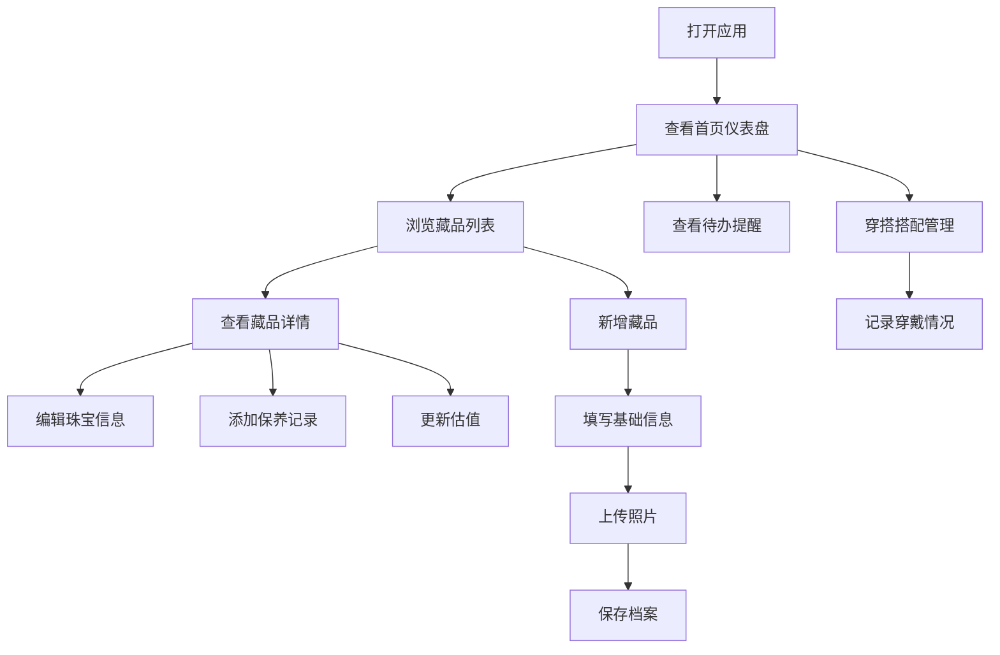

## 1. 产品概述

在线珠宝和饰品收藏管理工具，帮助珠宝收藏家、爱好者系统化管理个人珠宝藏品。提供藏品档案、价值追踪、维护保养、穿搭搭配四大核心功能模块，实现珠宝全生命周期管理。

## 2. 核心功能

### 2.1 用户角色

| 角色 | 注册方式 | 核心权限 |
|------|---------|----------|
| 普通用户 | 本地存储 | 创建/编辑/删除藏品档案、记录维护信息、管理穿搭搭配 |

### 2.2 功能模块

1. **藏品档案模块**：珠宝信息录入、多角度照片存档、来源故事记录
2. **价值管理模块**：价格估值追踪、保险投保管理、鉴定证书存档
3. **维护保养模块**：清洁保养记录、维修历史追踪、材质保养提醒
4. **穿搭搭配模块**：场合适配标注、搭配记录收藏、穿戴频率统计

### 2.3 页面详情

| 页面名称 | 模块名称 | 功能描述 |
|----------|---------|----------|
| 首页仪表盘 | 藏品概览 | 藏品统计卡片、价值总览图表、近期保养提醒、收藏精选展示 |
| 藏品列表页 | 藏品管理 | 藏品列表展示、高级筛选搜索、分类标签、快速操作按钮 |
| 藏品详情页 | 档案详情 | 珠宝基础信息、照片画廊、来源故事、价值记录、保养记录 |
| 新增/编辑藏品页 | 档案录入 | 分步表单录入珠宝信息、照片上传、多字段编辑 |
| 价值管理页 | 价值追踪 | 估值历史曲线、保险信息管理、证书文档库 |
| 维护保养页 | 保养日历 | 保养计划列表、维修记录、材质保养知识库 |
| 穿搭搭配页 | 搭配管理 | 场合分类、搭配收藏夹、穿戴统计分析 |

## 3. 核心流程

## 4. 用户界面设计

### 4.1 设计风格

**设计理念：奢华、精致、优雅**

- **主色调**：深金色 (#B8860B) - 代表奢华与珍贵
- **辅助色**：奶油白 (#FDF5E6)、深墨灰 (#2C2C2C)、玫瑰金 (#B76E79)
- **强调色**：祖母绿 (#50C878)、蓝宝石 (#0F52BA)、红宝石 (#E0115F)
- **按钮风格**：圆角按钮，金色边框搭配微妙阴影，悬停时有光泽效果
- **字体**：标题使用 Playfair Display（优雅衬线字体），正文使用 Cormorant Garamond
- **布局风格**：卡片式布局，优雅的阴影层次，金色装饰线条
- **图标风格**：线性图标搭配金色填充，精致简约

### 4.2 页面设计概述

| 页面名称 | 模块名称 | UI元素 |
|----------|---------|--------|
| 首页仪表盘 | 藏品概览 | 金色数据卡片、环形统计图表、渐变背景、优雅动画 |
| 藏品列表页 | 藏品管理 | 网格/列表双视图、金色筛选标签、悬停卡片放大效果 |
| 藏品详情页 | 档案详情 | 照片轮播画廊、标签式内容区、时间线记录展示 |
| 新增/编辑页 | 档案录入 | 分步进度条、优雅表单控件、照片拖放区域 |
| 价值管理页 | 价值追踪 | 折线图估值曲线、保险信息卡片、证书文档网格 |
| 维护保养页 | 保养日历 | 日历视图、保养提醒卡片、知识库折叠面板 |
| 穿搭搭配页 | 搭配管理 | 场合分类卡片、搭配瀑布流布局、统计柱状图 |

### 4.3 响应式

- 桌面端优先设计，支持1920px、1440px、1024px宽度
- 平板端自适应布局，卡片重新排列
- 移动端优化触摸交互，底部导航栏
- 图片自适应加载，保证性能

### 4.4 视觉特效

- 页面加载时的渐入动画和元素错落显示
- 卡片悬停时的微妙上浮和阴影加深效果
- 金色装饰元素的微光动画
- 照片画廊的平滑过渡效果
- 表单提交时的优雅加载状态
