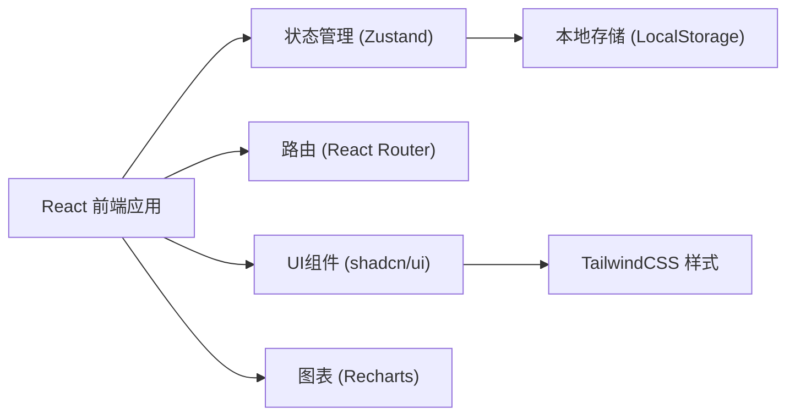
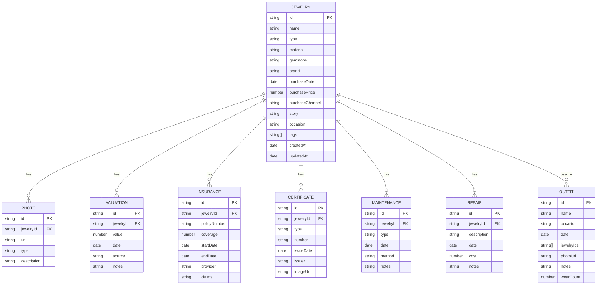

## 1. 架构设计



## 2. 技术描述

- **前端框架**: React@18 + TypeScript
- **构建工具**: Vite@5
- **样式方案**: TailwindCSS@3
- **UI组件**: shadcn/ui
- **状态管理**: Zustand
- **路由管理**: React Router@6
- **图表库**: Recharts
- **图标库**: Lucide React
- **数据持久化**: LocalStorage (模拟数据)
- **日期处理**: date-fns

## 3. 路由定义

| 路由 | 页面 | 用途 |
|------|------|------|
| `/` | 首页仪表盘 | 藏品概览、统计数据、待办提醒 |
| `/collection` | 藏品列表页 | 所有珠宝列表、筛选搜索 |
| `/collection/:id` | 藏品详情页 | 单件珠宝完整信息展示 |
| `/collection/new` | 新增藏品页 | 创建新珠宝档案 |
| `/collection/:id/edit` | 编辑藏品页 | 编辑珠宝信息 |
| `/value` | 价值管理页 | 估值追踪、保险管理、证书存档 |
| `/maintenance` | 维护保养页 | 保养记录、维修历史、保养提醒 |
| `/outfit` | 穿搭搭配页 | 场合管理、搭配记录、穿戴统计 |

## 4. 数据模型

### 4.1 ER图



### 4.2 TypeScript 类型定义

```typescript
// 珠宝类型
interface Jewelry {
  id: string;
  name: string;
  type: 'ring' | 'necklace' | 'earring' | 'bracelet' | 'brooch' | 'watch' | 'other';
  material: string;
  gemstone: string;
  brand: string;
  purchaseDate: string;
  purchasePrice: number;
  purchaseChannel: string;
  story: {
    giver: string;
    occasion: string;
    meaning: string;
  };
  suitableOccasions: ('daily' | 'formal' | 'wedding' | 'party' | 'business')[];
  photos: Photo[];
  tags: string[];
  createdAt: string;
  updatedAt: string;
}

// 照片类型
interface Photo {
  id: string;
  url: string;
  type: 'wear' | 'detail' | 'certificate' | 'other';
  description: string;
}

// 估值类型
interface Valuation {
  id: string;
  jewelryId: string;
  value: number;
  date: string;
  source: string;
  notes: string;
}

// 保险类型
interface Insurance {
  id: string;
  jewelryId: string;
  policyNumber: string;
  coverage: number;
  startDate: string;
  endDate: string;
  provider: string;
  claims: Claim[];
}

interface Claim {
  id: string;
  date: string;
  description: string;
  amount: number;
  status: 'pending' | 'approved' | 'rejected';
}

// 证书类型
interface Certificate {
  id: string;
  jewelryId: string;
  type: 'GIA' | 'IGI' | 'NGTC' | 'other';
  number: string;
  issueDate: string;
  issuer: string;
  imageUrl: string;
}

// 保养类型
interface Maintenance {
  id: string;
  jewelryId: string;
  type: 'clean' | 'polish' | 'inspection' | 'other';
  date: string;
  method: string;
  notes: string;
  nextReminderDate?: string;
}

// 维修类型
interface Repair {
  id: string;
  jewelryId: string;
  description: string;
  date: string;
  cost: number;
  notes: string;
}

// 搭配类型
interface Outfit {
  id: string;
  name: string;
  occasion: string;
  date: string;
  jewelryIds: string[];
  photoUrl: string;
  notes: string;
  wearCount: number;
  lastWornDate?: string;
}

// 材质保养知识
interface MaterialCare {
  material: string;
  tips: string[];
  warning: string;
  cleaningFrequency: string;
}
```

## 5. 项目目录结构

```
src/
├── components/          # 通用组件
│   ├── ui/             # shadcn/ui 组件
│   ├── layout/         # 布局组件
│   └── shared/         # 业务组件
├── pages/              # 页面组件
│   ├── Dashboard/
│   ├── Collection/
│   ├── Value/
│   ├── Maintenance/
│   └── Outfit/
├── store/              # Zustand 状态管理
│   └── jewelryStore.ts
├── types/              # TypeScript 类型定义
│   └── index.ts
├── data/               # Mock 数据
│   └── mockData.ts
├── utils/              # 工具函数
│   ├── format.ts
│   ├── date.ts
│   └── storage.ts
├── hooks/              # 自定义 Hooks
│   └── useJewelry.ts
├── App.tsx
├── main.tsx
└── index.css
```

## 6. 核心功能实现要点

### 6.1 状态管理
- 使用 Zustand 创建全局珠宝数据存储
- 实现 LocalStorage 持久化
- 支持增删改查操作

### 6.2 照片管理
- 使用 FileReader API 实现本地图片预览
- Base64 编码存储图片数据
- 支持多照片上传和分类管理

### 6.3 数据可视化
- 使用 Recharts 实现估值趋势图
- 穿戴频率统计柱状图
- 藏品分类环形图

### 6.4 提醒系统
- 根据保养日期计算下次提醒
- 首页展示待办提醒列表
- 保险到期提醒

### 6.5 筛选搜索
- 支持多条件组合筛选
- 模糊搜索功能
- 标签分类过滤
