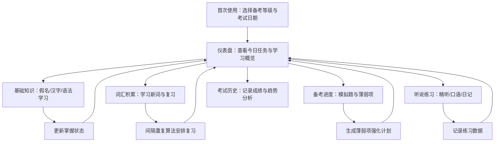

## 1. 产品概述

一个面向日语学习者的在线JLPT备考管理与学习追踪工具，帮助用户系统化地掌握假名、汉字、语法、词汇，并提供科学的间隔重复复习、模拟考试追踪和听说练习记录，全方位支持从N5到N1的JLPT备考之旅。

- 目标用户：正在备考JLPT各等级的日语学习者
- 核心价值：将零散的学习过程结构化，通过数据驱动的方式发现薄弱环节、优化复习策略

## 2. 核心功能

### 2.1 用户角色
| 角色 | 注册方式 | 核心权限 |
|------|----------|----------|
| 学习者 | 本地免注册 | 使用全部功能，数据存储于本地浏览器 |

### 2.2 功能模块
1. **仪表盘首页**：学习数据总览、今日任务、距离考试倒计时、各模块快速入口
2. **基础知识页**：假名自测追踪、汉字学习进度、语法掌握追踪
3. **词汇积累页**：等级分层词汇管理、间隔重复复习、词汇例句造句
4. **备考进度页**：考试倒计时与任务分解、模拟题练习记录、薄弱项专项强化
5. **听说练习页**：精听记录、口语录音自测、日语日记写作
6. **考试历史页**：历次JLPT成绩记录与趋势分析

### 2.3 页面详情
| 页面名称 | 模块名称 | 功能描述 |
|----------|----------|----------|
| 仪表盘首页 | 学习概览卡片 | 展示已学假名数、汉字数、词汇数、语法点数等核心统计 |
| 仪表盘首页 | 考试倒计时 | 距离最近一次JLPT考试的倒计时及每日任务建议 |
| 仪表盘首页 | 今日任务 | 根据复习算法生成的今日待复习词汇、待学习内容 |
| 仪表盘首页 | 模块导航 | 六大模块的快速入口卡片 |
| 基础知识页 | 假名掌握追踪 | 平假名/片假名五十一音图网格展示，每个字符标注掌握程度（未学/在学/已掌握），点击可自测并更新状态 |
| 基础知识页 | 汉字学习进度 | 按N5-N1等级分类的汉字学习进度，展示已学/在学/未学状态，支持筛选和搜索 |
| 基础知识页 | 语法掌握追踪 | 各等级语法点的学习状态追踪，列表展示并支持状态切换 |
| 词汇积累页 | 词汇等级管理 | N5/N4/N3/N2/N1各级词汇的分库管理，按等级切换浏览，展示词汇卡片 |
| 词汇积累页 | 间隔重复复习 | 基于遗忘曲线的复习安排，今日待复习词汇卡片翻转自测，标注认识/模糊/不认识 |
| 词汇积累页 | 例句造句 | 用学过的词汇创建例句并记录，支持查看和编辑 |
| 备考进度页 | 考试倒计时 | 设置目标考试日期，自动计算剩余天数和每日任务量 |
| 备考进度页 | 模拟题练习 | 记录历年真题的分项成绩（文字词汇/文法/读解/听解），图表展示趋势 |
| 备考进度页 | 薄弱项分析 | 四大题型的得分率分析，自动识别弱项并生成强化计划 |
| 听说练习页 | 精听记录 | 记录NHK新闻/日剧台词的精听练习，标注完成度和理解度 |
| 听说练习页 | 口语自测 | 录音功能，记录口语练习，可回放自评 |
| 听说练习页 | 日语日记 | 日语写作练习记录，支持日期筛选浏览 |
| 考试历史页 | 成绩记录 | 历次JLPT成绩录入和展示，含总分和分项得分 |
| 考试历史页 | 趋势分析 | 成绩变化趋势图表，帮助评估学习效果 |

## 3. 核心流程

用户首次使用时，选择当前备考等级和目标考试日期，系统生成初始学习计划。日常使用中，用户通过仪表盘查看今日任务，进入各模块完成学习和复习。间隔重复算法自动安排词汇复习，模拟题记录和薄弱项分析指导重点突破方向。

## 4. 用户界面设计

### 4.1 设计风格
- **主题**：日式和风美学 × 现代极简，融合传统与科技感
- **主色调**：深墨色(#1a1a2e)为底，朱红色(#c0392b)为强调色，搭配暖白(#faf3e0)和淡金(#d4a574)
- **辅助色**：各JLPT等级使用不同色系标识——N5翠绿(#27ae60)、N4海蓝(#2980b9)、N3紫藤(#8e44ad)、N2琥珀(#e67e22)、N1绯红(#c0392b)
- **字体**：标题使用 Noto Serif JP（衬线日式风格），正文使用 Noto Sans JP
- **按钮风格**：圆角微凸按钮，朱红色为主操作色，墨色为次操作色
- **布局风格**：左侧固定导航栏 + 右侧内容区，卡片式模块布局
- **装饰元素**：淡雅的樱花/波浪纹理作为背景点缀，浮世绘风格的分割线

### 4.2 页面设计概览
| 页面名称 | 模块名称 | UI元素 |
|----------|----------|--------|
| 仪表盘首页 | 学习概览卡片 | 四宫格统计卡片，大数字+标签，墨色卡片+金色边框 |
| 仪表盘首页 | 考试倒计时 | 大字号倒计时数字，圆形进度环显示备考进度 |
| 仪表盘首页 | 今日任务 | 竖向任务列表，左侧色条标识类型，复选框交互 |
| 仪表盘首页 | 模块导航 | 六宫格图标卡片，悬浮放大动效，朱红色图标 |
| 基础知识页 | 假名网格 | 10×5网格布局，每个格子含假名字符+状态色点（灰/黄/绿），点击弹出详情 |
| 基础知识页 | 汉字进度 | 进度条+数字统计，下方汉字卡片网格，色标标识状态 |
| 基础知识页 | 语法列表 | 分组折叠列表，语法点条目含状态标签和切换按钮 |
| 词汇积累页 | 词汇卡片 | 大尺寸翻转卡片（正面假名/汉字+背面释义），等级标签色 |
| 词汇积累页 | 复习界面 | 单卡居中展示，底部三个操作按钮（不认识/模糊/认识） |
| 词汇积累页 | 例句列表 | 时间线式布局，例句卡片含词汇标签和编辑按钮 |
| 备考进度页 | 倒计时 | 圆形进度环+大数字，日期选择器 |
| 备考进度页 | 成绩图表 | 折线图展示分项得分趋势，柱状图展示单次分项对比 |
| 备考进度页 | 雷达图 | 四维雷达图（文字词汇/文法/读解/听解），弱项高亮 |
| 听说练习页 | 精听列表 | 卡片列表，进度条+理解度评分星标 |
| 听说练习页 | 录音面板 | 波形动画+录音按钮，录音列表+播放按钮 |
| 听说练习页 | 日记编辑 | 简洁文本编辑器，日期选择，历史日记日历视图 |
| 考试历史页 | 成绩卡片 | 时间线布局，每次考试一张成绩卡片，含总分+分项柱状图 |
| 考试历史页 | 趋势图 | 折线图展示总分和分项的变化趋势 |

### 4.3 响应式设计
- 桌面优先设计，最小宽度1024px
- 平板适配：导航栏折叠为顶部汉堡菜单，卡片网格从3列变2列
- 移动端：单列布局，底部标签导航

### 4.4 3D场景指引
- 不适用
