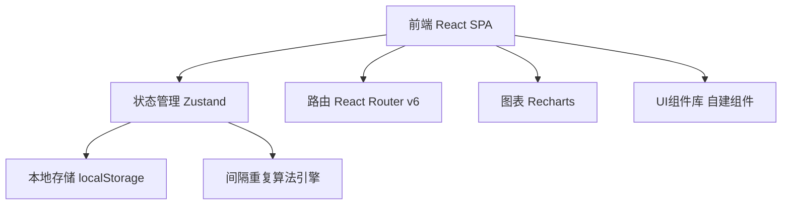

## 1. 架构设计



纯前端SPA应用，所有数据存储于浏览器localStorage，无需后端服务。

## 2. 技术说明
- 前端：React@18 + TypeScript + TailwindCSS@3 + Vite
- 初始化工具：Vite
- 状态管理：Zustand（轻量、支持持久化中间件）
- 路由：React Router v6
- 图表：Recharts
- 数据持久化：localStorage（通过Zustand persist中间件自动序列化）
- 后端：无
- 数据库：无（纯前端本地存储）

## 3. 路由定义
| 路由 | 用途 |
|------|------|
| / | 仪表盘首页 - 学习概览与今日任务 |
| /basics | 基础知识 - 假名/汉字/语法追踪 |
| /vocabulary | 词汇积累 - 词汇管理与复习 |
| /vocabulary/review | 词汇复习 - 间隔重复复习界面 |
| /vocabulary/sentences | 例句造句 - 词汇例句管理 |
| /exam-prep | 备考进度 - 倒计时与模拟题 |
| /exam-prep/weakness | 薄弱项分析 - 题型弱项与强化计划 |
| /listening | 听说练习 - 精听/口语/日记 |
| /exam-history | 考试历史 - 成绩记录与趋势 |

## 4. API定义
无后端API。所有数据通过Zustand store管理，持久化到localStorage。

## 5. 服务端架构
不适用

## 6. 数据模型

### 6.1 数据模型定义

```mermaid
erDiagram
    UserProfile ||--o{ KanaProgress : has
    UserProfile ||--o{ KanjiProgress : has
    UserProfile ||--o{ GrammarProgress : has
    UserProfile ||--o{ VocabularyItem : has
    UserProfile ||--o{ ExampleSentence : has
    UserProfile ||--o{ MockExam : has
    UserProfile ||--o{ ListeningRecord : has
    UserProfile ||--o{ SpeakingRecord : has
    UserProfile ||--o{ DiaryEntry : has
    UserProfile ||--o{ ExamHistory : has

    UserProfile {
        string id PK
        string targetLevel
        string examDate
        string createdAt
    }

    KanaProgress {
        string id PK
        string character
        string type
        string status
        string lastTested
        int correctCount
        int totalTests
    }

    KanjiProgress {
        string id PK
        string kanji
        string level
        string status
        string meaning
        string onyomi
        string kunyomi
        string lastStudied
    }

    GrammarProgress {
        string id PK
        string grammarPoint
        string level
        string status
        string meaning
        string example
        string lastStudied
    }

    VocabularyItem {
        string id PK
        string word
        string reading
        string meaning
        string level
        string status
        float easeFactor
        int interval
        int repetitions
        string nextReview
        string addedDate
    }

    ExampleSentence {
        string id PK
        string vocabularyId FK
        string sentence
        string translation
        string createdAt
    }

    MockExam {
        string id PK
        string date
        string level
        int vocabularyScore
        int vocabularyTotal
        int grammarScore
        int grammarTotal
        int readingScore
        int readingTotal
        int listeningScore
        int listeningTotal
    }

    ListeningRecord {
        string id PK
        string title
        string source
        string type
        int completionPercent
        int comprehensionScore
        string notes
        string date
    }

    SpeakingRecord {
        string id PK
        string title
        blob audioData
        string selfRating
        string notes
        string date
    }

    DiaryEntry {
        string id PK
        string content
        string date
        string wordCount
    }

    ExamHistory {
        string id PK
        string date
        string level
        int totalScore
        int vocabularyGrammarScore
        int readingScore
        int listeningScore
        bool passed
    }
```



### 6.2 数据定义语言

使用TypeScript接口定义，数据存储于localStorage：

```typescript
type MasteryStatus = 'unlearned' | 'learning' | 'mastered';
type JLPTLevel = 'N5' | 'N4' | 'N3' | 'N2' | 'N1';
type KanaType = 'hiragana' | 'katakana';

interface UserProfile {
  id: string;
  targetLevel: JLPTLevel;
  examDate: string;
  createdAt: string;
}

interface KanaProgress {
  id: string;
  character: string;
  type: KanaType;
  status: MasteryStatus;
  lastTested: string;
  correctCount: number;
  totalTests: number;
}

interface KanjiProgress {
  id: string;
  kanji: string;
  level: JLPTLevel;
  status: MasteryStatus;
  meaning: string;
  onyomi: string;
  kunyomi: string;
  lastStudied: string;
}

interface GrammarProgress {
  id: string;
  grammarPoint: string;
  level: JLPTLevel;
  status: MasteryStatus;
  meaning: string;
  example: string;
  lastStudied: string;
}

interface VocabularyItem {
  id: string;
  word: string;
  reading: string;
  meaning: string;
  level: JLPTLevel;
  status: MasteryStatus;
  easeFactor: number;
  interval: number;
  repetitions: number;
  nextReview: string;
  addedDate: string;
}

interface ExampleSentence {
  id: string;
  vocabularyId: string;
  sentence: string;
  translation: string;
  createdAt: string;
}

interface MockExam {
  id: string;
  date: string;
  level: JLPTLevel;
  vocabularyScore: number;
  vocabularyTotal: number;
  grammarScore: number;
  grammarTotal: number;
  readingScore: number;
  readingTotal: number;
  listeningScore: number;
  listeningTotal: number;
}

interface ListeningRecord {
  id: string;
  title: string;
  source: string;
  type: 'nhk' | 'drama' | 'anime' | 'other';
  completionPercent: number;
  comprehensionScore: number;
  notes: string;
  date: string;
}

interface SpeakingRecord {
  id: string;
  title: string;
  audioData: string;
  selfRating: number;
  notes: string;
  date: string;
}

interface DiaryEntry {
  id: string;
  content: string;
  date: string;
  wordCount: number;
}

interface ExamHistory {
  id: string;
  date: string;
  level: JLPTLevel;
  totalScore: number;
  vocabularyGrammarScore: number;
  readingScore: number;
  listeningScore: number;
  passed: boolean;
}
```
