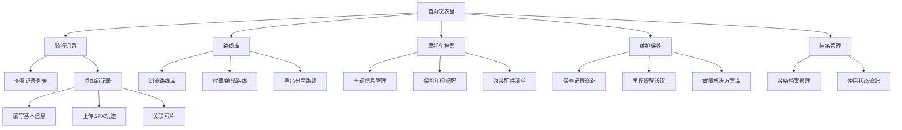

## 1. 产品概述
摩托车骑行日志和路线管理工具，为摩托车爱好者提供一站式骑行记录、路线规划、车辆管理和装备追踪的完整解决方案。

- **主要目的**：帮助摩托车骑手系统化管理骑行生活，记录珍贵旅程，维护车辆状态，发现精彩路线
- **目标用户**：摩托车爱好者、骑行俱乐部成员、长途摩旅爱好者
- **市场价值**：填补国内摩托车骑行管理工具市场空白，提供本地化的全功能骑行管理平台

## 2. 核心功能

### 2.1 用户角色
| 角色 | 注册方式 | 核心权限 |
|------|----------|----------|
| 普通用户 | 本地存储（无需注册） | 全部功能使用，数据本地存储 |

### 2.2 功能模块
1. **骑行记录模块**：骑行日志管理、GPX轨迹导入、路线地图展示、照片关联
2. **路线库管理模块**：路线收藏、路线详情、路线导出分享
3. **摩托车档案模块**：车辆信息、保险年检提醒、改装清单
4. **维护保养模块**：保养记录、里程提醒、故障记录
5. **装备管理模块**：装备档案、使用状态追踪

### 2.3 页面详情
| 页面名称 | 模块名称 | 功能描述 |
|-----------|-------------|---------------------|
| 首页仪表盘 | 概览卡片 | 显示总里程、本月骑行次数、下次保养提醒、最近记录 |
| 首页仪表盘 | 快捷操作 | 快速添加记录、查看路线、车辆状态 |
| 骑行记录页 | 记录列表 | 按时间展示所有骑行记录，支持筛选搜索 |
| 骑行记录页 | 记录详情 | 显示完整日志、地图轨迹、照片画廊 |
| 骑行记录页 | 添加记录 | 表单录入骑行信息，GPX文件上传，照片上传 |
| 路线库页 | 路线列表 | 收藏路线卡片展示，按难度/里程筛选 |
| 路线库页 | 路线详情 | 路线信息、推荐理由、加油站标记、导出功能 |
| 摩托车档案页 | 车辆卡片 | 爱车基础信息展示 |
| 摩托车档案页 | 提醒面板 | 保险年检到期提醒 |
| 摩托车档案页 | 改装清单 | 改装配件列表管理 |
| 维护保养页 | 保养记录 | 历史保养记录时间线 |
| 维护保养页 | 保养提醒 | 下次保养里程提醒设置 |
| 维护保养页 | 故障记录 | 故障及解决方案记录 |
| 装备管理页 | 装备列表 | 各类装备卡片展示 |
| 装备管理页 | 装备详情 | 装备使用状态和历史记录 |

## 3. 核心流程

用户从首页仪表盘进入，可快速访问各功能模块。添加骑行记录时填写基本信息，可上传GPX轨迹和照片，保存后在记录列表和地图上查看。路线库可收藏和分享路线，摩托车档案记录车辆信息和保养提醒。

## 4. 用户界面设计

### 4.1 设计风格
- **主色调**：深炭灰色 (#1a1a2e) 配合 霓虹橙色 (#ff6b35) 作为点缀，体现摩托车的速度感和科技感
- **辅助色**：深蓝色 (#16213e)、深灰色 (#0f3460)，营造专业、稳重的氛围
- **按钮风格**：圆角矩形按钮，带有微妙的悬浮效果和过渡动画
- **字体**：标题使用 Orbitron（赛车风格字体），正文使用 Roboto，数字使用 monospace 增强科技感
- **布局风格**：卡片式布局，深色主题，网格+浮动元素组合
- **图标风格**：线性图标，统一的24px网格，配合霓虹色悬停效果

### 4.2 页面设计概览
| 页面名称 | 模块名称 | UI元素 |
|-----------|-------------|-------------|
| 首页仪表盘 | 概览卡片 | 大数字展示、渐变背景、霓虹边框、悬浮动画 |
| 骑行记录页 | 记录列表 | 时间线布局、地图缩略图、照片预览角标 |
| 路线库页 | 路线卡片 | 难度星级、里程标签、精彩看点预览 |
| 摩托车档案页 | 车辆卡片 | 摩托车主图、规格参数网格、状态指示灯 |
| 维护保养页 | 保养记录 | 垂直时间线、完成状态标记、进度条 |
| 装备管理页 | 装备卡片 | 圆形图标、使用状态标签、购入时间显示 |

### 4.3 响应式
- 桌面端优先设计，采用12列网格布局
- 平板端：侧边栏收起为图标导航，内容区自适应
- 移动端：底部Tab导航，卡片堆叠布局，表单简化

### 4.4 动效设计
- 页面加载：元素错落出现动画 (staggered reveal)
- 卡片悬停：轻微上浮+霓虹光晕效果
- 导航切换：平滑过渡+缩放动画
- 地图加载：渐显效果+点位标记弹跳动画
- 提醒通知：脉冲动画吸引注意
