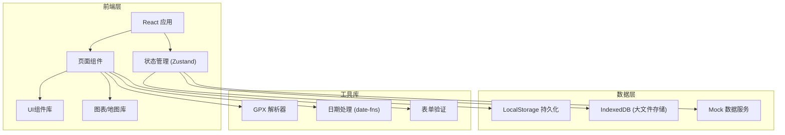
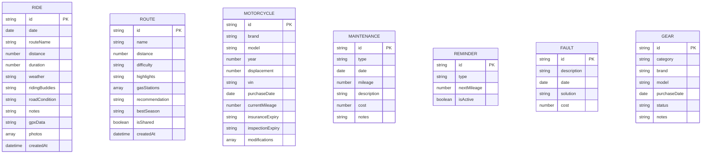

## 1. 架构设计



## 2. 技术描述

- **前端框架**: React@18 + TypeScript
- **构建工具**: Vite@5
- **样式方案**: TailwindCSS@3 + PostCSS
- **状态管理**: Zustand (轻量级状态管理)
- **路由**: React Router v6
- **地图展示**: Leaflet + React-Leaflet
- **图表库**: Recharts
- **日期处理**: date-fns
- **图标库**: Lucide React
- **数据持久化**: LocalStorage + IndexedDB
- **无后端架构**: 纯前端应用，数据本地存储

## 3. 路由定义

| 路由路径 | 页面用途 |
|----------|----------|
| / | 首页仪表盘 |
| /rides | 骑行记录列表 |
| /rides/new | 添加新骑行记录 |
| /rides/:id | 骑行记录详情 |
| /routes | 路线库 |
| /routes/new | 添加新路线 |
| /routes/:id | 路线详情 |
| /motorcycle | 摩托车档案 |
| /maintenance | 维护保养 |
| /gear | 装备管理 |

## 4. 数据模型

### 4.1 数据模型定义



### 4.2 TypeScript 类型定义

```typescript
// 骑行记录
interface Ride {
  id: string;
  date: string;
  routeName: string;
  distance: number;
  duration: number;
  weather: string;
  ridingBuddies: string;
  roadCondition: string;
  notes: string;
  gpxData?: string;
  photos: string[];
  createdAt: string;
}

// 路线
interface Route {
  id: string;
  name: string;
  distance: number;
  difficulty: 'easy' | 'medium' | 'hard' | 'extreme';
  highlights: string;
  gasStations: { name: string; location: string }[];
  recommendation: string;
  bestSeason: string;
  isShared: boolean;
  createdAt: string;
}

// 摩托车
interface Motorcycle {
  id: string;
  brand: string;
  model: string;
  year: number;
  displacement: number;
  vin: string;
  purchaseDate: string;
  currentMileage: number;
  insuranceExpiry: string;
  inspectionExpiry: string;
  modifications: Modification[];
}

interface Modification {
  id: string;
  name: string;
  date: string;
  cost: number;
  notes: string;
}

// 保养记录
interface Maintenance {
  id: string;
  type: 'oil' | 'brake' | 'tire' | 'chain' | 'other';
  date: string;
  mileage: number;
  description: string;
  cost: number;
  notes: string;
}

// 保养提醒
interface Reminder {
  id: string;
  type: string;
  nextMileage: number;
  isActive: boolean;
}

// 故障记录
interface Fault {
  id: string;
  description: string;
  date: string;
  solution: string;
  cost: number;
}

// 装备
interface Gear {
  id: string;
  category: 'helmet' | 'jacket' | 'gloves' | 'pants' | 'boots' | 'protection' | 'other';
  brand: string;
  model: string;
  purchaseDate: string;
  status: 'new' | 'good' | 'worn' | 'replace';
  notes: string;
}
```

## 5. 项目结构

```
src/
├── components/          # 通用组件
│   ├── layout/         # 布局组件
│   ├── ui/             # 基础UI组件
│   └── forms/          # 表单组件
├── pages/              # 页面组件
├── store/              # Zustand 状态管理
├── types/              # TypeScript 类型定义
├── utils/              # 工具函数
│   ├── gpxParser.ts    # GPX文件解析
│   ├── storage.ts      # 本地存储
│   └── formatters.ts   # 格式化工具
├── hooks/              # 自定义Hooks
├── assets/             # 静态资源
├── App.tsx
├── main.tsx
└── index.css
```

## 6. 关键技术点

1. **GPX 轨迹解析**：使用 `@tmcw/togeojson` 库解析GPX文件，配合Leaflet地图展示
2. **本地数据持久化**：Zustand + localStorage 实现状态持久化，大文件使用 IndexedDB
3. **响应式设计**：TailwindCSS 响应式断点，适配桌面、平板、手机
4. **图表展示**：使用 Recharts 展示里程统计、保养记录等数据可视化
5. **文件上传**：GPX文件和照片上传使用本地File API处理，不依赖后端
