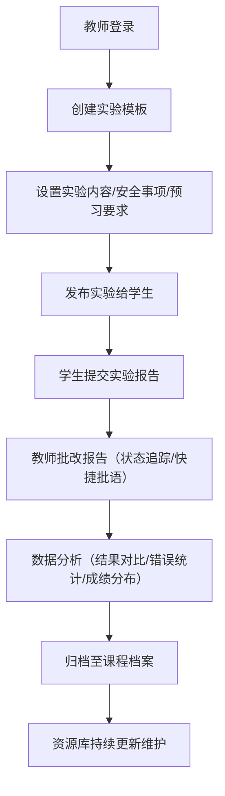

## 1. 产品概述

在线教学实验记录和学生实验报告管理工具，面向高等院校理工科实验课程，提供实验模板管理、学生报告批改、数据分析、资源库管理和课程档案一体化解决方案。目标用户包括实验教师、实验管理员和学生，解决实验教学中模板不统一、批改效率低、数据难以统计、资源分散等核心问题。

## 2. 核心功能

### 2.1 用户角色

| 角色 | 注册方式 | 核心权限 |
|------|----------|----------|
| 教师 | 管理员创建 | 创建实验模板、批改学生报告、查看数据分析、管理资源库、查看课程档案 |
| 管理员 | 系统初始化 | 所有教师权限 + 用户管理、实验室排班、系统配置 |
| 学生 | 管理员导入 | 提交实验报告、查看批改结果、浏览实验资源 |

### 2.2 功能模块

1. **实验模板管理**：实验模板创建、安全注意事项、预习要求和考核要点设置
2. **学生报告管理**：报告提交存档、批改状态追踪、快捷批改意见输入
3. **数据分析**：班级实验数据汇总、常见错误统计、成绩分布分析
4. **资源库管理**：文献资料收集、设备维护记录、示范视频链接管理
5. **课程档案**：多学期历史档案、年度更新记录、实验室排班管理

### 2.3 页面详情

| 页面名称 | 模块名称 | 功能描述 |
|----------|----------|----------|
| 首页仪表盘 | 数据概览 | 待批改报告数量、今日实验安排、近期数据分析、快捷操作入口 |
| 实验模板列表 | 模板管理 | 模板列表展示、搜索筛选、新建/编辑/删除模板 |
| 实验模板编辑 | 模板管理 | 实验名称/目的/原理/仪器/步骤/数据表格/思考题完整编辑、安全注意事项、预习要求、考核要点设置 |
| 学生报告列表 | 报告管理 | 按班级/实验/学生分类展示、批改状态筛选、批量操作 |
| 报告批改详情 | 报告管理 | 报告内容查看、批改状态切换、模板化批语快速套用、成绩录入 |
| 数据分析概览 | 数据分析 | 实验结果与理论值对比、常见错误步骤统计、成绩分布图表 |
| 资源库首页 | 资源管理 | 文献资料列表、设备状态看板、视频资源分类 |
| 课程档案首页 | 档案管理 | 学期历史档案、实验内容更新记录、实验室排班日历 |
| 设置页面 | 系统设置 | 个人信息、班级管理、学生账号管理 |

## 3. 核心流程

## 4. 用户界面设计

### 4.1 设计风格
- **主色调**：深蓝科技蓝 (#1e3a5f)，代表学术严谨和专业性
- **辅助色**：薄荷绿 (#2dd4bf) 用于成功/正确状态，橙红色 (#f97316) 用于警告/待处理
- **中性色**：深灰 (#1e293b) 文字，浅灰 (#f1f5f9) 背景
- **按钮风格**：圆角8px，悬停微上浮效果，120ms过渡动画
- **字体**：标题使用 Lora 衬线字体体现学术感，正文使用 Inter 无衬线字体保证可读性
- **布局**：左侧导航栏 + 主内容区，卡片式模块布局，留白充足
- **图标**：Lucide 线性图标，统一24px尺寸，与文字垂直居中对齐

### 4.2 页面设计概览

| 页面名称 | 模块名称 | UI 元素 |
|----------|----------|---------|
| 首页仪表盘 | 数据概览 | 统计卡片网格（数据卡片带渐变色块和图标）、待办事项列表、快捷操作按钮组、图表预览区 |
| 实验模板列表 | 模板管理 | 搜索筛选栏、卡片列表（模板封面+元数据标签）、浮动新建按钮 |
| 实验模板编辑 | 模板管理 | 分步骤表单向导（7个步骤进度条）、富文本编辑器、动态表格编辑、保存/预览双按钮 |
| 学生报告列表 | 报告管理 | 三级分类筛选器（班级→实验→学生）、状态标签徽章、批量操作工具栏 |
| 报告批改详情 | 报告管理 | 左右分栏布局（左：报告内容；右：批改面板）、批语模板下拉选择、评分滑块 |
| 数据分析概览 | 数据分析 | 三栏图表布局（雷达图对比理论值、柱状图错误统计、饼图成绩分布）、数据筛选器 |
| 资源库首页 | 资源管理 | 标签切换导航、文献卡片网格、设备状态仪表盘、视频卡片列表 |
| 课程档案首页 | 档案管理 | 学期时间轴、更新记录列表、月视图排班日历 |

### 4.3 响应式
- 桌面端优先设计（1280px+）
- 平板端（768-1279px）：导航栏折叠为图标模式，双栏布局
- 移动端（<768px）：底部标签栏导航，单列布局，卡片堆叠

### 4.4 动效设计
- 页面进入：渐入 + 轻微上移（8px），150ms ease-out
- 卡片悬停：box-shadow 加深 + 上移2px，120ms过渡
- 状态切换：标签颜色渐变过渡，200ms
- 图表加载：柱状图从下到上生长动画，300ms错开延迟
