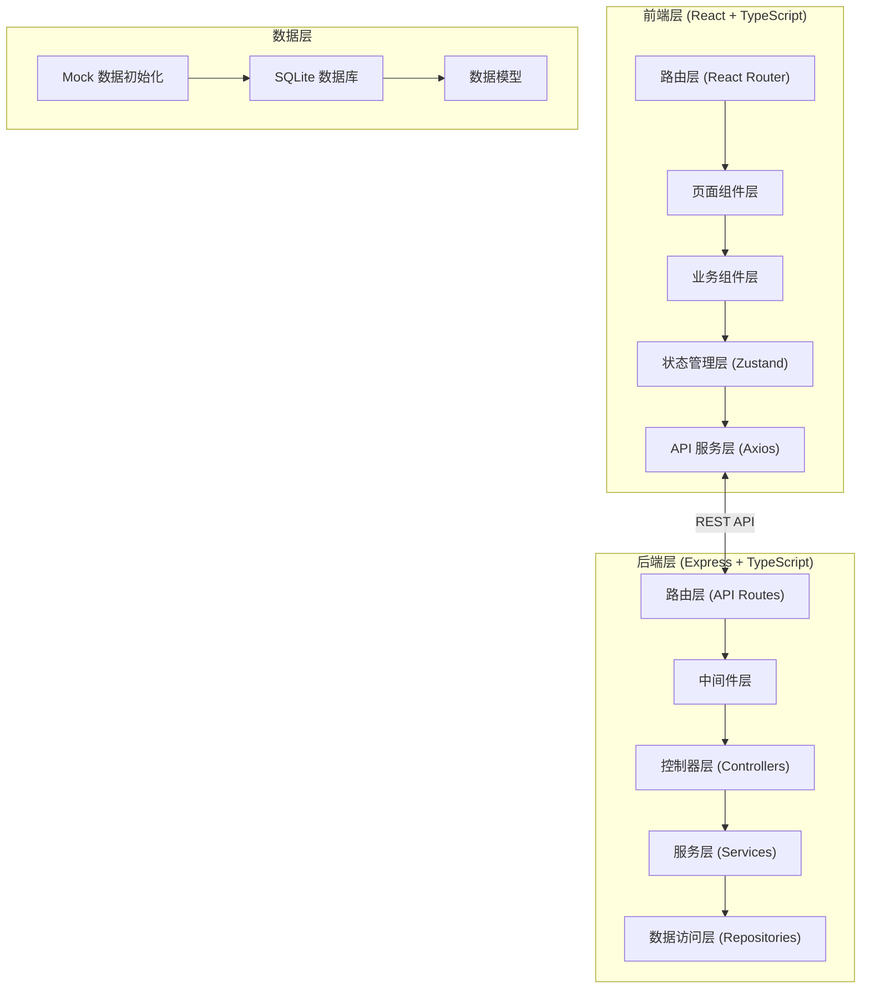
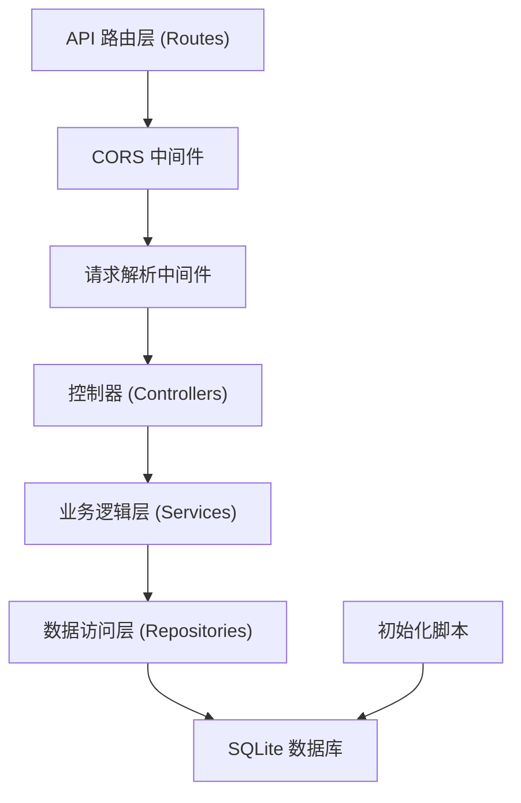

## 1. 架构设计



## 2. 技术说明

- **前端**：React@18 + TypeScript + Vite + TailwindCSS@3 + Zustand + React Router + Recharts + Lucide React
- **后端**：Express@4 + TypeScript + CORS + 内置 SQLite (better-sqlite3)
- **初始化工具**：vite-init
- **数据库**：SQLite (无需外部服务，开箱即用)
- **图表**：Recharts (React 图表库)
- **图标**：Lucide React

## 3. 路由定义

### 前端路由
| 路由路径 | 页面名称 | 说明 |
|----------|----------|------|
| `/` | 首页仪表盘 | 数据概览和快捷操作 |
| `/templates` | 实验模板列表 | 模板列表管理 |
| `/templates/new` | 新建实验模板 | 创建新实验模板 |
| `/templates/:id` | 编辑实验模板 | 编辑现有模板 |
| `/reports` | 学生报告列表 | 按分类展示报告 |
| `/reports/:id` | 报告批改详情 | 批改单个报告 |
| `/analytics` | 数据分析概览 | 多维度数据分析 |
| `/resources` | 资源库首页 | 文献/设备/视频管理 |
| `/archives` | 课程档案首页 | 历史档案和排班 |
| `/settings` | 设置页面 | 系统设置 |

### 后端 API 路由
| 方法 | 路径 | 功能 |
|------|------|------|
| GET | `/api/dashboard` | 获取仪表盘统计数据 |
| GET | `/api/templates` | 获取实验模板列表 |
| GET | `/api/templates/:id` | 获取单个模板详情 |
| POST | `/api/templates` | 创建实验模板 |
| PUT | `/api/templates/:id` | 更新实验模板 |
| DELETE | `/api/templates/:id` | 删除实验模板 |
| GET | `/api/reports` | 获取学生报告列表 |
| GET | `/api/reports/:id` | 获取单个报告详情 |
| PUT | `/api/reports/:id` | 更新报告批改状态和意见 |
| GET | `/api/analytics/summary` | 获取数据分析汇总 |
| GET | `/api/resources` | 获取资源库列表 |
| POST | `/api/resources` | 添加资源 |
| GET | `/api/archives` | 获取课程档案列表 |
| GET | `/api/schedule` | 获取实验室排班 |

## 4. API 类型定义

```typescript
// 共享类型定义
export interface ExperimentTemplate {
  id: number;
  name: string;
  courseName: string;
  purpose: string;
  principle: string;
  instruments: string[];
  steps: Step[];
  dataTable: DataTableColumn[];
  questions: Question[];
  safetyNotes: string[];
  previewRequirements: string[];
  assessmentPoints: string[];
  createdAt: string;
  updatedAt: string;
}

export interface Step {
  order: number;
  title: string;
  description: string;
}

export interface DataTableColumn {
  name: string;
  unit: string;
  type: 'number' | 'text';
}

export interface Question {
  id: number;
  content: string;
  type: 'essay' | 'calculation';
}

export interface StudentReport {
  id: number;
  studentId: number;
  studentName: string;
  className: string;
  templateId: number;
  templateName: string;
  submittedAt: string;
  status: 'ungraded' | 'graded' | 'needs-revision';
  data: Record<string, any>;
  answers: Record<number, string>;
  grade?: number;
  feedback?: string;
  gradedAt?: string;
}

export interface CommentTemplate {
  id: number;
  category: string;
  content: string;
}

export interface Resource {
  id: number;
  type: 'literature' | 'equipment' | 'video';
  title: string;
  description: string;
  url?: string;
  status?: string;
  lastMaintenance?: string;
}

export interface Archive {
  id: number;
  semester: string;
  year: number;
  courseName: string;
  summary: string;
  updateRecords: UpdateRecord[];
}

export interface Schedule {
  id: number;
  date: string;
  timeSlot: string;
  labName: string;
  courseName: string;
  className: string;
}
```

## 5. 服务端架构图



## 6. 数据模型

### 6.1 ER 图

```mermaid
erDiagram
    EXPERIMENT_TEMPLATE ||--o{ STUDENT_REPORT : has
    EXPERIMENT_TEMPLATE {
        INTEGER id PK
        TEXT name
        TEXT course_name
        TEXT purpose
        TEXT principle
        TEXT instruments
        TEXT steps
        TEXT data_table
        TEXT questions
        TEXT safety_notes
        TEXT preview_requirements
        TEXT assessment_points
        DATETIME created_at
        DATETIME updated_at
    }
    STUDENT_REPORT {
        INTEGER id PK
        INTEGER student_id
        TEXT student_name
        TEXT class_name
        INTEGER template_id FK
        TEXT submitted_at
        TEXT status
        TEXT data
        TEXT answers
        INTEGER grade
        TEXT feedback
        DATETIME graded_at
    }
    COMMENT_TEMPLATE {
        INTEGER id PK
        TEXT category
        TEXT content
    }
    RESOURCE {
        INTEGER id PK
        TEXT type
        TEXT title
        TEXT description
        TEXT url
        TEXT status
        DATETIME last_maintenance
    }
    ARCHIVE {
        INTEGER id PK
        TEXT semester
        INTEGER year
        TEXT course_name
        TEXT summary
        TEXT update_records
    }
    SCHEDULE {
        INTEGER id PK
        TEXT date
        TEXT time_slot
        TEXT lab_name
        TEXT course_name
        TEXT class_name
    }
    CLASS {
        INTEGER id PK
        TEXT name
        INTEGER student_count
    }
    STUDENT {
        INTEGER id PK
        TEXT name
        TEXT student_no
        INTEGER class_id FK
    }
```

### 6.2 DDL 语句

```sql
-- 实验模板表
CREATE TABLE experiment_templates (
  id INTEGER PRIMARY KEY AUTOINCREMENT,
  name TEXT NOT NULL,
  course_name TEXT NOT NULL,
  purpose TEXT,
  principle TEXT,
  instruments TEXT,
  steps TEXT,
  data_table TEXT,
  questions TEXT,
  safety_notes TEXT,
  preview_requirements TEXT,
  assessment_points TEXT,
  created_at DATETIME DEFAULT CURRENT_TIMESTAMP,
  updated_at DATETIME DEFAULT CURRENT_TIMESTAMP
);

-- 学生报告表
CREATE TABLE student_reports (
  id INTEGER PRIMARY KEY AUTOINCREMENT,
  student_id INTEGER NOT NULL,
  student_name TEXT NOT NULL,
  class_name TEXT NOT NULL,
  template_id INTEGER NOT NULL,
  template_name TEXT NOT NULL,
  submitted_at DATETIME DEFAULT CURRENT_TIMESTAMP,
  status TEXT DEFAULT 'ungraded',
  data TEXT,
  answers TEXT,
  grade INTEGER,
  feedback TEXT,
  graded_at DATETIME,
  FOREIGN KEY (template_id) REFERENCES experiment_templates(id)
);

-- 批语模板表
CREATE TABLE comment_templates (
  id INTEGER PRIMARY KEY AUTOINCREMENT,
  category TEXT NOT NULL,
  content TEXT NOT NULL
);

-- 资源库表
CREATE TABLE resources (
  id INTEGER PRIMARY KEY AUTOINCREMENT,
  type TEXT NOT NULL,
  title TEXT NOT NULL,
  description TEXT,
  url TEXT,
  status TEXT,
  last_maintenance DATETIME
);

-- 课程档案表
CREATE TABLE archives (
  id INTEGER PRIMARY KEY AUTOINCREMENT,
  semester TEXT NOT NULL,
  year INTEGER NOT NULL,
  course_name TEXT NOT NULL,
  summary TEXT,
  update_records TEXT
);

-- 实验室排班表
CREATE TABLE schedules (
  id INTEGER PRIMARY KEY AUTOINCREMENT,
  date TEXT NOT NULL,
  time_slot TEXT NOT NULL,
  lab_name TEXT NOT NULL,
  course_name TEXT NOT NULL,
  class_name TEXT NOT NULL
);

-- 班级表
CREATE TABLE classes (
  id INTEGER PRIMARY KEY AUTOINCREMENT,
  name TEXT NOT NULL,
  student_count INTEGER DEFAULT 0
);

-- 学生表
CREATE TABLE students (
  id INTEGER PRIMARY KEY AUTOINCREMENT,
  name TEXT NOT NULL,
  student_no TEXT NOT NULL UNIQUE,
  class_id INTEGER,
  FOREIGN KEY (class_id) REFERENCES classes(id)
);

-- 索引
CREATE INDEX idx_reports_status ON student_reports(status);
CREATE INDEX idx_reports_class ON student_reports(class_name);
CREATE INDEX idx_reports_template ON student_reports(template_id);
CREATE INDEX idx_schedules_date ON schedules(date);
```
