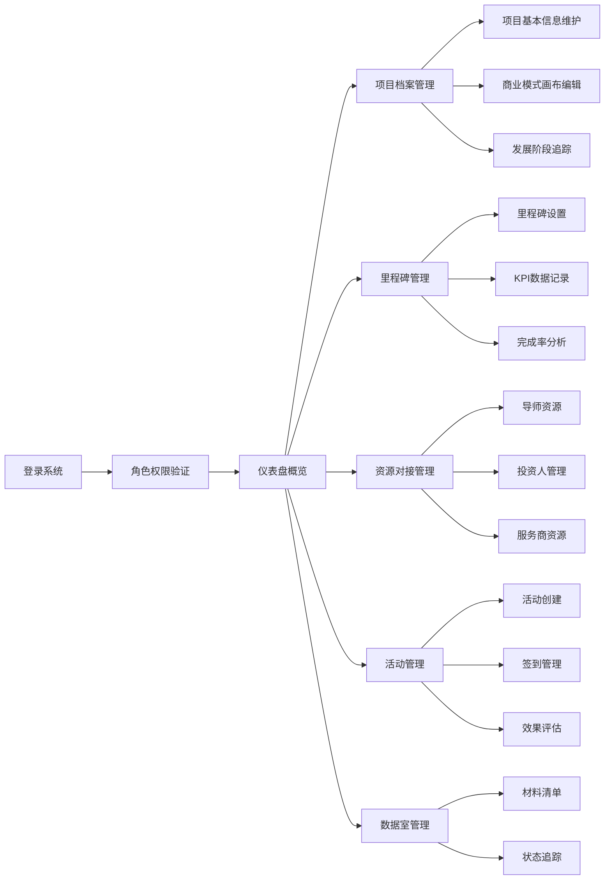

## 1. 产品概述

本产品是一套完整的在线孵化器和创业项目管理工具，旨在帮助孵化器运营者高效管理入孵项目、追踪发展进度、对接资源并组织活动。系统解决了传统孵化器管理中信息分散、进度追踪困难、资源对接效率低下等核心问题，为孵化器提供一体化的数字化管理解决方案。

目标用户包括孵化器管理人员、创业项目负责人、导师及投资人，核心价值在于提升孵化效率、优化资源配置、加速项目成长。

## 2. 核心功能

### 2.1 用户角色

| 角色 | 注册方式 | 核心权限 |
|------|----------|----------|
| 孵化器管理员 | 账号密码登录 | 全部功能管理、项目审核、数据统计 |
| 项目负责人 | 账号密码登录 | 项目档案维护、里程碑更新、活动报名 |
| 导师 | 账号密码登录 | 导师档案维护、服务记录查看、项目对接 |
| 投资人 | 账号密码登录 | 项目浏览、投资意向记录、对接状态管理 |

### 2.2 功能模块

1. **创业项目档案模块**：项目基本信息管理、商业模式画布、发展阶段追踪
2. **里程碑和目标管理模块**：里程碑设置与追踪、KPI指标记录、完成率分析
3. **资源对接模块**：导师资源管理、投资人管理、服务商资源整理
4. **活动管理模块**：活动创建与管理、签到记录、效果收集
5. **数据室管理模块**：尽调材料清单、完成状态追踪

### 2.3 页面详情

| 页面名称 | 模块名称 | 功能描述 |
|---------|----------|----------|
| 仪表盘 | 数据概览 | 项目总数、阶段分布、里程碑完成率、资源统计卡片 |
| 项目列表 | 创业项目档案 | 项目列表展示、筛选搜索、新增/编辑/删除项目 |
| 项目详情 | 创业项目档案 | 基本信息展示、商业模式画布编辑器、阶段追踪时间轴 |
| 里程碑管理 | 里程碑和目标管理 | 里程碑列表、状态更新、KPI记录表单、完成率图表 |
| 导师管理 | 资源对接 | 导师档案列表、专业领域标签、服务记录时间线 |
| 投资人管理 | 资源对接 | 投资人列表、兴趣程度标签、跟进状态追踪 |
| 服务商管理 | 资源对接 | 服务商分类管理、联系方式维护 |
| 活动列表 | 活动管理 | 活动日历视图、活动创建表单、签到管理 |
| 活动详情 | 活动管理 | 活动信息展示、参与项目列表、满意度收集 |
| 数据室 | 数据室管理 | 尽调材料清单、上传状态追踪、完成进度展示 |

## 3. 核心流程

用户登录系统后，根据角色权限进入对应功能模块。管理员可创建和管理项目，设置项目里程碑；项目负责人维护项目档案和更新KPI数据；资源对接模块实现导师、投资人、服务商的全生命周期管理；活动管理支持从创建到效果评估的完整闭环；数据室确保尽调材料的有序收集和状态追踪。

## 4. 用户界面设计

### 4.1 设计风格

- **主色调**：深青色 #165DFF，代表专业与信任
- **辅助色**：橙色 #FF7D00（警示/重要）、绿色 #00B42A（成功/完成）、灰色 #4E5969（中性）
- **按钮风格**：圆角8px，微立体阴影，悬停有缩放和颜色加深效果
- **字体**：标题使用 "Noto Sans SC" 粗体，正文使用 "Inter" 常规字重
- **布局风格**：左侧导航栏 + 右侧内容区，卡片式布局，充分留白
- **图标风格**：线性图标，统一2px描边，与主色调保持一致

### 4.2 页面设计概览

| 页面名称 | 模块名称 | UI元素 |
|---------|----------|--------|
| 仪表盘 | 数据概览 | 渐变统计卡片、环形进度图、柱状图、折线图、数据表格 |
| 项目列表 | 创业项目档案 | 搜索栏、筛选标签、卡片列表、分页组件、操作按钮组 |
| 项目详情 | 创业项目档案 | Tab切换、表单组件、九宫格画布编辑器、时间轴组件 |
| 里程碑管理 | 里程碑和目标管理 | 里程碑卡片、状态标签、KPI趋势图、完成率仪表盘 |
| 导师管理 | 资源对接 | 头像卡片、专业标签、服务记录时间线、筛选器 |
| 活动列表 | 活动管理 | 日历视图、活动卡片、状态徽章、快捷操作按钮 |
| 数据室 | 数据室管理 | 树形目录、进度条、文件上传组件、状态图标 |

### 4.3 响应式

采用桌面优先设计，断点设置为1200px、992px、768px、576px。移动端自动折叠侧边栏为汉堡菜单，表格转为卡片列表，表单字段自适应单列布局。支持触屏滑动和手势操作。

### 4.4 交互设计

- 页面加载采用渐入动画，内容区块依次延迟显示
- 卡片悬停时有轻微上浮和阴影加深效果
- 按钮点击有缩放反馈
- 表单输入有焦点状态和错误提示动画
- 数据更新时采用平滑过渡效果
- 模态框采用从下往上滑入动画
