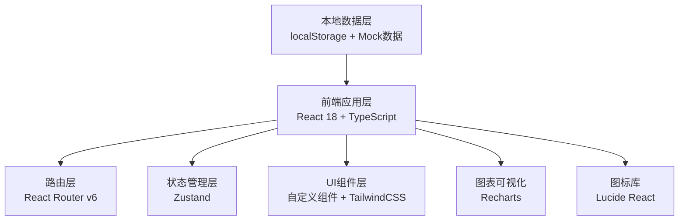
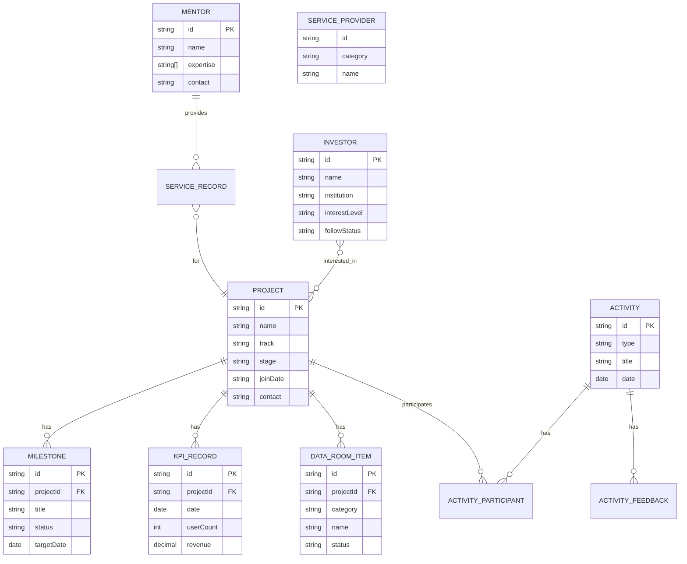

## 1. 架构设计



## 2. 技术描述

- **前端框架**: React@18.2.0 + TypeScript@5.0.0
- **构建工具**: Vite@5.0.0
- **样式方案**: TailwindCSS@3.4.0
- **状态管理**: Zustand@4.4.0
- **路由管理**: React Router@6.20.0
- **图表库**: Recharts@2.10.0
- **图标库**: Lucide React@0.294.0
- **后端**: 纯前端方案，使用localStorage持久化 + Mock数据
- **数据存储**: localStorage 作为数据持久化方案

## 3. 路由定义

| 路由路径 | 页面组件 | 功能描述 |
|---------|----------|----------|
| `/` | Dashboard | 数据概览仪表盘 |
| `/projects` | ProjectList | 项目列表页 |
| `/projects/:id` | ProjectDetail | 项目详情页 |
| `/projects/:id/canvas` | BusinessCanvas | 商业模式画布 |
| `/milestones` | MilestoneList | 里程碑列表 |
| `/milestones/:projectId` | ProjectMilestones | 项目里程碑详情 |
| `/mentors` | MentorList | 导师资源管理 |
| `/investors` | InvestorList | 投资人管理 |
| `/providers` | ProviderList | 服务商管理 |
| `/activities` | ActivityList | 活动列表 |
| `/activities/:id` | ActivityDetail | 活动详情 |
| `/dataroom` | DataRoom | 数据室管理 |
| `/dataroom/:projectId` | ProjectDataRoom | 项目尽调材料 |

## 4. API 定义（本地数据接口）

```typescript
// 项目档案类型
interface Project {
  id: string;
  name: string;
  track: string;
  foundingTeam: TeamMember[];
  contact: string;
  joinDate: string;
  stage: 'idea' | 'validation' | 'development' | 'launch' | 'growth';
  description: string;
  businessCanvas: BusinessCanvas;
  milestones: Milestone[];
  kpiRecords: KPIRecord[];
}

interface TeamMember {
  id: string;
  name: string;
  role: string;
  avatar?: string;
}

interface BusinessCanvas {
  customers: string;
  valueProposition: string;
  channels: string;
  customerRelationships: string;
  revenueStreams: string;
  keyResources: string;
  keyActivities: string;
  keyPartnerships: string;
  costStructure: string;
}

// 里程碑类型
interface Milestone {
  id: string;
  projectId: string;
  title: string;
  description: string;
  targetDate: string;
  status: 'pending' | 'in_progress' | 'completed' | 'delayed';
  completedDate?: string;
}

interface KPIRecord {
  id: string;
  projectId: string;
  date: string;
  userCount: number;
  revenue: number;
  financingProgress: number;
}

// 资源类型
interface Mentor {
  id: string;
  name: string;
  expertise: string[];
  avatar?: string;
  contact: string;
  serviceRecords: ServiceRecord[];
}

interface ServiceRecord {
  id: string;
  date: string;
  projectId: string;
  content: string;
}

interface Investor {
  id: string;
  name: string;
  institution: string;
  interestLevel: 'high' | 'medium' | 'low';
  followStatus: 'contacted' | 'meeting' | 'negotiating' | 'invested' | 'lost';
  contact: string;
  projects: string[];
}

interface ServiceProvider {
  id: string;
  category: 'legal' | 'finance' | 'brand' | 'technology';
  name: string;
  contact: string;
  description: string;
}

// 活动类型
interface Activity {
  id: string;
  type: 'roadshow' | 'training' | 'networking';
  title: string;
  date: string;
  location: string;
  description: string;
  participants: ActivityParticipant[];
  feedback: ActivityFeedback[];
}

interface ActivityParticipant {
  projectId: string;
  signInTime?: string;
  status: 'registered' | 'signed_in' | 'absent';
}

interface ActivityFeedback {
  projectId: string;
  rating: number;
  comment: string;
}

// 数据室类型
interface DataRoomItem {
  id: string;
  projectId: string;
  category: string;
  name: string;
  required: boolean;
  status: 'pending' | 'uploaded' | 'verified';
  uploadedDate?: string;
}
```

## 5. 数据模型 ER 图



## 6. 目录结构

```
src/
├── components/          # 公共组件
│   ├── Layout/         # 布局组件
│   ├── ui/             # 基础UI组件
│   └── charts/         # 图表组件
├── pages/              # 页面组件
│   ├── Dashboard/
│   ├── Projects/
│   ├── Milestones/
│   ├── Resources/
│   ├── Activities/
│   └── DataRoom/
├── store/              # 状态管理
│   ├── useProjectStore.ts
│   ├── useResourceStore.ts
│   ├── useActivityStore.ts
│   └── useDataRoomStore.ts
├── types/              # 类型定义
│   └── index.ts
├── data/               # Mock数据
│   └── mockData.ts
├── utils/              # 工具函数
│   ├── helpers.ts
│   └── constants.ts
├── App.tsx
├── main.tsx
└── index.css
```
