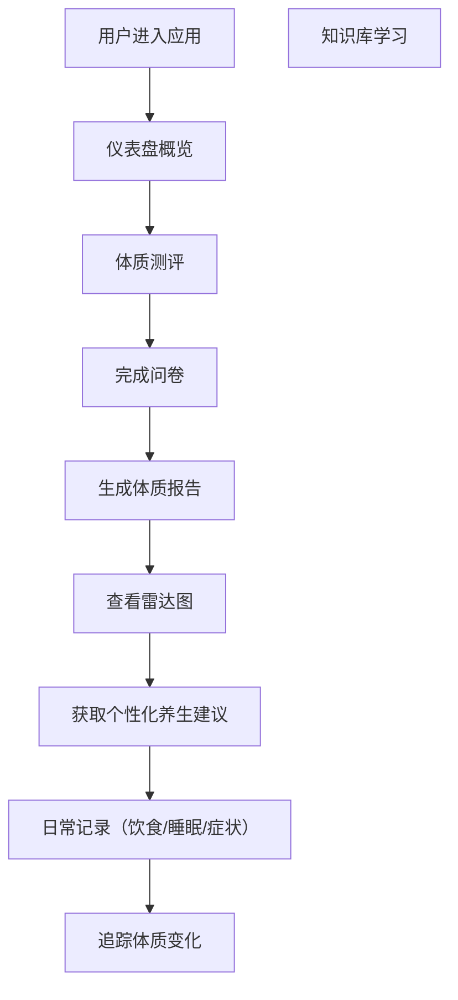
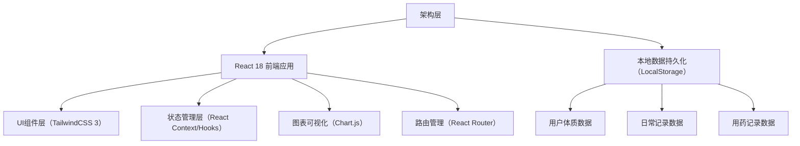

## 1. 产品概述

本产品是一个完整的在线中医体质管理和养生指导工具，旨在帮助用户通过中医九种体质测评了解自身体质特点，获取个性化养生建议，追踪健康状态，实现中医养生的科学化和日常化。

- 主要目的：提供中医体质测评、个性化养生指导、健康数据追踪、中医知识学习
- 目标用户：关注健康养生、希望了解自身体质并进行日常健康管理的普通人群
- 产品价值：将传统中医理论与现代健康管理结合，让用户便捷地获得专业的中医体质管理服务

## 2. 核心功能

### 2.1 用户角色
| 角色 | 注册方式 | 核心权限 |
|------|----------|----------|
| 普通用户 | 无需注册，本地存储 | 使用全部功能，数据本地持久化存储 |

### 2.2 功能模块
1. **体质评估模块**：九种体质测评问卷、雷达图可视化、体质变化追踪
2. **养生建议模块**：个性化养生建议、季节养生提醒、穴位推荐
3. **日常记录模块**：饮食日志、睡眠精力记录、症状日记
4. **中药食疗管理模块**：用药记录、药食同源食材收藏
5. **知识库模块**：中医基础知识学习

### 2.3 页面详情
| 页面名称 | 模块名称 | 功能描述 |
|---------|----------|----------|
| 首页/仪表盘 | 概览卡片 | 展示当前体质状态、今日养生提醒、最近记录概览 |
| 体质评估 | 测评问卷 | 中医九种体质标准测评量表（60道题目） |
| 体质评估 | 结果可视化 | 九种体质得分雷达图展示 |
| 体质评估 | 历史追踪 | 多次评估结果对比折线图 |
| 养生建议 | 个性化建议 | 基于体质的饮食、起居、运动、情志综合建议 |
| 养生建议 | 季节养生 | 不同季节不同体质的养生要点 |
| 养生建议 | 穴位推荐 | 常用保健穴位图示和按摩方法 |
| 日常记录 | 饮食日志 | 参照体质饮食建议执行情况记录 |
| 日常记录 | 睡眠精力 | 每日睡眠质量和精力状态记录 |
| 日常记录 | 症状日记 | 身体不适症状记录与体质关联分析 |
| 中药食疗 | 用药管理 | 医生处方用药记录和效果追踪 |
| 中药食疗 | 食材收藏 | 药食同源食材功效和用法 |
| 知识库 | 基础理论 | 阴阳五行、经络、气血津液基础概念学习 |

## 3. 核心流程

## 4. 用户界面设计

### 4.1 设计风格
- **主色调**：中医药传统色彩搭配，以沉稳的青绿（#2C5F2D）作为主色，体现中医沉稳、自然的理念
- **辅助色**：柔和的米色（#F5F0E1）作为背景，温暖的赭石色（#B5651D）作为强调色
- **中性色**：深棕色系为主，体现传统与现代结合
- **按钮风格**：圆润柔和的圆角设计，带有微妙的阴影，自然过渡
- **字体**：思源宋体（标题）+ 思源黑体（正文），体现传统与现代结合
- **布局风格**：卡片式布局，留白充足，层次分明
- **图标风格**：线性图标，融入中医元素（阴阳、五行、草药等）

### 4.2 页面设计概览
| 页面名称 | 模块名称 | UI元素 |
|---------|----------|--------|
| 仪表盘 | 概览卡片 | 柔和渐变背景，卡片悬停微动效，数据可视化图表 |
| 体质测评 | 问卷页面 | 进度条指示，单选按钮柔和过渡，题目卡片 |
| 结果展示 | 雷达图 | 交互式雷达图，点击查看详情，动画展示 |
| 养生建议 | 建议卡片 | 分类标签，图标，详细内容展开收起 |
| 穴位推荐 | 穴位卡片 | 人体穴位示意图，按摩方法说明 |
| 日常记录 | 记录表单 | 日历选择器，表单输入，历史记录列表 |
| 知识库 | 学习笔记 | 分类导航，内容卡片，展开阅读 |

### 4.3 响应式
- 桌面端优先设计，适配1200px以上
- 移动端自适应，768px以下优化
- 触控优化，确保移动端表单输入体验流畅

