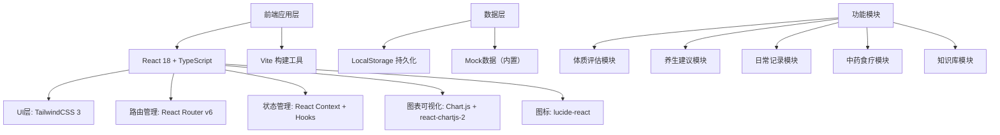
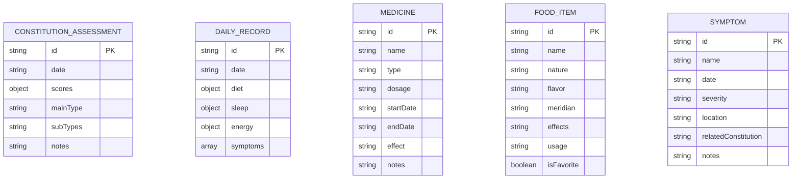

## 1. 架构设计



## 2. 技术描述

- **前端**: React@18 + TypeScript + TailwindCSS@3
- **初始化工具**: vite-init
- **后端**: 无后端，纯前端应用
- **数据库**: LocalStorage 本地存储
- **数据**: 内置Mock数据，包含完整的体质测评问卷、养生建议、穴位数据、中医知识库等

## 3. 路由定义

| 路由 | 页面 | 功能描述 |
|------|------|----------|
| / | 仪表盘 | 体质概览、今日提醒、最近记录 |
| /assessment | 体质测评 | 中医九种体质测评问卷 |
| /assessment/result | 测评结果 | 雷达图展示、体质分析 |
| /assessment/history | 历史追踪 | 多次测评结果对比 |
| /advice | 养生建议 | 个性化综合建议 |
| /advice/seasonal | 季节养生 | 不同季节养生要点 |
| /advice/acupoints | 穴位推荐 | 穴位图示与按摩方法 |
| /records/diet | 饮食日志 | 饮食记录与体质建议对照 |
| /records/sleep | 睡眠精力 | 睡眠质量和精力记录 |
| /records/symptoms | 症状日记 | 症状记录与体质分析 |
| /medicine | 用药管理 | 中药处方记录与效果追踪 |
| /medicine/foods | 食材收藏 | 药食同源食材功效用法 |
| /knowledge | 知识库 | 中医基础理论学习 |

## 4. 数据模型

### 4.1 数据模型定义



### 4.2 核心数据结构

#### 体质测评结果
```typescript
interface ConstitutionResult {
  id: string;
  date: string;
  scores: {
    pinghe: number;      // 平和质
    qixu: number;        // 气虚质
    yangxu: number;      // 阳虚质
    yinxu: number;       // 阴虚质
    tanshi: number;      // 痰湿质
    shire: number;       // 湿热质
    xueyu: number;       // 血瘀质
    qiyu: number;        // 气郁质
    tebing: number;      // 特禀质
  };
  mainType: string;
  subTypes: string[];
}
```

#### 日常记录
```typescript
interface DailyRecord {
  id: string;
  date: string;
  diet: {
    breakfast: string;
    lunch: string;
    dinner: string;
    snacks: string;
    compliance: number; // 饮食遵循度 0-100
  };
  sleep: {
    quality: number;    // 1-5
    duration: number;   // 小时
    bedtime: string;
    wakeTime: string;
  };
  energy: {
    morning: number;    // 1-10
    afternoon: number;  // 1-10
    evening: number;    // 1-10
  };
  symptoms: Symptom[];
}
```

#### 养生建议
```typescript
interface HealthAdvice {
  constitution: string;
  diet: string[];
  lifestyle: string[];
  exercise: string[];
  emotion: string[];
  acupoints: string[];
  seasonal: {
    spring: string[];
    summer: string[];
    autumn: string[];
    winter: string[];
  };
}
```

## 5. 功能模块说明

### 5.1 体质评估模块
- **测评问卷**: 60道标准化题目，覆盖九种体质类型
- **得分计算**: 按照中华中医药学会标准算法计算
- **雷达图可视化**: 九维雷达图直观展示各体质得分
- **历史对比**: 折线图展示多次测评的体质变化趋势

### 5.2 养生建议模块
- **个性化建议**: 根据体质类型生成饮食、起居、运动、情志建议
- **季节养生**: 春夏秋冬四季针对性养生要点
- **穴位推荐**: 人体穴位图示，按摩方法详细说明

### 5.3 日常记录模块
- **饮食日志**: 记录三餐，对照体质饮食建议评分
- **睡眠精力**: 记录睡眠时长、质量和每日精力变化
- **症状日记**: 记录身体不适，关联体质分析

### 5.4 中药食疗模块
- **用药管理**: 记录处方用药、剂量、效果
- **食材收藏**: 药食同源食材功效、用法、宜忌

### 5.5 知识库模块
- **中医基础**: 阴阳五行、经络、气血津液概念讲解
- **学习笔记**: 可收藏、标记的学习内容

## 6. 技术实现要点

1. **状态持久化**: 使用React Context + useReducer管理全局状态，自动同步到LocalStorage
2. **图表渲染**: 使用Chart.js实现雷达图、折线图等数据可视化
3. **表单处理**: 使用React Hooks处理复杂表单，支持分步问卷
4. **动画效果**: CSS transitions实现流畅的页面切换和交互反馈
5. **响应式设计**: TailwindCSS响应式类适配不同屏幕尺寸
6. **类型安全**: TypeScript全程类型定义，确保代码健壮性
