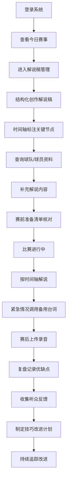

## 1. 产品概述

在线赛事直播解说和比赛评论管理工具，为体育解说员提供一站式的解说准备、执行和复盘解决方案。

- **主要用途**：帮助解说员高效管理解说稿、球队资料、复盘记录和赛程安排，提升解说专业性和工作效率
- **目标用户**：体育赛事解说员、评论员、直播主持
- **解决问题**：解说资料分散、准备不充分、复盘无记录、排班混乱等痛点

**产品价值**：
- 集中化管理所有解说相关资源，实现赛前、赛中、赛后全流程数字化
- 提供结构化的解说稿创作模板，提升解说内容的专业性和完整性
- 建立球队和运动员资料库，支持解说时快速调用关键数据
- 通过复盘系统持续改进解说技巧，提升解说质量

---

## 2. 核心功能

### 2.1 用户角色

| 角色 | 注册方式 | 核心权限 |
|------|----------|----------|
| 解说员 | 账号登录 | 解说稿管理、资料查询、复盘记录、查看个人排班 |
| 管理员 | 账号登录 | 全部功能权限、赛程排班、解说员管理 |

### 2.2 功能模块

1. **首页/仪表盘**：今日赛事概览、待办提醒、快捷入口
2. **解说稿管理**：结构化创作、时间轴标注、备用台词库
3. **球队资料库**：球队档案、运动员档案、数据快速查询
4. **解说复盘**：录音笔记、听众反馈、技巧改进记录
5. **赛程管理**：排班日历、赛前准备清单、解说员档案

### 2.3 页面详情

| 页面名称 | 模块名称 | 功能描述 |
|---------|----------|----------|
| 首页/仪表盘 | 今日概览 | 显示当日解说任务、倒计时、快捷操作入口 |
| 首页/仪表盘 | 待办清单 | 赛前准备待办事项、进度追踪 |
| 首页/仪表盘 | 数据统计 | 本月解说场次、评分趋势、常用资料 |
| 解说稿管理 | 稿件列表 | 所有解说稿的列表展示、筛选、搜索 |
| 解说稿管理 | 结构化创作 | 背景介绍/队伍介绍/战术分析/历史对决/悬念预设分段编辑 |
| 解说稿管理 | 时间轴标注 | 可视化时间轴，标记各时间点解说重点 |
| 解说稿管理 | 备用台词库 | 断播/延误/意外等紧急情况的台词分类管理 |
| 球队资料库 | 球队列表 | 球队档案列表、按赛事类型筛选 |
| 球队资料库 | 球队档案详情 | 队史/主教练/核心球员/近期成绩展示 |
| 球队资料库 | 运动员列表 | 运动员档案列表、搜索筛选 |
| 球队资料库 | 运动员详情 | 基本信息/职业生涯数据/技术特点/个人故事 |
| 球队资料库 | 数据查询 | 多维度快速查询，支持解说时快速调用 |
| 解说复盘 | 复盘列表 | 每场解说的复盘记录列表 |
| 解说复盘 | 录音笔记 | 录音回放、打点标记、优缺点记录 |
| 解说复盘 | 听众反馈 | 反馈收集、分类整理、关键词统计 |
| 解说复盘 | 技巧改进 | 语速控制/专业术语/煽情时机的练习记录和追踪 |
| 赛程管理 | 排班日历 | 月/周视图展示解说排班，支持拖拽调整 |
| 赛程管理 | 赛前准备清单 | 资料收集/器材测试/备稿的准备流程和核对 |
| 赛程管理 | 解说员档案 | 个人风格/擅长项目/评价记录 |

---

## 3. 核心流程

### 3.1 解说准备流程

解说员登录系统后，首先查看首页的今日任务和待办事项。选择即将进行的比赛，进入解说稿管理模块，使用结构化模板创作文稿，在时间轴上标注关键解说点，并查阅备用台词库。同时在球队资料库中快速查询对阵双方的球队和球员数据，补充到解说稿中。赛前按照准备清单逐项核对，确保准备充分。

### 3.2 解说执行流程

比赛进行中，解说员可以打开时间轴标注界面，按照预设的时间点进行解说。遇到紧急情况时，快速打开备用台词库获取合适的串词。需要数据支撑时，使用数据快速查询界面调取关键统计数据。

### 3.3 赛后复盘流程

比赛结束后，解说员上传解说录音，在复盘模块中回听并记录优缺点。收集整理听众反馈，分析问题所在。在技巧改进记录中制定提升计划，追踪练习进度，形成完整的PDCA改进循环。

---

## 4. 用户界面设计

### 4.1 设计风格

- **主色调**：深靛蓝 (#1e3a5f)，代表专业和稳重
- **辅助色**：活力橙 (#ff6b35)，用于强调和交互元素
- **中性色**：深灰 (#2d3748)、中灰 (#718096)、浅灰 (#e2e8f0)、白色 (#ffffff)
- **按钮风格**：圆角矩形，带有微妙的阴影和悬停动效，主按钮采用渐变效果
- **字体选择**：
  - 标题字体：'Noto Serif SC'，庄重专业，适合体育赛事氛围
  - 正文字体：'Noto Sans SC'，清晰易读
- **布局风格**：卡片式布局，左侧导航 + 右侧内容区的经典管理后台架构
- **图标风格**：线性图标，统一2px描边，配合主题色

### 4.2 页面设计概览

| 页面名称 | 模块名称 | UI元素 |
|---------|----------|--------|
| 首页/仪表盘 | 今日概览 | 大号倒计时卡片、赛事信息卡、渐变色进度条、微动画数字 |
| 首页/仪表盘 | 待办清单 | 勾选复选框、进度圆环、悬停高亮效果 |
| 首页/仪表盘 | 数据统计 | 数据卡片网格、迷你趋势图、图标动画 |
| 解说稿管理 | 结构化创作 | 分段标签页、富文本编辑器、自动保存指示器 |
| 解说稿管理 | 时间轴标注 | 横向时间轴、可拖动标记点、时间刻度、悬停预览 |
| 解说稿管理 | 备用台词库 | 分类标签、卡片式展示、一键复制按钮、关键词高亮 |
| 球队资料库 | 球队/球员详情 | 信息网格、数据可视化图表、标签系统、故事时间线 |
| 解说复盘 | 录音笔记 | 音频波形播放器、打点标记器、分段评论区 |
| 解说复盘 | 技巧改进 | 技能雷达图、练习日志时间线、目标进度追踪 |
| 赛程管理 | 排班日历 | 月/周视图切换、彩色事件块、拖拽调整、弹出详情层 |
| 赛程管理 | 准备清单 | 分步进度条、可折叠步骤、完成状态动画 |

### 4.3 响应式设计

- **设计原则**：桌面优先，移动端自适应
- **断点设置**：
  - 桌面端：≥ 1280px，完整侧边栏 + 内容区
  - 平板端：768px - 1279px，折叠式侧边栏 + 内容区
  - 移动端：< 768px，底部导航栏，垂直堆叠内容
- **触摸优化**：移动端按钮最小高度48px，增大点击区域，支持滑动操作

### 4.4 动效与交互

- **页面加载**：错落有致的卡片入场动画，使用 animation-delay 创造层次感
- **导航切换**：平滑的内容淡入淡出过渡
- **按钮交互**：悬停时微妙的上浮和阴影加深，点击时的缩放反馈
- **数据更新**：数字变化时的滚动动画，图表数据的渐进式加载
- **时间轴交互**：标记点的拖拽吸附效果，时间刻度的缩放动画
- **表单交互**：输入框聚焦时的边框高亮，验证错误的震动提示
