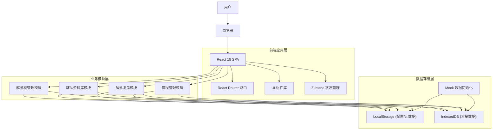
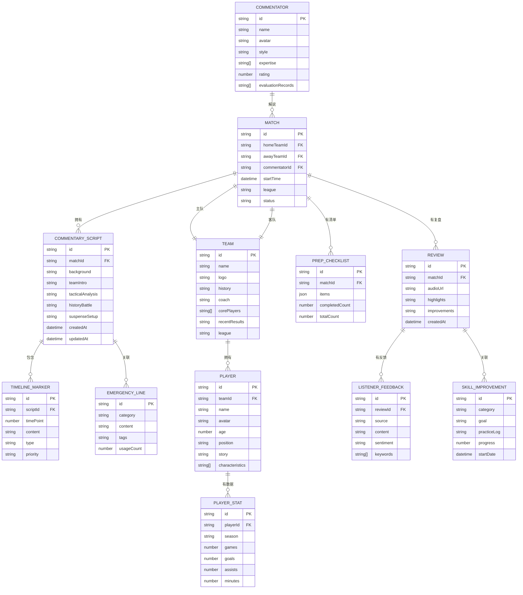

## 1. 架构设计

本系统采用纯前端架构，使用 React 18 构建单页应用，数据存储采用浏览器本地存储（localStorage）和 IndexedDB 结合的方式，支持离线使用。



---

## 2. 技术描述

### 2.1 技术栈选择

| 技术 | 版本 | 用途 |
|------|------|------|
| React | 18.x | 前端框架 |
| TypeScript | 5.x | 类型系统 |
| Vite | 5.x | 构建工具 |
| Tailwind CSS | 3.4 | CSS 框架 |
| React Router | 6.x | 路由管理 |
| Zustand | 4.x | 状态管理 |
| Recharts | 2.x | 图表可视化 |
| Lucide React | latest | 图标库 |
| uuid | latest | 唯一ID生成 |

### 2.2 初始化方式

使用 Vite 官方初始化命令创建 React + TypeScript 项目：
```bash
npm create vite@latest . -- --template react-ts
```

### 2.3 数据存储方案

- **LocalStorage**：存储用户配置、界面状态、小型元数据
- **IndexedDB**：存储解说稿内容、录音元数据、大量球队/球员资料
- **Mock 数据**：首次加载时初始化示例数据，包含完整的演示内容

---

## 3. 路由定义

| 路由路径 | 页面名称 | 说明 |
|---------|----------|------|
| `/` | 首页/仪表盘 | 今日赛事概览、待办清单、数据统计 |
| `/scripts` | 解说稿管理 - 列表 | 解说稿列表展示、搜索筛选 |
| `/scripts/new` | 解说稿管理 - 新建 | 新建解说稿，结构化创作 |
| `/scripts/:id` | 解说稿管理 - 编辑 | 编辑解说稿、时间轴标注、备用台词 |
| `/teams` | 球队资料库 - 球队列表 | 球队档案列表、筛选 |
| `/teams/:id` | 球队资料库 - 球队详情 | 球队详细信息展示 |
| `/players` | 球队资料库 - 球员列表 | 运动员档案列表、搜索 |
| `/players/:id` | 球队资料库 - 球员详情 | 运动员详细信息 |
| `/players/query` | 球队资料库 - 数据查询 | 快速数据查询界面 |
| `/reviews` | 解说复盘 - 复盘列表 | 复盘记录列表 |
| `/reviews/:id` | 解说复盘 - 复盘详情 | 录音笔记、听众反馈 |
| `/reviews/skills` | 解说复盘 - 技巧改进 | 技巧改进记录和追踪 |
| `/schedule` | 赛程管理 - 排班日历 | 解说排班日历视图 |
| `/schedule/checklist/:matchId` | 赛程管理 - 准备清单 | 赛前准备清单 |
| `/commentators` | 赛程管理 - 解说员档案 | 解说员档案列表和详情 |

---

## 4. 数据模型

### 4.1 实体关系图



### 4.2 核心数据类型定义

```typescript
// 解说员
interface Commentator {
  id: string;
  name: string;
  avatar?: string;
  style: string;
  expertise: string[];
  rating: number;
  evaluationRecords: string[];
}

// 比赛
interface Match {
  id: string;
  homeTeamId: string;
  awayTeamId: string;
  commentatorId: string;
  startTime: string;
  league: string;
  status: 'upcoming' | 'live' | 'completed';
  homeTeam?: Team;
  awayTeam?: Team;
  commentator?: Commentator;
}

// 解说稿
interface CommentaryScript {
  id: string;
  matchId: string;
  background: string;
  teamIntro: string;
  tacticalAnalysis: string;
  historyBattle: string;
  suspenseSetup: string;
  createdAt: string;
  updatedAt: string;
  match?: Match;
}

// 时间轴标记
interface TimelineMarker {
  id: string;
  scriptId: string;
  timePoint: number;
  content: string;
  type: 'general' | 'key' | 'warning';
  priority: 'high' | 'medium' | 'low';
}

// 备用台词
interface EmergencyLine {
  id: string;
  category: 'interruption' | 'delay' | 'accident' | 'other';
  content: string;
  tags: string[];
  usageCount: number;
}

// 球队
interface Team {
  id: string;
  name: string;
  logo?: string;
  history: string;
  coach: string;
  corePlayers: string[];
  recentResults: string;
  league: string;
}

// 球员
interface Player {
  id: string;
  teamId: string;
  name: string;
  avatar?: string;
  age: number;
  position: string;
  story: string;
  characteristics: string[];
  team?: Team;
}

// 球员数据
interface PlayerStat {
  id: string;
  playerId: string;
  season: string;
  games: number;
  goals: number;
  assists: number;
  minutes: number;
}

// 复盘记录
interface Review {
  id: string;
  matchId: string;
  audioUrl?: string;
  highlights: string;
  improvements: string;
  createdAt: string;
  match?: Match;
}

// 听众反馈
interface ListenerFeedback {
  id: string;
  reviewId: string;
  source: string;
  content: string;
  sentiment: 'positive' | 'neutral' | 'negative';
  keywords: string[];
}

// 技巧改进
interface SkillImprovement {
  id: string;
  category: 'speech_speed' | 'terminology' | 'emotion' | 'other';
  goal: string;
  practiceLog: string;
  progress: number;
  startDate: string;
}

// 准备清单
interface PrepChecklist {
  id: string;
  matchId: string;
  items: ChecklistItem[];
  completedCount: number;
  totalCount: number;
}

interface ChecklistItem {
  id: string;
  title: string;
  description: string;
  category: 'data' | 'equipment' | 'script';
  completed: boolean;
}
```

---

## 5. 目录结构

```
src/
├── assets/              # 静态资源
│   ├── fonts/          # 字体文件
│   └── images/         # 图片资源
├── components/         # 通用组件
│   ├── Layout/         # 布局组件
│   ├── ui/             # 基础UI组件
│   └── charts/         # 图表组件
├── pages/              # 页面组件
│   ├── Dashboard/      # 首页仪表盘
│   ├── Scripts/        # 解说稿管理
│   ├── Teams/          # 球队资料库
│   ├── Reviews/        # 解说复盘
│   └── Schedule/       # 赛程管理
├── store/              # 状态管理
│   ├── useScriptStore.ts
│   ├── useTeamStore.ts
│   ├── useReviewStore.ts
│   └── useScheduleStore.ts
├── types/              # 类型定义
│   └── index.ts
├── data/               # Mock数据
│   ├── mockTeams.ts
│   ├── mockPlayers.ts
│   ├── mockScripts.ts
│   └── mockMatches.ts
├── utils/              # 工具函数
│   ├── storage.ts      # 本地存储工具
│   ├── date.ts         # 日期处理
│   └── helpers.ts      # 通用工具
├── hooks/              # 自定义Hooks
│   ├── useLocalStorage.ts
│   └── useDebounce.ts
├── App.tsx
├── main.tsx
└── index.css
```
