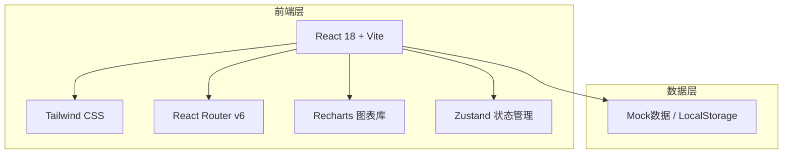
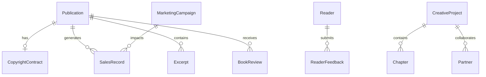

## 1. 架构设计



## 2. 技术说明

- **前端框架**: React@18 + TypeScript
- **构建工具**: Vite
- **样式方案**: Tailwind CSS@3
- **路由**: React Router v6
- **图表库**: Recharts（轻量级React图表，支持折线图/饼图/柱状图）
- **状态管理**: Zustand（轻量级，适合中型应用）
- **图标**: Lucide React
- **初始化工具**: Vite (npm create vite@latest)
- **后端**: 无（纯前端，使用Mock数据+LocalStorage持久化）
- **数据库**: 无（LocalStorage + 内存Mock数据）

## 3. 路由定义

| 路由 | 用途 |
|------|------|
| / | 仪表盘首页 - 数据概览、近期动态、快捷操作 |
| /publications | 出版物档案 - 出版物列表、时间线、版权合同 |
| /publications/:id | 出版物详情 - 单本出版物完整信息 |
| /sales | 销售数据 - 渠道汇总、趋势图、营销追踪 |
| /readers | 读者互动 - 反馈分类、FAQ、读者档案 |
| /planning | 创作计划 - 策划文档、进度追踪、合作方 |
| /marketing | 内容营销 - 书摘发布、媒体采访、书评收集 |

## 4. API定义

无后端API，使用前端Mock数据。所有数据操作通过Zustand Store + LocalStorage完成。

核心数据类型定义：

```typescript
interface Publication {
  id: string;
  title: string;
  type: 'book' | 'ebook' | 'column' | 'report';
  coverImage: string;
  publishDate: string;
  description: string;
  isbn?: string;
  price: number;
  contract?: CopyrightContract;
}

interface CopyrightContract {
  id: string;
  publicationId: string;
  royaltyRate: number;
  startDate: string;
  endDate: string;
  publisher: string;
  status: 'active' | 'expired' | 'negotiating';
}

interface SalesRecord {
  id: string;
  publicationId: string;
  channel: string;
  quantity: number;
  revenue: number;
  date: string;
}

interface MarketingCampaign {
  id: string;
  name: string;
  type: 'discount' | 'media' | 'launch' | 'other';
  startDate: string;
  endDate: string;
  description: string;
  impact: { before: number; after: number };
}

interface ReaderFeedback {
  id: string;
  readerId: string;
  category: 'praise' | 'criticism' | 'question' | 'suggestion';
  content: string;
  date: string;
  priority: 'high' | 'medium' | 'low';
  resolved: boolean;
}

interface FAQ {
  id: string;
  question: string;
  answer: string;
  category: string;
  order: number;
}

interface Reader {
  id: string;
  name: string;
  email: string;
  avatar: string;
  tags: string[];
  interactionCount: number;
  lastContactDate: string;
  notes: string;
}

interface CreativeProject {
  id: string;
  title: string;
  status: 'planning' | 'writing' | 'editing' | 'published';
  targetDate: string;
  progress: number;
  outline: string;
  targetAudience: string;
  marketResearch: string;
  chapters: Chapter[];
}

interface Chapter {
  id: string;
  title: string;
  status: 'todo' | 'writing' | 'done';
  wordCount: number;
}

interface Partner {
  id: string;
  name: string;
  company: string;
  role: string;
  email: string;
  phone: string;
  status: 'negotiating' | 'contracted' | 'completed';
  notes: string;
}

interface Excerpt {
  id: string;
  publicationId: string;
  title: string;
  content: string;
  publishDate: string;
  platform: string;
  views: number;
}

interface MediaInterview {
  id: string;
  title: string;
  mediaName: string;
  date: string;
  url: string;
  influenceRating: number;
}

interface BookReview {
  id: string;
  publicationId: string;
  source: string;
  rating: number;
  content: string;
  sentiment: 'positive' | 'neutral' | 'negative';
  date: string;
}
```

## 5. 服务端架构图

不适用（纯前端项目）

## 6. 数据模型

### 6.1 数据模型定义



### 6.2 数据定义语言

使用TypeScript接口定义 + JSON Mock数据文件，存储于 `src/data/mockData.ts`。

LocalStorage键值规划：
- `pub_vault_publications` - 出版物数据
- `pub_vault_sales` - 销售数据
- `pub_vault_readers` - 读者数据
- `pub_vault_planning` - 创作计划数据
- `pub_vault_marketing` - 内容营销数据
