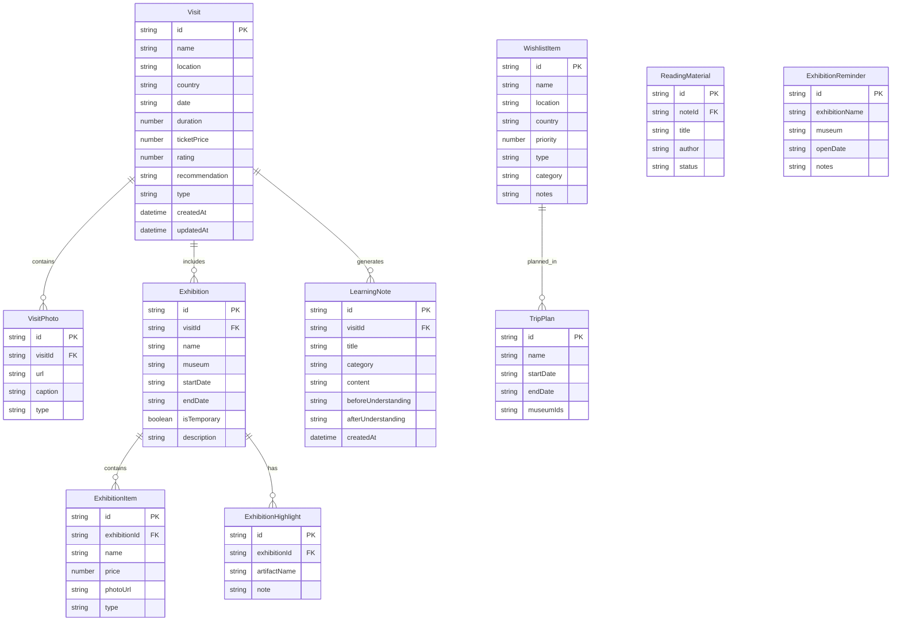

## 1. 架构设计

```mermaid
flowchart TD
    "前端应用 (React + Vite)" --> "状态管理 (Zustand)"
    "状态管理 (Zustand)" --> "本地存储 (localStorage)"
    "前端应用 (React + Vite)" --> "UI组件层"
    "UI组件层" --> "页面组件"
    "页面组件" --> "通用组件"
    "前端应用 (React + Vite)" --> "路由层 (React Router)"
```

## 2. 技术说明

- 前端：React@18 + TypeScript + Tailwind CSS@3 + Vite
- 初始化工具：vite-init
- 后端：无（纯前端应用，数据存储于 localStorage）
- 数据库：无（使用 localStorage + Zustand persist 中间件持久化）
- 图表库：recharts（用于统计数据可视化）
- 图标库：lucide-react

## 3. 路由定义

| 路由 | 用途 |
|------|------|
| / | 首页，个人文化探索概览 |
| /visits | 参观记录列表页 |
| /visits/new | 新增参观记录页 |
| /visits/:id | 参观详情页 |
| /exhibitions | 展览追踪列表页 |
| /exhibitions/new | 新增展览记录页 |
| /notes | 学习笔记页 |
| /wishlist | 愿望清单页 |
| /statistics | 统计数据页 |

## 4. API 定义

无后端 API，所有数据操作通过 Zustand store 在本地完成。

## 5. 服务器架构图

不适用（纯前端应用）

## 6. 数据模型

### 6.1 数据模型定义



### 6.2 数据定义语言

使用 TypeScript 接口定义数据结构，通过 Zustand persist 中间件存储到 localStorage：

```typescript
interface Visit {
  id: string;
  name: string;
  location: string;
  country: string;
  date: string;
  duration: number;
  ticketPrice: number;
  rating: number;
  recommendation: string;
  type: 'art' | 'history' | 'science' | 'nature' | 'other';
  createdAt: string;
  updatedAt: string;
  photos: VisitPhoto[];
}

interface VisitPhoto {
  id: string;
  url: string;
  caption: string;
  type: 'photo' | 'sketch';
}

interface Exhibition {
  id: string;
  visitId: string;
  name: string;
  museum: string;
  startDate: string;
  endDate: string;
  isTemporary: boolean;
  description: string;
  items: ExhibitionItem[];
  highlights: ExhibitionHighlight[];
}

interface ExhibitionItem {
  id: string;
  name: string;
  price: number;
  photoUrl: string;
  type: 'catalog' | 'souvenir';
}

interface ExhibitionHighlight {
  id: string;
  artifactName: string;
  note: string;
}

interface LearningNote {
  id: string;
  visitId?: string;
  title: string;
  category: 'event' | 'person' | 'culture' | 'other';
  content: string;
  beforeUnderstanding: string;
  afterUnderstanding: string;
  readingMaterials: ReadingMaterial[];
  createdAt: string;
}

interface ReadingMaterial {
  id: string;
  title: string;
  author: string;
  status: 'unread' | 'reading' | 'read';
}

interface WishlistItem {
  id: string;
  name: string;
  location: string;
  country: string;
  priority: number;
  type: 'art' | 'history' | 'science' | 'nature' | 'other';
  category: 'global' | 'domestic';
  notes: string;
}

interface TripPlan {
  id: string;
  name: string;
  startDate: string;
  endDate: string;
  museumIds: string[];
}

interface ExhibitionReminder {
  id: string;
  exhibitionName: string;
  museum: string;
  openDate: string;
  notes: string;
}
```
