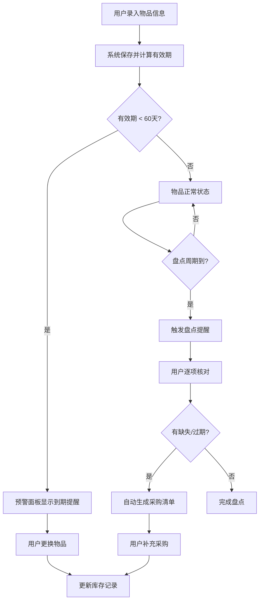
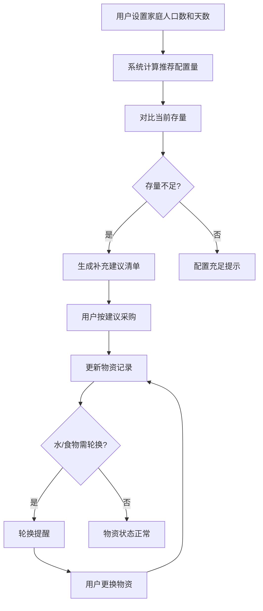

## 1. 产品概述

在线家庭急救箱盘点和应急物资管理工具，帮助家庭系统化管理急救箱物品、应急储备物资和药品，提供有效期预警、盘点提醒、轮换管理和急救知识关联等核心能力。
- 目标用户：注重家庭安全与健康的普通家庭用户，尤其是有儿童或老人的家庭
- 核心价值：让家庭急救物资从"买了就忘"变为"随时可用、及时更新"，关键时刻不掉链子

## 2. 核心功能

### 2.1 用户角色

| 角色 | 注册方式 | 核心权限 |
|------|----------|----------|
| 家庭管理员 | 邮箱/手机注册 | 管理急救箱、物资、药品，设置预警规则，查看所有记录 |
| 家庭成员 | 管理员邀请 | 查看物资清单，记录物品使用 |

### 2.2 功能模块

1. **急救箱管理页**：急救箱物品清单、有效期预警面板、盘点提醒
2. **应急物资管理页**：应急储备物资清单、轮换提醒、按人口/天数推荐配置计算
3. **药品分类管理页**：处方药/OTC区分、儿童药品标注、存放位置标注
4. **使用记录页**：物品使用记录、补充采购清单、采购历史
5. **知识关联页**：急救物品与急救知识关联、急救操作指南
6. **仪表盘首页**：预警汇总、盘点状态、库存概览

### 2.3 页面详情

| 页面名称 | 模块名称 | 功能描述 |
|----------|----------|----------|
| 仪表盘首页 | 预警汇总 | 显示即将过期物品（60天内）、需要轮换的物资、库存低于安全数量的物品 |
| 仪表盘首页 | 盘点状态 | 显示距上次盘点天数、下次盘点日期、盘点进度 |
| 仪表盘首页 | 库存概览 | 各类物资数量统计图表、健康度评分 |
| 急救箱管理页 | 物品清单 | 录入/编辑急救箱物品（名称/数量/规格/有效期/用途），支持分类筛选和搜索 |
| 急救箱管理页 | 有效期预警 | 提前60天提醒物品即将到期，按紧急程度排序（红/黄/绿） |
| 急救箱管理页 | 盘点提醒 | 每3个月触发盘点提醒，支持一键确认盘点或标记缺失物品 |
| 应急物资管理页 | 物资清单 | 管理水/食物/电池/手电/急救包等储备物资的存量 |
| 应急物资管理页 | 轮换提醒 | 储备水/食物定期更换提醒，标记需轮换物资 |
| 应急物资管理页 | 推荐配置 | 根据家庭人口数和天数计算推荐储备量，对比当前存量给出建议 |
| 药品分类管理页 | 处方药/OTC管理 | 区分管理处方药与非处方药，不同标签颜色标识 |
| 药品分类管理页 | 儿童药品标注 | 单独标注儿童专用药品，支持快速筛选查看 |
| 药品分类管理页 | 存放位置标注 | 标注药品存放位置（哪个急救箱/哪个抽屉），支持位置导航 |
| 使用记录页 | 使用记录 | 记录每次使用急救物品的详情，自动更新剩余量 |
| 使用记录页 | 采购清单 | 库存低于安全数量时自动加入采购清单，支持手动添加 |
| 使用记录页 | 采购历史 | 记录采购来源/价格/质量评价，支持按物品查看历史 |
| 知识关联页 | 物品-知识关联 | 每件急救物品关联对应急救知识（药品用途/AED操作/包扎方法等） |
| 知识关联页 | 急救知识库 | 浏览常见急救场景和操作指南，支持搜索 |

## 3. 核心流程

**物品录入与预警流程**：用户录入急救物品信息 → 系统计算有效期 → 到期前60天自动预警 → 用户更换物品 → 更新库存记录

**盘点流程**：每3个月系统触发盘点提醒 → 用户逐项核对物品 → 标记缺失/过期物品 → 系统自动生成采购清单 → 用户补充采购

**应急物资配置流程**：用户设置家庭人口数 → 系统计算推荐配置量 → 对比当前存量 → 生成补充建议 → 用户按建议储备

## 4. 用户界面设计

### 4.1 设计风格

- 主色调：深青色(#0D7377) + 暖橙色(#FF6B35)作为警示强调色，传达安全与警觉并存的氛围
- 辅助色：浅灰蓝(#E8F0F2)背景、白色卡片、深灰(#2D3436)文字
- 预警色彩：红色(#E74C3C)紧急、琥珀色(#F39C12)警告、绿色(#27AE60)正常
- 按钮风格：圆角(8px)、微妙阴影、hover时微上浮效果
- 字体：标题使用 Noto Sans SC Bold，正文使用 Noto Sans SC Regular
- 布局风格：左侧固定导航栏 + 右侧内容区，卡片式布局
- 图标风格：线条图标(Lucide Icons)，2px描边

### 4.2 页面设计概览

| 页面名称 | 模块名称 | UI元素 |
|----------|----------|--------|
| 仪表盘首页 | 预警汇总 | 三色预警卡片（红/黄/绿），数字徽章，脉冲动画提示紧急项 |
| 仪表盘首页 | 盘点状态 | 圆环进度图，倒计时天数，行动按钮 |
| 仪表盘首页 | 库存概览 | 柱状图/环形图，健康度仪表盘 |
| 急救箱管理页 | 物品清单 | 表格列表，内联编辑，分类标签，搜索栏，浮动添加按钮 |
| 急救箱管理页 | 有效期预警 | 预警卡片列表，渐变背景（绿→黄→红），时间轴视图 |
| 急救箱管理页 | 盘点提醒 | 模态弹窗盘点确认，进度条，物品核对清单 |
| 应急物资管理页 | 物资清单 | 卡片网格布局，物资图标，存量进度条 |
| 应急物资管理页 | 轮换提醒 | 时间线布局，轮换倒计时标签 |
| 应急物资管理页 | 推荐配置 | 对比表格（推荐量 vs 当前量），差距高亮，人口/天数输入 |
| 药品分类管理页 | 处方药/OTC | 标签色区分（蓝色OTC/紫色处方药），筛选标签栏 |
| 药品分类管理页 | 儿童药品 | 独立儿童药品区域，可爱图标标识 |
| 药品分类管理页 | 存放位置 | 位置树形结构，面包屑导航 |
| 使用记录页 | 使用记录 | 时间线视图，物品缩略图，剩余量进度条 |
| 使用记录页 | 采购清单 | 清单式布局，勾选完成，一键采购按钮 |
| 使用记录页 | 采购历史 | 表格列表，筛选排序，价格趋势 |
| 知识关联页 | 物品-知识关联 | 关联网络图，物品卡片点击展开知识面板 |
| 知识关联页 | 急救知识库 | 卡片网格，场景图标，搜索栏，分类标签 |

### 4.3 响应式设计

- 桌面优先设计，最小宽度1024px
- 平板端（768-1024px）：导航栏折叠为图标模式，卡片布局自适应
- 移动端（<768px）：底部Tab导航，单列卡片，浮动操作按钮

### 4.4 3D场景指导

不适用
