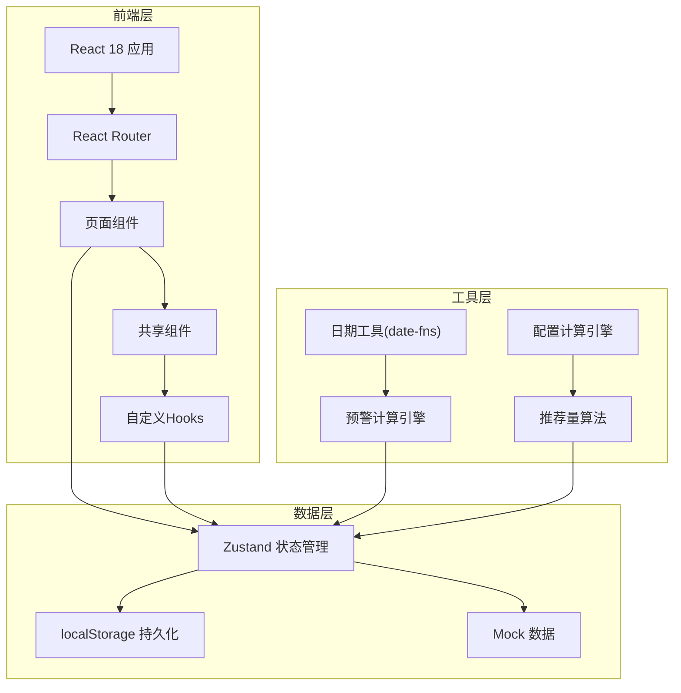
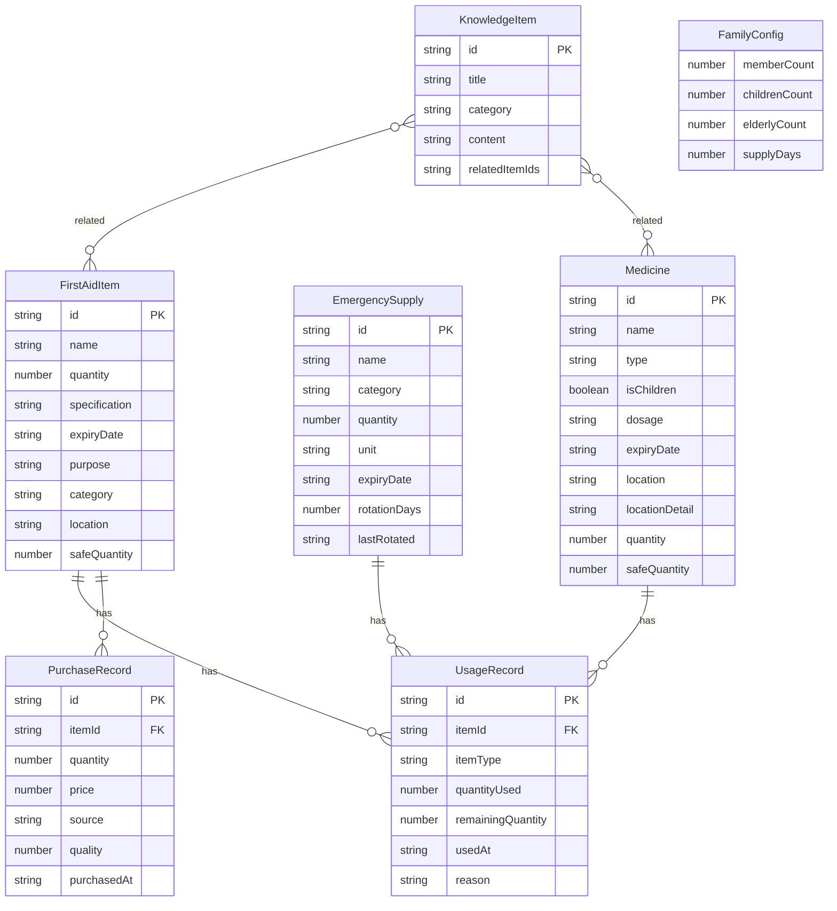

## 1. 架构设计



## 2. 技术说明

- 前端：React@18 + TypeScript + Tailwind CSS@3 + Vite
- 初始化工具：Vite (react-ts 模板)
- 后端：无（纯前端，数据持久化使用 localStorage）
- 数据库：无（使用 Zustand + localStorage 作为本地存储方案）
- 图表库：Recharts
- 图标库：Lucide React
- 日期处理：date-fns
- 状态管理：Zustand（轻量级，内置持久化中间件）

## 3. 路由定义

| 路由 | 用途 |
|------|------|
| / | 仪表盘首页 - 预警汇总、盘点状态、库存概览 |
| /first-aid-kit | 急救箱管理 - 物品清单、有效期预警、盘点提醒 |
| /emergency-supplies | 应急物资管理 - 物资清单、轮换提醒、推荐配置 |
| /medicine | 药品分类管理 - 处方药/OTC、儿童药品、存放位置 |
| /records | 使用记录 - 使用记录、采购清单、采购历史 |
| /knowledge | 知识关联 - 物品知识关联、急救知识库 |

## 4. API定义

无后端API，所有数据操作通过 Zustand store 完成。

### 核心数据类型定义

```typescript
interface FirstAidItem {
  id: string;
  name: string;
  quantity: number;
  specification: string;
  expiryDate: string;
  purpose: string;
  category: string;
  location: string;
  safeQuantity: number;
  createdAt: string;
  updatedAt: string;
}

interface EmergencySupply {
  id: string;
  name: string;
  category: 'water' | 'food' | 'battery' | 'flashlight' | 'firstaid' | 'other';
  quantity: number;
  unit: string;
  expiryDate: string;
  rotationDays: number;
  lastRotated: string;
  createdAt: string;
}

interface Medicine {
  id: string;
  name: string;
  type: 'prescription' | 'otc';
  isChildren: boolean;
  dosage: string;
  expiryDate: string;
  location: string;
  locationDetail: string;
  purpose: string;
  quantity: number;
  safeQuantity: number;
}

interface UsageRecord {
  id: string;
  itemId: string;
  itemType: 'firstaid' | 'emergency' | 'medicine';
  itemName: string;
  quantityUsed: number;
  remainingQuantity: number;
  usedAt: string;
  reason: string;
}

interface PurchaseRecord {
  id: string;
  itemId: string;
  itemName: string;
  quantity: number;
  price: number;
  source: string;
  quality: 1 | 2 | 3 | 4 | 5;
  purchasedAt: string;
}

interface KnowledgeItem {
  id: string;
  title: string;
  category: string;
  content: string;
  relatedItemIds: string[];
  steps: string[];
}

interface FamilyConfig {
  memberCount: number;
  childrenCount: number;
  elderlyCount: number;
  supplyDays: number;
}

interface InventoryCheck {
  id: string;
  date: string;
  nextDate: string;
  status: 'pending' | 'in_progress' | 'completed';
  checkedItems: { itemId: string; status: 'ok' | 'missing' | 'expired' }[];
}
```

## 5. 服务端架构

不适用（纯前端应用）

## 6. 数据模型

### 6.1 数据模型定义



### 6.2 数据定义语言

使用 localStorage 存储，key 设计如下：

- `firstaid_items`: FirstAidItem[]
- `emergency_supplies`: EmergencySupply[]
- `medicines`: Medicine[]
- `usage_records`: UsageRecord[]
- `purchase_records`: PurchaseRecord[]
- `knowledge_items`: KnowledgeItem[]
- `family_config`: FamilyConfig
- `inventory_checks`: InventoryCheck[]
- `shopping_list`: { itemId: string; itemName: string; quantity: number; type: string }[]
