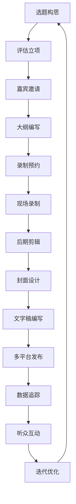

## 1. 产品概述

播客制作流程和节目管理工具，为播客创作者提供从选题策划到发布运营的全流程管理解决方案。解决播客制作过程中流程分散、协作低效、进度追踪困难等问题，帮助创作者系统化管理节目制作全生命周期。

- 目标用户：独立播客创作者、播客制作团队、媒体机构内容部门
- 核心价值：通过标准化流程和可视化管理，提升播客制作效率，确保内容质量，实现数据驱动的运营决策

## 2. 核心功能

### 2.1 用户角色
| 角色 | 注册方式 | 核心权限 |
|------|----------|----------|
| 创作者 | 邮箱/手机号注册 | 完整使用所有模块功能，管理个人节目 |
| 团队成员 | 邀请加入 | 根据角色权限访问对应模块，协作完成任务 |
| 管理员 | 平台认证 | 管理团队成员、配置工作流模板 |

### 2.2 功能模块
1. **首页仪表盘**：概览所有模块关键数据、待办事项、近期活动
2. **节目策划模块**：选题库管理、嘉宾邀请跟进、录制大纲结构化写作
3. **录制管理模块**：录制会话预约提醒、录制记录、文件版本管理
4. **后期制作模块**：剪辑任务清单、封面制作记录、文字稿/Show Notes管理
5. **发布管理模块**：多平台发布状态、内容日历排期、发布后数据追踪
6. **听众关系模块**：听众反馈收集、高亮标记、趋势分析

### 2.3 页面详情
| 页面名称 | 模块名称 | 功能描述 |
|-----------|-------------|---------------------|
| 首页仪表盘 | 数据概览 | 关键指标卡片、待办任务列表、近期活动时间线、快速操作入口 |
| 节目策划 - 选题库 | 选题管理 | 想法快速录入、热度/可行性评估、选题状态流转、标签分类 |
| 节目策划 - 嘉宾管理 | 嘉宾邀请 | 嘉宾信息库、邀请状态追踪、沟通记录、档期确认 |
| 节目策划 - 大纲管理 | 录制大纲 | 结构化大纲编辑器、问题清单、话题流程、过渡语言模板 |
| 录制管理 - 会话管理 | 预约提醒 | 日历视图、录制预约、24小时设备检查提醒、通知推送 |
| 录制管理 - 录制记录 | 录制日志 | 实际时长记录、技术问题、需处理片段标记、录音上传 |
| 录制管理 - 文件管理 | 版本管理 | 原始/剪辑/最终版分类、版本对比、文件关联、存储管理 |
| 后期制作 - 剪辑任务 | 剪辑清单 | 剪切标记、背景音乐、CTA配置、任务进度追踪 |
| 后期制作 - 素材管理 | 封面配图 | 设计记录、版本迭代、尺寸适配、素材库 |
| 后期制作 - 文字稿管理 | Show Notes | 文字稿编写、时间轴同步、要点高亮、链接管理 |
| 发布管理 - 平台管理 | 多平台发布 | 喜马拉雅/苹果/Spotify等平台配置、发布状态同步 |
| 发布管理 - 内容日历 | 排期规划 | 日历视图、发布计划、档期冲突检测、批量排期 |
| 发布管理 - 数据分析 | 数据追踪 | 播放量、订阅增长、评论反馈、多平台数据汇总 |
| 听众关系 - 反馈管理 | 听众互动 | 反馈收集、高亮标记、情绪分析、回复跟踪 |

## 3. 核心流程

### 3.1 节目制作主流程
选题构思 → 评估立项 → 嘉宾邀请 → 大纲编写 → 录制预约 → 现场录制 → 后期剪辑 → 封面设计 → 文字稿编写 → 多平台发布 → 数据追踪 → 听众互动

### 3.2 选题管理流程
录制想法收集 → 热度/可行性评估 → 选题立项 → 分配负责人 → 进入策划流程

### 3.3 发布流程
内容审核 → 平台配置 → 排期设定 → 自动发布 → 状态同步 → 数据回收

## 4. 用户界面设计

### 4.1 设计风格
- **设计理念**：专业工作室风格，融合现代简约与创意活力
- **主色调**：深邃藏青 (#1a2942) 作为主色，传达专业与可靠
- **辅助色**：活力橙 (#ff6b35) 用于强调和交互元素，激发创作热情
- **中性色**：暖灰系列 (#f8f9fa, #e9ecef, #adb5bd, #495057, #212529)
- **按钮风格**：圆角矩形 (border-radius: 8px)，微妙的悬停阴影效果
- **字体**：标题使用 "Space Grotesk" 现代几何无衬线字体，正文使用 "Inter" 保证可读性
- **布局风格**：左侧导航 + 主内容区的双栏布局，卡片式信息展示
- **图标风格**：lucide-react 线性图标，统一24px尺寸，保持视觉轻盈

### 4.2 页面设计概述
| 页面名称 | 模块名称 | UI元素 |
|-----------|-------------|-------------|
| 首页仪表盘 | 数据概览 | 渐变数据卡片、动态进度环、时间线动画、悬停微交互 |
| 选题库 | 卡片列表 | 标签彩色标记、评估分数环形图、拖拽排序、状态标签动画 |
| 嘉宾管理 | 表格+卡片 | 状态进度条、沟通记录时间线、头像+首字母占位 |
| 录制大纲 | 编辑器 | 结构化折叠面板、可拖拽排序、颜色标记话题类型 |
| 内容日历 | 日历视图 | 月/周/日切换、拖拽调整排期、冲突红色警示 |
| 数据追踪 | 图表面板 | 面积图趋势、柱状图对比、悬停数据tooltip、动画加载 |
| 反馈管理 | 信息流 | 高亮标签、情绪色彩编码、重要标记星标 |

### 4.3 响应式
- **桌面端优先**：1280px以上完整展示双栏布局
- **平板适配**：1024px时导航折叠为图标模式
- **移动端**：768px以下采用底部Tab导航，内容区单列布局
- **触控优化**：按钮最小44x44px触控区域，关键操作增加触觉反馈

### 4.4 动效设计
- 页面加载：元素从下往上淡入，错开100ms延迟创造层次感
- 卡片悬停：上移2px + 阴影加深，过渡150ms ease-out
- 状态变更：数值变化使用数字滚动动画，进度条平滑过渡
- 模态框：背景模糊 + 缩放淡入，关闭时反向动画
