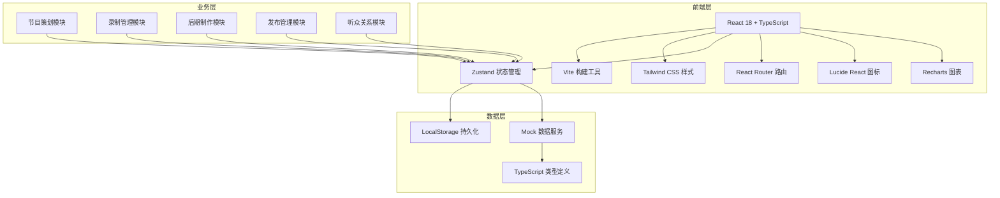
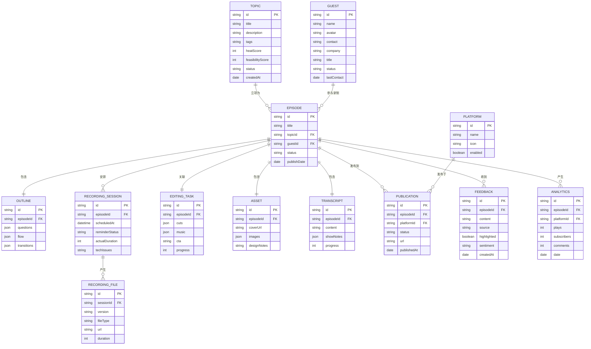

## 1. 架构设计



## 2. 技术描述

- **前端框架**：React@18 + TypeScript@5
- **构建工具**：Vite@5
- **样式方案**：Tailwind CSS@3
- **状态管理**：Zustand@4
- **路由管理**：React Router DOM@6
- **图标库**：Lucide React@0.344
- **图表库**：Recharts@2
- **日期处理**：date-fns@3
- **后端**：无后端，纯前端应用，使用LocalStorage持久化 + Mock数据
- **数据库**：LocalStorage 浏览器本地存储

## 3. 路由定义

| 路由 | 页面 | 用途 |
|-------|------|------|
| /dashboard | Dashboard | 首页仪表盘，数据概览与快速操作 |
| /planning/topics | TopicLibrary | 选题库管理 |
| /planning/guests | GuestManagement | 嘉宾邀请管理 |
| /planning/outline | OutlineEditor | 录制大纲结构化写作 |
| /recording/sessions | RecordingSessions | 录制会话预约与提醒 |
| /recording/records | RecordingRecords | 录制记录管理 |
| /recording/files | FileManagement | 录制文件版本管理 |
| /postproduction/editing | EditingTasks | 剪辑任务清单管理 |
| /postproduction/assets | AssetManagement | 封面图和配图制作记录 |
| /postproduction/transcript | TranscriptEditor | 文字稿/Show Notes编写 |
| /publishing/platforms | PlatformManagement | 发布平台管理 |
| /publishing/calendar | ContentCalendar | 内容日历与发布排期 |
| /publishing/analytics | DataAnalytics | 发布后数据追踪 |
| /audience/feedback | FeedbackManagement | 听众反馈收集和高亮 |

## 4. 数据模型

### 4.1 数据模型ER图



### 4.2 核心数据类型定义

```typescript
// 选题
interface Topic {
  id: string;
  title: string;
  description: string;
  tags: string[];
  heatScore: number;
  feasibilityScore: number;
  status: 'idea' | 'evaluating' | 'approved' | 'rejected';
  createdAt: Date;
}

// 嘉宾
interface Guest {
  id: string;
  name: string;
  avatar?: string;
  contact: string;
  company: string;
  title: string;
  status: 'invited' | 'negotiating' | 'confirmed' | 'declined';
  lastContact: Date;
  communicationLog: CommunicationEntry[];
}

interface CommunicationEntry {
  date: Date;
  content: string;
  type: 'email' | 'phone' | 'meeting';
}

// 录制大纲
interface Outline {
  id: string;
  episodeId: string;
  questions: Question[];
  flow: FlowItem[];
  transitions: Transition[];
}

interface Question {
  id: string;
  content: string;
  order: number;
  estimatedTime: number;
}

interface FlowItem {
  id: string;
  title: string;
  description: string;
  duration: number;
  order: number;
}

interface Transition {
  id: string;
  from: string;
  to: string;
  content: string;
}

// 录制会话
interface RecordingSession {
  id: string;
  episodeId: string;
  scheduledAt: Date;
  reminderSent: boolean;
  equipmentCheck: boolean;
  actualDuration?: number;
  techIssues?: string;
  clipsToEdit?: ClipMarker[];
  status: 'scheduled' | 'completed' | 'cancelled';
}

interface ClipMarker {
  id: string;
  startTime: number;
  endTime: number;
  note: string;
  type: 'cut' | 'keep' | 'review';
}

// 录制文件
interface RecordingFile {
  id: string;
  sessionId: string;
  version: 'original' | 'edited' | 'final';
  fileName: string;
  fileSize: number;
  duration: number;
  createdAt: Date;
}

// 剪辑任务
interface EditingTask {
  id: string;
  episodeId: string;
  cuts: CutItem[];
  music: MusicItem[];
  cta: string;
  progress: number;
  status: 'pending' | 'in_progress' | 'review' | 'completed';
}

interface CutItem {
  id: string;
  startTime: number;
  endTime: number;
  description: string;
  done: boolean;
}

interface MusicItem {
  id: string;
  name: string;
  position: 'intro' | 'outro' | 'background';
  startTime: number;
  volume: number;
  done: boolean;
}

// 发布
interface Publication {
  id: string;
  episodeId: string;
  platformId: string;
  status: 'draft' | 'scheduled' | 'published' | 'failed';
  scheduledAt?: Date;
  publishedAt?: Date;
  url?: string;
}

// 分析数据
interface AnalyticsData {
  id: string;
  episodeId: string;
  platformId: string;
  date: Date;
  plays: number;
  newSubscribers: number;
  comments: number;
  averageListenTime: number;
}

// 听众反馈
interface Feedback {
  id: string;
  episodeId: string;
  content: string;
  source: string;
  highlighted: boolean;
  sentiment: 'positive' | 'neutral' | 'negative';
  createdAt: Date;
  author?: string;
}
```

## 5. 目录结构

```
src/
├── components/           # 通用组件
│   ├── Layout/          # 布局组件
│   ├── Cards/           # 卡片组件
│   ├── Forms/           # 表单组件
│   ├── Charts/          # 图表组件
│   └── UI/              # 基础UI组件
├── pages/               # 页面组件
│   ├── Dashboard/
│   ├── Planning/
│   ├── Recording/
│   ├── PostProduction/
│   ├── Publishing/
│   └── Audience/
├── store/               # Zustand 状态管理
│   └── useAppStore.ts
├── types/               # TypeScript 类型定义
│   └── index.ts
├── utils/               # 工具函数
│   ├── date.ts
│   ├── storage.ts
│   └── mock.ts
├── data/                # Mock 数据
│   └── seed.ts
├── App.tsx
├── main.tsx
└── index.css
```

## 6. 状态管理设计

使用 Zustand 创建单一 store，按功能模块划分：

```typescript
interface AppState {
  // 数据
  topics: Topic[];
  guests: Guest[];
  episodes: Episode[];
  outlines: Outline[];
  sessions: RecordingSession[];
  files: RecordingFile[];
  editingTasks: EditingTask[];
  assets: Asset[];
  transcripts: Transcript[];
  platforms: Platform[];
  publications: Publication[];
  analytics: AnalyticsData[];
  feedbacks: Feedback[];
  
  // 操作方法
  // 节目策划
  addTopic: (topic: Omit<Topic, 'id' | 'createdAt'>) => void;
  updateTopic: (id: string, updates: Partial<Topic>) => void;
  deleteTopic: (id: string) => void;
  addGuest: (guest: Omit<Guest, 'id'>) => void;
  updateGuest: (id: string, updates: Partial<Guest>) => void;
  addGuestCommunication: (guestId: string, entry: CommunicationEntry) => void;
  saveOutline: (outline: Outline) => void;
  
  // 录制管理
  addSession: (session: Omit<RecordingSession, 'id'>) => void;
  updateSession: (id: string, updates: Partial<RecordingSession>) => void;
  addFile: (file: Omit<RecordingFile, 'id'>) => void;
  
  // 后期制作
  updateEditingTask: (id: string, updates: Partial<EditingTask>) => void;
  saveTranscript: (transcript: Transcript) => void;
  
  // 发布管理
  addPublication: (publication: Omit<Publication, 'id'>) => void;
  updatePublication: (id: string, updates: Partial<Publication>) => void;
  
  // 听众关系
  toggleFeedbackHighlight: (id: string) => void;
  addFeedback: (feedback: Omit<Feedback, 'id' | 'createdAt'>) => void;
  
  // 持久化
  loadFromStorage: () => void;
  saveToStorage: () => void;
}
```
