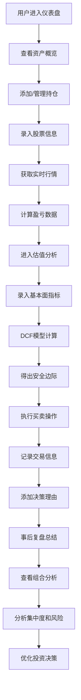

## 1. 产品概述

本产品是一款专业的在线股票投资组合管理和估值分析工具，为个人投资者提供系统化的持仓追踪、基本面估值、交易记录和组合分析功能。通过整合实时行情数据、DCF估值模型和量化分析指标，帮助投资者做出更理性的投资决策。

- 核心目标：解决个人投资者缺乏系统化投资工具的痛点，提供从持仓管理到估值分析的一站式解决方案
- 目标用户：主动型个人投资者、价值投资者、需要系统化管理投资组合的股民
- 市场价值：填补国内个人投资组合管理工具的空白，将专业机构级的分析能力普惠给个人投资者

## 2. 核心功能

### 2.1 用户角色

| 角色 | 注册方式 | 核心权限 |
|------|----------|----------|
| 普通用户 | 本地存储，无需注册 | 完整使用所有功能，数据存储在浏览器本地 |

### 2.2 功能模块

1. **仪表盘**：资产概览、核心指标卡片、收益走势图
2. **持仓管理**：持股录入、实时行情、盈亏计算
3. **估值分析**：基本面指标追踪、DCF估值模型、安全边际计算
4. **交易记录**：买卖操作记录、决策理由、事后复盘
5. **组合分析**：持仓集中度、收益对比、风险指标统计

### 2.3 页面详情

| 页面名称 | 模块名称 | 功能描述 |
|----------|----------|----------|
| 仪表盘 | 资产概览 | 总资产、总收益、今日盈亏、持仓市值等核心指标卡片展示 |
| 仪表盘 | 收益走势 | 组合收益与沪深300基准的对比折线图 |
| 仪表盘 | 持仓分布 | 饼图展示行业分布和十大重仓股 |
| 持仓管理 | 持股列表 | 展示所有持仓股票，包含代码、名称、数量、成本、现价、市值、盈亏等 |
| 持仓管理 | 添加持仓 | 表单录入股票代码、持有数量、买入均价、买入日期 |
| 持仓管理 | 行情更新 | 一键刷新所有持仓的实时价格，对接股票API |
| 持仓管理 | 盈亏分析 | 计算每只股票的浮盈浮亏金额、收益率、占组合比例 |
| 估值分析 | 基本面指标 | PE、PB、ROE、毛利率、净利率的历史数据表格和趋势图 |
| 估值分析 | DCF估值 | 输入自由现金流、增速、折现率、永续增长率，计算内在价值 |
| 估值分析 | 敏感性分析 | 增速和折现率双维度的敏感性矩阵表格 |
| 估值分析 | 安全边际 | 计算当前价格相对于内在价值的折扣比例，展示安全区间 |
| 交易记录 | 交易列表 | 完整展示所有买卖操作，包含时间、价格、数量、手续费、金额 |
| 交易记录 | 添加交易 | 表单录入交易信息和决策理由 |
| 交易记录 | 交易复盘 | 编辑区记录事后分析，评估决策质量 |
| 组合分析 | 集中度分析 | 单股占比、行业占比、风格占比的图表展示 |
| 组合分析 | 收益追踪 | 组合净值曲线与沪深300指数对比 |
| 组合分析 | 风险指标 | 年化收益率、最大回撤、夏普比率的计算和展示 |

## 3. 核心流程

用户完整使用流程：从仪表盘查看整体资产状况开始，先管理持仓并更新行情，然后对持仓股票进行估值分析，根据估值结果做出交易决策并记录，最后通过组合分析模块评估整体表现，形成完整的投资闭环。

## 4. 用户界面设计

### 4.1 设计风格

- **主色调**：深蓝色 `#0F172A` 作为背景，体现金融专业感和信任感
- **辅助色**：上涨用翠绿 `#10B981`，下跌用珊瑚红 `#EF4444`，中性色用深灰 `#334155`
- **点缀色**：金色 `#F59E0B` 用于重点指标和安全边际突出显示
- **按钮风格**：微圆角（8px）、轻微悬停动效、按压反馈，采用扁平化设计
- **字体**：标题使用 `Inter` 字体，数据展示使用 `JetBrains Mono` 等宽字体，确保数字对齐易读
- **布局风格**：卡片式布局，清晰的模块分隔，充足的留白，数据密度适中
- **图标风格**：使用 `Lucide React` 线性图标，保持简洁专业

### 4.2 页面设计概述

| 页面名称 | 模块名称 | UI 元素 |
|----------|----------|----------|
| 仪表盘 | 资产概览 | 渐变背景卡片、动态数字滚动、红绿颜色区分涨跌、网格布局 |
| 仪表盘 | 收益走势 | 交互式折线图、悬浮数据提示、双Y轴对比、时间范围切换 |
| 持仓管理 | 持股列表 | 数据表格、斑马纹、条件格式化（盈亏颜色）、固定表头、可排序 |
| 估值分析 | DCF模型 | 步骤式表单、实时计算预览、热力图展示敏感性矩阵、进度条展示安全边际 |
| 交易记录 | 交易列表 | 时间线布局、买入/卖出标签区分、折叠展开的复盘详情区 |
| 组合分析 | 集中度分析 | 旭日图/环形图、行业配色区分、交互式数据筛选 |

### 4.3 响应式设计

- **桌面优先**：以 1440px 宽度为基准设计，支持 1280px-1920px 范围
- **平板适配**：在 768px-1024px 宽度下，表格横向滚动，卡片两列布局
- **移动端**：在 375px-767px 宽度下，卡片单列布局，表格转为卡片式展示，底部导航切换
- **触摸优化**：按钮最小高度 44px，点击区域充足，避免误触

### 4.4 交互与动效

- 页面加载时的卡片渐入动画，错落有致的延迟效果
- 数据更新时的数字滚动动效，平滑过渡
- 涨跌变化时的微闪烁提示
- 表格行悬停时的背景色变化
- 模态框的缩放进入动画
- 图表数据的渐进式渲染
