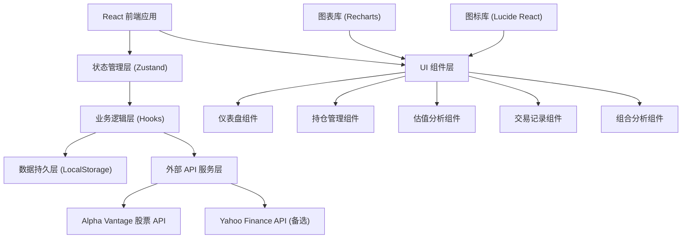
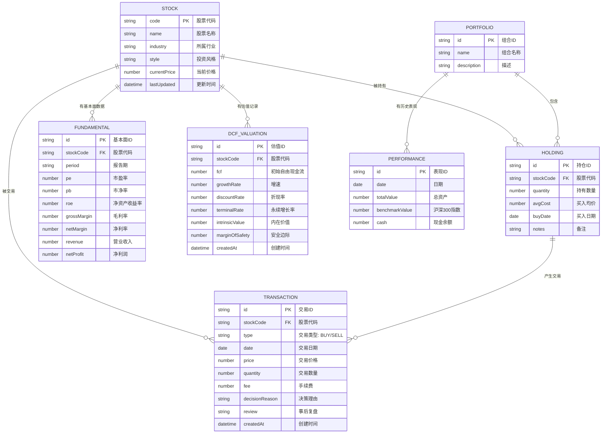

## 1. 架构设计



## 2. 技术描述

- **前端框架**: React 18 + TypeScript + Vite
- **构建工具**: Vite 5
- **样式方案**: TailwindCSS 3
- **状态管理**: Zustand
- **路由管理**: React Router DOM 6
- **图表库**: Recharts 2
- **图标库**: Lucide React
- **数据持久化**: LocalStorage
- **HTTP 客户端**: Fetch API (原生)
- **日期处理**: date-fns
- **数据格式**: 本地 Mock 数据 + 可选 Alpha Vantage API 对接
- **代码规范**: ESLint + Prettier

## 3. 路由定义

| 路由 | 页面 | 主要功能 |
|------|------|----------|
| `/` | 仪表盘 | 资产概览、核心指标、收益走势、持仓分布 |
| `/portfolio` | 持仓管理 | 持股列表、添加持仓、行情更新、盈亏分析 |
| `/valuation` | 估值分析 | 基本面指标、DCF估值、敏感性分析、安全边际 |
| `/transactions` | 交易记录 | 交易列表、添加交易、决策理由、交易复盘 |
| `/analysis` | 组合分析 | 集中度分析、收益追踪、风险指标 |

## 4. 数据模型

### 4.1 数据模型定义



### 4.2 TypeScript 类型定义

```typescript
// 股票基础信息
interface Stock {
  code: string;
  name: string;
  industry: string;
  style: 'value' | 'growth' | 'dividend' | 'cyclical' | 'defensive';
  currentPrice: number;
  lastUpdated: string;
}

// 持仓信息
interface Holding {
  id: string;
  stockCode: string;
  quantity: number;
  avgCost: number;
  buyDate: string;
  notes?: string;
}

// 基本面指标
interface Fundamental {
  id: string;
  stockCode: string;
  period: string;
  pe: number;
  pb: number;
  roe: number;
  grossMargin: number;
  netMargin: number;
  revenue: number;
  netProfit: number;
}

// DCF 估值
interface DCFValuation {
  id: string;
  stockCode: string;
  fcf: number;
  growthRate: number;
  discountRate: number;
  terminalRate: number;
  intrinsicValue: number;
  marginOfSafety: number;
  createdAt: string;
}

// 交易记录
interface Transaction {
  id: string;
  stockCode: string;
  type: 'BUY' | 'SELL';
  date: string;
  price: number;
  quantity: number;
  fee: number;
  decisionReason?: string;
  review?: string;
  createdAt: string;
}

// 组合表现
interface Performance {
  id: string;
  date: string;
  totalValue: number;
  benchmarkValue: number;
  cash: number;
}

// 计算指标
interface HoldingMetrics {
  marketValue: number;
  costValue: number;
  profitLoss: number;
  profitLossRate: number;
  proportion: number;
}

interface PortfolioMetrics {
  totalValue: number;
  totalCost: number;
  totalProfitLoss: number;
  totalProfitLossRate: number;
  dailyChange: number;
  dailyChangeRate: number;
  annualizedReturn: number;
  maxDrawdown: number;
  sharpeRatio: number;
}
```

## 5. 核心业务逻辑

### 5.1 盈亏计算

```typescript
// 持仓市值 = 当前价格 × 持有数量
const marketValue = currentPrice * quantity;

// 持仓成本 = 买入均价 × 持有数量
const costValue = avgCost * quantity;

// 浮动盈亏 = 市值 - 成本
const profitLoss = marketValue - costValue;

// 收益率 = 浮动盈亏 / 成本 × 100%
const profitLossRate = (profitLoss / costValue) * 100;

// 占比 = 个股市值 / 组合总市值 × 100%
const proportion = (marketValue / totalMarketValue) * 100;
```

### 5.2 DCF 估值模型

```typescript
// DCF 估值核心公式
function calculateDCF(
  fcf: number,           // 初始自由现金流
  growthRate: number,    // 增速
  discountRate: number,  // 折现率
  terminalRate: number,  // 永续增长率
  years: number = 10     // 预测期
): number {
  let intrinsicValue = 0;
  
  // 预测期现金流折现
  for (let i = 1; i <= years; i++) {
    const fcfYear = fcf * Math.pow(1 + growthRate, i);
    const discountFactor = Math.pow(1 + discountRate, i);
    intrinsicValue += fcfYear / discountFactor;
  }
  
  // 终值计算 (Gordon Growth Model)
  const finalFCF = fcf * Math.pow(1 + growthRate, years);
  const terminalValue = (finalFCF * (1 + terminalRate)) / (discountRate - terminalRate);
  const terminalDiscountFactor = Math.pow(1 + discountRate, years);
  intrinsicValue += terminalValue / terminalDiscountFactor;
  
  return intrinsicValue;
}

// 安全边际 = (内在价值 - 当前价格) / 内在价值 × 100%
const marginOfSafety = ((intrinsicValue - currentPrice) / intrinsicValue) * 100;
```

### 5.3 风险指标计算

```typescript
// 年化收益率
// 年化 = (期末净值 / 期初净值)^(365/天数) - 1
const annualizedReturn = Math.pow(endValue / startValue, 365 / days) - 1;

// 最大回撤
// 最大回撤 = max( (峰值 - 谷值) / 峰值 )
function maxDrawdown(values: number[]): number {
  let maxDD = 0;
  let peak = values[0];
  
  for (const value of values) {
    if (value > peak) peak = value;
    const dd = (peak - value) / peak;
    if (dd > maxDD) maxDD = dd;
  }
  
  return maxDD;
}

// 夏普比率
// 夏普 = (年化收益 - 无风险利率) / 年化波动率
function sharpeRatio(returns: number[], riskFreeRate: number = 0.03): number {
  const avgReturn = mean(returns);
  const stdDev = std(returns);
  const annualizedReturn = avgReturn * 252;
  const annualizedStd = stdDev * Math.sqrt(252);
  
  return (annualizedReturn - riskFreeRate) / annualizedStd;
}
```

### 5.4 股票 API 集成

支持 Alpha Vantage 和 Yahoo Finance 双数据源，提供统一的接口封装：

```typescript
interface StockAPI {
  getQuote(symbol: string): Promise<{ price: number; change: number; changePercent: number }>;
  getQuoteBatch(symbols: string[]): Promise<Map<string, { price: number; change: number }>>;
  getHistoricalData(symbol: string, days: number): Promise<{ date: string; close: number }[]>;
}
```

## 6. Mock 数据定义

为了在无 API Key 情况下也能完整演示功能，内置丰富的 Mock 数据，包含：

- 15 只 A 股热门股票基础信息（贵州茅台、宁德时代、比亚迪等）
- 10 条持仓记录
- 30 条历史交易记录
- 5 年的基本面数据样例
- 1 年的组合历史表现数据
- 沪深 300 指数对比数据

## 7. 项目目录结构

```
src/
├── components/           # 通用组件
│   ├── layout/          # 布局组件
│   ├── ui/              # 基础UI组件
│   └── charts/          # 图表组件
├── pages/               # 页面组件
│   ├── Dashboard/
│   ├── Portfolio/
│   ├── Valuation/
│   ├── Transactions/
│   └── Analysis/
├── store/               # Zustand 状态管理
├── hooks/               # 自定义 Hooks
├── utils/               # 工具函数
│   ├── calculations.ts  # 计算逻辑
│   ├── dcf.ts           # DCF 估值模型
│   ├── risk.ts          # 风险指标计算
│   └── api.ts           # API 封装
├── types/               # TypeScript 类型定义
├── data/                # Mock 数据
├── styles/              # 全局样式
└── App.tsx              # 应用入口
```
