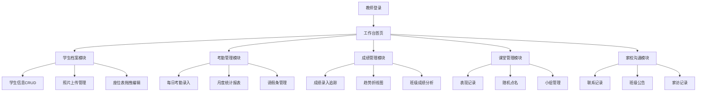

## 1. 产品概述

本产品是面向中小学教师的在线班级管理和教师工作台工具，旨在帮助教师高效管理班级日常事务，提升教学管理效率。通过整合学生档案、考勤、成绩、课堂表现和家校沟通五大核心模块，为教师提供一站式数字化管理解决方案。

目标用户为K12阶段的班主任和任课教师，产品价值在于简化教师行政工作负担，实现班级管理的数字化、可视化和智能化。

## 2. 核心功能

### 2.1 用户角色
| 角色 | 注册方式 | 核心权限 |
|------|----------|----------|
| 教师 | 账号登录 | 所有模块的完整管理权限 |

### 2.2 功能模块
1. **学生档案模块**：学生信息管理、照片录入、座位表可视化
2. **考勤管理模块**：每日考勤录入、月度统计报告、请假条管理
3. **成绩管理模块**：考试成绩录入、成绩趋势图、班级成绩分析
4. **课堂管理模块**：课堂表现记录、随机点名、小组管理
5. **家校沟通模块**：家长联系记录、班级公告、家访记录

### 2.3 页面详情

| 页面名称 | 模块名称 | 功能描述 |
|---------|----------|----------|
| 工作台首页 | 数据概览 | 显示今日考勤、近期成绩、待办事项等关键指标 |
| 学生档案页 | 学生信息管理 | 增删改查学生基本信息（姓名/学号/家长联系方式/住址/特殊情况备注） |
| 学生档案页 | 学生照片管理 | 上传、预览、删除学生照片 |
| 学生档案页 | 座位表管理 | 可视化座位排布、拖拽调整座位、打印功能 |
| 考勤管理页 | 考勤录入 | 快速标记学生考勤状态（到/迟到/请假/旷课） |
| 考勤管理页 | 考勤统计 | 月度出勤率统计、各类缺课次数统计图表 |
| 考勤管理页 | 请假条管理 | 家长请假条上传、审核、归档 |
| 成绩管理页 | 成绩录入 | 多次考试成绩录入和编辑 |
| 成绩管理页 | 成绩趋势 | 学生个人成绩折线图、对比分析 |
| 成绩管理页 | 成绩分析 | 班级平均分、及格率、优秀率、分布直方图 |
| 课堂管理页 | 表现记录 | 正负表现记录（回答问题/积极参与/违纪） |
| 课堂管理页 | 随机点名 | 随机抽取学生回答问题 |
| 课堂管理页 | 小组管理 | 创建小组、分配成员、管理小组作业 |
| 家校沟通页 | 联系记录 | 记录与家长沟通的时间、原因、内容 |
| 家校沟通页 | 班级公告 | 发布、编辑、历史公告查看 |
| 家校沟通页 | 家访记录 | 家访记录整理与归档 |

## 3. 核心流程

### 3.1 主流程
教师登录系统后，在工作台首页查看当日关键数据，根据工作需求进入相应模块完成操作：
- 每日早晨：进入考勤模块完成班级考勤录入
- 考试后：进入成绩模块录入考试成绩并查看分析报告
- 课堂中：使用课堂模块进行随机点名和表现记录
- 需要时：进入学生档案查询学生信息或调整座位
- 定期：在家校沟通模块记录与家长的联系情况

### 3.2 流程图

## 4. 界面设计

### 4.1 设计风格
- **主色调**：深蓝色(#1e3a5f) 搭配 暖橙色(#f59e0b)，体现专业严谨又不失活力
- **辅助色**：绿色(#10b981)表示正常/出勤、红色(#ef4444)表示异常/旷课、黄色(#f59e0b)表示警告/迟到
- **字体**：标题使用「思源宋体」，正文使用「思源黑体」，数字使用「JetBrains Mono」等宽字体
- **按钮风格**：圆角8px，带有微妙阴影，hover时有轻微上浮效果
- **布局风格**：左侧导航栏 + 顶部工具栏 + 主内容区的卡片式布局
- **图标风格**：使用Lucide图标库，统一线性风格

### 4.2 页面设计概览

| 页面名称 | 模块名称 | UI元素 |
|---------|----------|--------|
| 工作台首页 | 数据概览 | 统计卡片、数据图表、快捷入口、待办列表、渐变色背景、卡片悬浮动画 |
| 学生档案页 | 信息管理 | 表格列表、搜索筛选、表单弹窗、照片预览、拖拽排序、翻页动画 |
| 学生档案页 | 座位表 | 网格布局、可拖拽卡片、讲台标识、打印样式、拖拽时的半透明效果 |
| 考勤管理页 | 考勤录入 | 日历选择器、状态快速切换按钮、批量操作、状态颜色编码 |
| 考勤管理页 | 统计报表 | 柱状图、饼图、数据表格、导出按钮、图表切换动画 |
| 成绩管理页 | 成绩分析 | 折线图、直方图、数据卡片、筛选器、图表hover交互效果 |
| 课堂管理页 | 随机点名 | 大字体姓名展示、随机抽取动画、历史记录、滚动数字效果 |
| 家校沟通页 | 时间线 | 垂直时间线布局、联系类型标签、详情展开收起动画 |

### 4.3 响应式
- 采用桌面优先设计，主窗口最小宽度1280px
- 平板端：左侧导航可折叠，内容区自适应
- 移动端：底部Tab导航，卡片垂直堆叠
- 所有交互元素确保触摸友好，最小点击区域44x44px

### 4.4 交互与动效
- 页面加载：元素从上到下依次淡入，带轻微位移
- 数据卡片：hover时上浮4px，阴影加深
- 按钮点击：0.1s缩放反馈
- 图表数据：加载时从0到目标值的过渡动画
- 模态框：背景模糊 + 缩放淡入效果
- 拖拽操作：半透明跟随效果，放置时弹性动画
