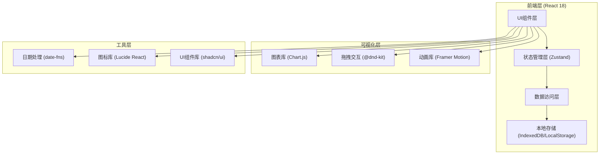
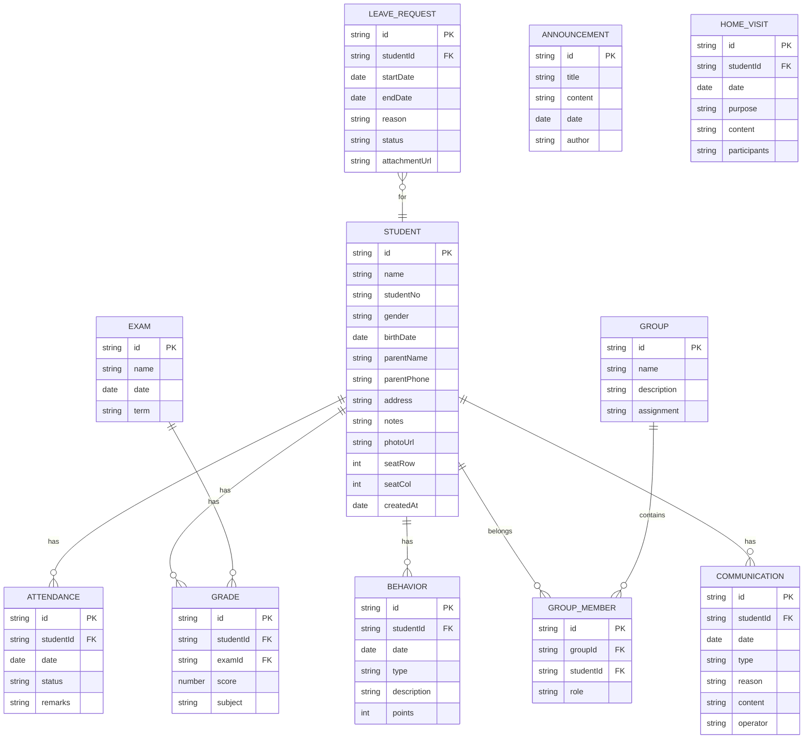

## 1. 架构设计



## 2. 技术描述

- **前端框架**: React@18 + TypeScript
- **构建工具**: Vite@5
- **样式方案**: TailwindCSS@3 + CSS Variables
- **状态管理**: Zustand（轻量级，适合中小规模应用）
- **路由管理**: React Router DOM@6
- **图表可视化**: Chart.js + react-chartjs-2
- **拖拽交互**: @dnd-kit/core + @dnd-kit/sortable
- **动画效果**: Framer Motion
- **UI组件库**: shadcn/ui（基于Radix UI）
- **图标**: Lucide React
- **日期处理**: date-fns
- **数据持久化**: LocalStorage + IndexedDB（通过localForage）
- **后端**: 无（纯前端应用，数据存储在浏览器本地）
- **数据库**: 本地存储（模拟数据用于演示）

## 3. 路由定义

| 路由 | 页面名称 | 目的 |
|------|----------|------|
| /dashboard | 工作台首页 | 数据概览、快捷入口、待办事项 |
| /students | 学生档案 | 学生信息管理、照片管理 |
| /students/seating | 座位表 | 可视化座位管理、拖拽调整 |
| /attendance | 考勤管理 | 考勤录入、月度统计 |
| /attendance/leaves | 请假条管理 | 家长请假条审核归档 |
| /grades | 成绩管理 | 成绩录入、趋势分析 |
| /grades/analysis | 成绩分析 | 班级成绩分布、统计指标 |
| /classroom | 课堂管理 | 表现记录、随机点名 |
| /classroom/groups | 小组管理 | 小组创建、成员分配 |
| /communication | 家校沟通 | 联系记录、公告、家访 |

## 4. 数据模型

### 4.1 数据模型定义 (ER图)



### 4.2 数据初始化说明

系统将预置模拟数据，包括：
- 40名学生的完整档案信息（含占位头像）
- 最近30天的考勤记录
- 3次考试的成绩数据
- 若干课堂表现记录
- 3个示例小组
- 若干家校沟通记录和公告

## 5. 核心模块文件结构

```
src/
├── components/           # 通用UI组件
│   ├── ui/              # shadcn/ui组件
│   ├── layout/          # 布局组件（侧边栏、顶栏）
│   └── common/          # 通用组件（表格、图表、模态框）
├── pages/               # 页面组件
│   ├── Dashboard/
│   ├── Students/
│   ├── Attendance/
│   ├── Grades/
│   ├── Classroom/
│   └── Communication/
├── store/               # Zustand状态管理
│   ├── useStudentStore.ts
│   ├── useAttendanceStore.ts
│   ├── useGradeStore.ts
│   ├── useClassroomStore.ts
│   └── useCommunicationStore.ts
├── types/               # TypeScript类型定义
│   └── index.ts
├── data/                # 模拟数据
│   └── mockData.ts
├── utils/               # 工具函数
│   ├── storage.ts
│   ├── formatters.ts
│   └── helpers.ts
├── hooks/               # 自定义Hooks
│   ├── useLocalStorage.ts
│   └── useChartData.ts
├── App.tsx
├── main.tsx
└── index.css
```

## 6. 关键技术实现点

### 6.1 座位表拖拽
- 使用@dnd-kit实现学生卡片的拖拽排序
- 网格布局使用CSS Grid，支持行列配置
- 拖拽时显示半透明预览，放置时有弹性动画
- 支持打印功能，通过@media print定制打印样式

### 6.2 图表可视化
- 成绩趋势：使用Chart.js折线图，支持多学生对比
- 成绩分布：使用柱状图展示分数段分布
- 考勤统计：饼图展示出勤状态分布，柱状图展示月度趋势
- 所有图表支持数据hover提示和动画效果

### 6.3 随机点名
- 使用Fisher-Yates洗牌算法实现真正的随机
- 动画效果：名字滚动切换，最终定格
- 可配置排除已点名学生
- 历史记录展示

### 6.4 数据持久化
- 使用localForage封装IndexedDB操作
- 关键数据实时自动保存
- 支持数据导出为JSON备份
- 支持从JSON文件恢复数据

### 6.5 打印功能
- 座位表打印：专门的打印样式，隐藏工具栏
- 考勤报告打印：表格样式优化，支持A4纸适配
- 使用window.print()配合CSS媒体查询实现
