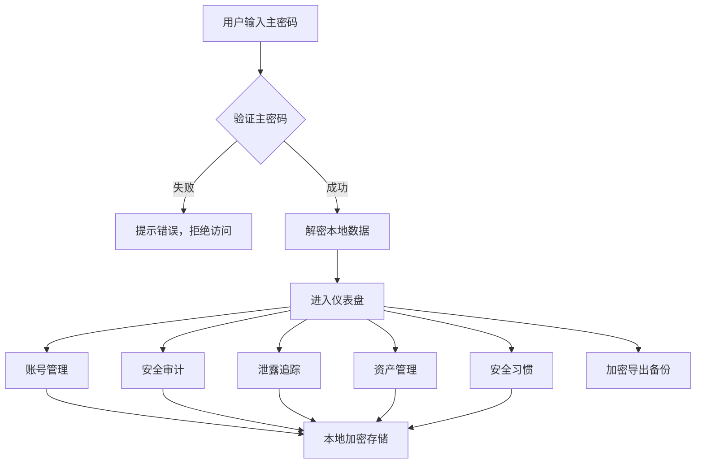

## 1. 产品概述

GuardVault是一款专业的在线数字资产和账号安全管理工具，帮助用户全面管理和保护其数字身份与资产安全。通过本地加密存储、安全审计、泄露追踪等功能，为用户的数字生活提供全方位的安全保障。

- 核心价值：解决用户数字账号分散、密码安全意识薄弱、资产信息混乱等问题
- 目标用户：关注个人信息安全的互联网用户、数字资产爱好者
- 产品定位：轻量、安全、专业的个人数字安全管家

## 2. 核心功能

### 2.1 用户角色

| 角色 | 注册方式 | 核心权限 |
|------|----------|----------|
| 普通用户 | 本地主密码认证 | 完整的账号管理、安全审计、资产追踪、加密导出权限 |

### 2.2 功能模块

1. **账号清单管理**: 账号分类记录、重要程度分级、注销状态追踪
2. **安全审计中心**: 密码强度检查、2FA开启状态追踪、备用恢复信息管理
3. **数据泄露追踪**: HIBP API泄露检查、泄露后密码更换记录、可疑登录事件
4. **资产清单管理**: 数字版权资产、储值余额追踪、年费订阅管理
5. **安全习惯提醒**: 密码定期更换提醒、安全评分系统

### 2.3 页面详情

| 页面名称 | 模块名称 | 功能描述 |
|-----------|-------------|---------------------|
| 仪表盘 | 概览模块 | 安全评分、风险提示、快速统计、待办提醒 |
| 账号管理 | 账号清单 | 账号增删改查、分类筛选、重要程度标记、注销追踪 |
| 安全审计 | 审计中心 | 密码强度分析、重复密码检测、2FA状态检查、备用信息管理 |
| 泄露追踪 | 泄露检测 | HIBP API查询、泄露事件记录、密码更换历史、可疑登录 |
| 资产管理 | 资产清单 | 数字版权、储值余额、订阅管理、资产统计 |
| 安全习惯 | 提醒中心 | 密码更换提醒、安全建议、习惯养成追踪 |
| 设置 | 系统设置 | 主密码管理、加密导出/导入、数据备份、应用配置 |

## 3. 核心流程

## 4. 用户界面设计

### 4.1 设计风格

- **设计方向**: 科技感、专业可靠的深色主题，营造安全可信赖的氛围
- **主色调**: 深海蓝 (#0B2545) 作为背景主色，代表安全与专业
- **辅助色**: 翡翠绿 (#10B981) 表示安全，琥珀橙 (#F59E0B) 表示警告，玫红 (#EF4444) 表示危险
- **强调色**: 电蓝 (#3B82F6) 用于交互元素和关键信息
- **字体**: 标题使用 Space Grotesk，正文使用 Inter，确保科技感与可读性平衡
- **按钮风格**: 微圆角 (8px)、轻微阴影、hover时提升效果
- **布局风格**: 侧边导航 + 内容区卡片式布局，信息层次分明
- **图标风格**: Lucide 线性图标，统一 18px 尺寸

### 4.2 页面设计概述

| 页面名称 | 模块名称 | UI元素 |
|-----------|-------------|-------------|
| 仪表盘 | 概览模块 | 安全评分环形图、风险卡片、统计数字、渐变背景、动效加载 |
| 账号管理 | 账号清单 | 数据表格、分类筛选标签、状态徽章、模态框表单、搜索框 |
| 安全审计 | 审计中心 | 强度进度条、风险列表、2FA开关、分组卡片、统计图表 |
| 泄露追踪 | 泄露检测 | API查询表单、时间线记录、状态指示、泄露详情面板 |
| 资产管理 | 资产清单 | 分类卡片、余额统计、订阅日历、资产价值总计 |
| 安全习惯 | 提醒中心 | 进度追踪、提醒列表、习惯打卡、安全建议 |
| 设置 | 系统设置 | 表单分组、滑块开关、文件上传/下载、密码强度指示器 |

### 4.3 响应式设计

- **桌面优先**: 1440px 基准设计，侧边导航固定 260px
- **平板适配**: 1024px 时导航收起为图标模式，内容区自适应
- **手机适配**: 768px 以下导航转为底部 Tab 栏，表格转为卡片列表
- **触摸优化**: 按钮最小高度 44px，列表项增加垂直间距

### 4.4 视觉细节

- 背景使用多层渐变叠加细微噪点纹理，增加质感
- 卡片使用 1px 浅色边框 + 微妙内发光，营造玻璃拟态效果
- 关键数据使用渐变色数字和动态计数动画
- 页面加载使用错落的骨架屏动画，提升感知速度
- 悬停交互包含轻微位移和阴影变化
