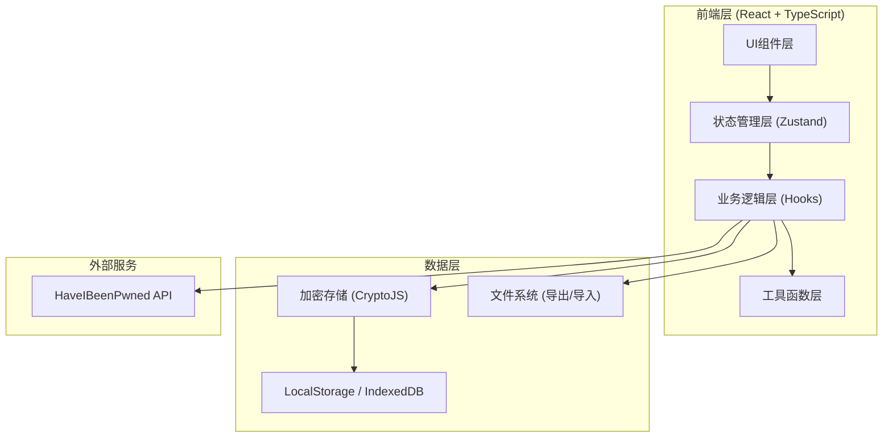
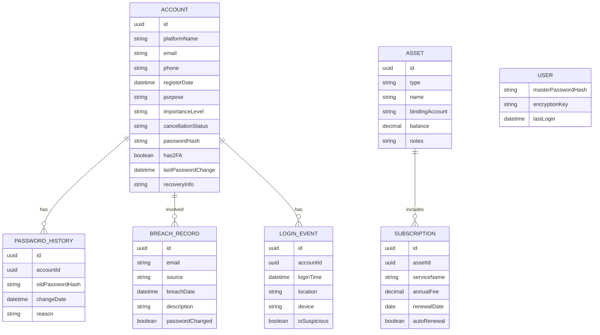

## 1. 架构设计



## 2. 技术栈说明

- **前端框架**: React@18 + TypeScript@5 + Vite@5
- **样式方案**: TailwindCSS@3 + CSS Variables
- **状态管理**: Zustand@4 (轻量级状态管理)
- **路由管理**: React Router DOM@6
- **图标库**: Lucide React
- **加密方案**: CryptoJS (AES加密存储)
- **图表库**: Recharts (数据可视化)
- **HTTP客户端**: Fetch API (内置)

## 3. 路由定义

| 路由路径 | 页面组件 | 功能说明 |
|----------|----------|----------|
| `/` | LoginPage | 主密码登录页面 |
| `/dashboard` | DashboardPage | 安全概览仪表盘 |
| `/accounts` | AccountsPage | 账号清单管理 |
| `/audit` | AuditPage | 安全审计中心 |
| `/breach` | BreachPage | 数据泄露追踪 |
| `/assets` | AssetsPage | 资产清单管理 |
| `/habits` | HabitsPage | 安全习惯提醒 |
| `/settings` | SettingsPage | 系统设置与备份 |

## 4. 数据模型定义

### 4.1 实体关系图



### 4.2 核心数据类型

```typescript
// 账号重要程度
type ImportanceLevel = 'core' | 'daily' | 'temporary';

// 注销状态
type CancellationStatus = 'active' | 'pending' | 'cancelled' | 'impossible';

// 密码强度等级
type PasswordStrength = 'weak' | 'fair' | 'good' | 'strong';

// 账号接口
interface Account {
  id: string;
  platformName: string;
  email: string;
  phone: string;
  registerDate: string;
  purpose: string;
  importanceLevel: ImportanceLevel;
  cancellationStatus: CancellationStatus;
  passwordHash: string;
  passwordHint: string;
  has2FA: boolean;
  lastPasswordChange: string;
  passwordChangeInterval: number;
  recoveryEmail: string;
  recoveryPhone: string;
  recoveryCodes: string[];
  createdAt: string;
  updatedAt: string;
}

// 泄露记录接口
interface BreachRecord {
  id: string;
  email: string;
  source: string;
  breachDate: string;
  description: string;
  dataTypes: string[];
  passwordChanged: boolean;
  changeDate?: string;
  verified: boolean;
}

// 可疑登录接口
interface SuspiciousLogin {
  id: string;
  accountId: string;
  loginTime: string;
  location: string;
  device: string;
  ipAddress: string;
  notes: string;
}

// 数字资产接口
interface DigitalAsset {
  id: string;
  type: 'software' | 'game' | 'music' | 'ebook' | 'balance' | 'subscription';
  name: string;
  platform: string;
  bindingAccountId?: string;
  purchaseDate?: string;
  price?: number;
  balance?: number;
  currency?: string;
  renewalDate?: string;
  autoRenewal: boolean;
  annualFee?: number;
  notes: string;
}

// 安全习惯接口
interface SecurityHabit {
  id: string;
  type: 'password_change' | '2fa_check' | 'backup';
  accountId?: string;
  lastCompleted: string;
  nextReminder: string;
  intervalDays: number;
  enabled: boolean;
}

// 加密存储结构
interface EncryptedStorage {
  version: string;
  encryptedData: string;
  salt: string;
  iv: string;
  checksum: string;
}
```

## 5. 加密安全设计

### 5.1 加密流程
1. 用户主密码通过 PBKDF2 派生加密密钥 (100000次迭代)
2. 使用 AES-256-CBC 加密所有数据
3. 每条记录包含随机 IV 和盐值
4. 存储 HMAC-SHA256 校验和验证数据完整性
5. 密码仅存储 SHA-256 哈希值，永不存储明文

### 5.2 导出格式
- 导出文件为 JSON 格式，包含完整加密数据
- 支持 AES-256 加密导出，需输入导出密码
- 导出文件包含版本号和校验和，支持导入验证

## 6. HIBP API 集成

- **API端点**: `https://api.pwnedpasswords.com/range/{prefix}`
- **查询方式**: k-匿名性 (仅发送密码哈希前5位)
- **频率限制**: 每1.5秒1次请求
- **缓存策略**: 本地缓存查询结果7天，减少API调用
