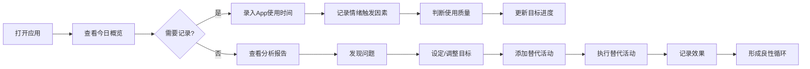

## 1. 产品概述

数字健康追踪工具是一款帮助用户管理手机使用时间、培养健康数字生活习惯的在线应用。通过记录、分析和干预手机使用行为，帮助用户建立更平衡的生活方式，减少无意识的手机依赖。

- 面向所有希望改善数字健康的人群，尤其是感到手机过度使用影响生活质量的用户
- 核心价值：通过数据洞察和行为干预，帮助用户实现"有意识使用"而非"被动沉溺"

## 2. 核心功能

### 2.1 用户角色

| 角色 | 注册方式 | 核心权限 |
|------|----------|----------|
| 普通用户 | 无需注册，本地存储 | 记录使用数据、设定目标、查看分析报告、管理替代方案 |

### 2.2 功能模块

1. **仪表板首页**：今日概览、使用时间统计、目标完成进度、快速录入入口
2. **使用追踪页面**：App使用时间录入、趋势分析图表、对比分析视图
3. **目标设定页面**：App类别时长上限、无屏幕时段、数字排毒挑战
4. **影响分析页面**：健康指标关联、情绪触发记录、有效/无效使用区分
5. **替代方案页面**：替代活动清单、执行效果记录、个性化推荐

### 2.3 页面详情

| 页面名称 | 模块名称 | 功能描述 |
|----------|----------|----------|
| 仪表板首页 | 今日概览 | 显示今日总使用时间、各类别占比、目标完成进度圆环 |
| 仪表板首页 | 快速操作 | 一键记录App使用、快速标记情绪触发、添加替代活动完成 |
| 仪表板首页 | 本周趋势 | 简化版周使用趋势图，关键指标卡片 |
| 使用追踪页面 | 使用录入 | 按App分类（社交媒体/娱乐/工作/学习/通讯）手动录入使用时长 |
| 使用追踪页面 | 趋势分析 | 周/月使用时间趋势折线图、各类别堆叠面积图 |
| 使用追踪页面 | 对比分析 | 工作日vs周末对比柱状图、不同月份使用习惯对比 |
| 目标设定页面 | 时长上限 | 为每类App设置每日使用时长上限，超量提醒 |
| 目标设定页面 | 无屏幕时段 | 设置每日"断网"时间段，记录完成情况 |
| 目标设定页面 | 排毒挑战 | 自定义数字排毒挑战（如周末一天不用社交媒体） |
| 影响分析页面 | 健康关联 | 记录睡眠质量、专注力水平，与屏幕使用时间做关联分析 |
| 影响分析页面 | 情绪触发 | 记录每次拿起手机的情绪原因（无聊/焦虑/习惯性检查等） |
| 影响分析页面 | 使用质量 | 区分有效使用（学习/工作）和无效使用（刷视频/无目的浏览） |
| 替代方案页面 | 活动清单 | 管理想拿手机时的替代活动（散步/深呼吸/看书等） |
| 替代方案页面 | 效果记录 | 记录替代活动执行情况和效果，分析哪种最有效 |
| 替代方案页面 | 智能推荐 | 根据历史数据推荐当前最适合的替代活动 |

## 3. 核心流程

用户每天的典型流程：打开应用查看今日使用情况 → 录入新的使用记录 → 标记情绪和使用质量 → 查看是否达到目标 → 如需调整则修改目标或添加替代活动 → 当想玩手机时从替代清单中选择活动执行 → 记录效果完成闭环。

## 4. 用户界面设计

### 4.1 设计风格

- **主色调**：柔和的薄荷绿 (#10B981) 代表健康与平衡，搭配温暖的珊瑚橙 (#F97316) 作为提醒色
- **辅助色**：淡紫 (#8B5CF6) 用于学习类、天蓝 (#3B82F6) 用于工作类、玫红 (#EC4899) 用于社交类
- **背景**：渐变的柔和底色配合微妙的噪点纹理，营造平静放松的氛围
- **按钮风格**：圆润的胶囊形按钮，带有微妙的阴影和悬停上浮效果
- **字体**：标题使用优雅的衬线字体 Lora，正文使用清晰易读的 Inter
- **布局风格**：卡片式布局，错落有致的网格，大量留白营造呼吸感
- **图标风格**：线性图标配合柔和填充，统一的圆角风格，微动画交互

### 4.2 页面设计概述

| 页面名称 | 模块名称 | UI 元素 |
|----------|----------|----------|
| 仪表板首页 | 今日概览 | 大型圆环进度图、渐变色卡片、分类颜色标签、微动效数字滚动 |
| 使用追踪页面 | 趋势分析 | 交互式图表、悬停数据提示、时间范围切换标签、动画过渡 |
| 目标设定页面 | 时长上限 | 滑块控件、实时预览、达到阈值时的颜色变化提醒 |
| 影响分析页面 | 健康关联 | 散点图展示相关性、热力图展示时间段分布 |
| 替代方案页面 | 活动清单 | 卡片网格布局、emoji图标、成功率徽章、一键选择按钮 |

### 4.3 响应式

- 采用桌面优先设计，适配平板和移动端
- 响应式断点：1280px（桌面）、768px（平板）、480px（手机）
- 移动端优化触摸区域，按钮最小44x44px
- 图表在移动端自适应切换为简化视图

### 4.4 动画与交互

- 页面加载时的淡入和滑动交错动画
- 数据录入后的微震动反馈和数字滚动动画
- 图表数据变化时的平滑过渡动画
- 目标达成时的庆祝动效（彩屑/渐变色脉冲）
- 卡片悬停时的微妙上浮和阴影加深
