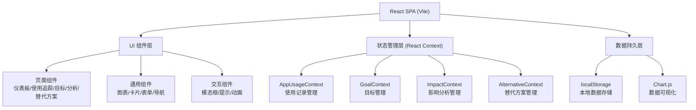

## 1. 架构设计



## 2. 技术描述

- **前端框架**：React@18 + TypeScript + Vite@5
- **样式方案**：TailwindCSS@3 + CSS 变量 + CSS 动画
- **图表库**：Chart.js@4 + react-chartjs-2
- **图标库**：Lucide React
- **数据存储**：浏览器 localStorage（无需后端）
- **初始化工具**：npm create vite@latest
- **状态管理**：React Context + useReducer
- **路由**：React Router DOM@6

## 3. 路由定义

| 路由 | 页面组件 | 功能描述 |
|------|----------|----------|
| / | Dashboard | 仪表板首页，今日概览和快速操作 |
| /tracking | UsageTracking | 使用追踪页面，录入和趋势分析 |
| /goals | GoalSetting | 目标设定页面，时长上限和排毒挑战 |
| /impact | ImpactAnalysis | 影响分析页面，健康关联和情绪记录 |
| /alternatives | AlternativeManagement | 替代方案管理页面 |

## 4. 数据模型

### 4.1 数据模型定义

```mermaid
erDiagram
    APP_USAGE {
        string id
        string category "社交媒体/娱乐/工作/学习/通讯"
        string appName
        number durationMinutes
        date date
        string usageQuality "有效/无效"
        string emotionalTrigger "无聊/焦虑/习惯性/其他"
        string notes
        timestamp createdAt
    }
    
    GOAL {
        string id
        string type "dailyLimit/screenFreeTime/detoxChallenge"
        string category "适用分类，all表示全部"
        number targetValue "目标值（分钟/小时数）"
        string timeRange "如20:00-21:00"
        string frequency "daily/weekends/custom"
        date startDate
        date endDate
        boolean active
    }
    
    HEALTH_METRIC {
        string id
        date date
        number sleepQuality "1-10"
        number sleepHours
        number focusLevel "1-10"
        number moodLevel "1-10"
        string notes
    }
    
    ALTERNATIVE_ACTIVITY {
        string id
        string name
        string category "运动/冥想/阅读/社交/其他"
        string emoji
        number durationMinutes
        number effectivenessScore "1-5 基于历史记录"
        number usageCount
        boolean active
    }
    
    ACTIVITY_LOG {
        string id
        string alternativeActivityId
        date date
        timestamp startTime
        number durationMinutes
        boolean completed
        number effectivenessRating "1-5 用户评分"
        string notes
    }
    
    SCREEN_FREE_LOG {
        string id
        date date
        string timeRange
        boolean completed
        string notes
    }
```



### 4.2 初始Mock数据

```typescript
// 初始使用记录（最近14天）
const initialAppUsage: AppUsage[] = [
  { id: '1', category: 'social', appName: '微信', durationMinutes: 45, date: '2026-06-06', usageQuality: 'mixed', emotionalTrigger: 'habit', notes: '', createdAt: new Date().toISOString() },
  { id: '2', category: 'entertainment', appName: '抖音', durationMinutes: 60, date: '2026-06-06', usageQuality: 'ineffective', emotionalTrigger: 'boredom', notes: '', createdAt: new Date().toISOString() },
  { id: '3', category: 'work', appName: '邮箱', durationMinutes: 30, date: '2026-06-06', usageQuality: 'effective', emotionalTrigger: 'intentional', notes: '', createdAt: new Date().toISOString() },
];

// 初始目标
const initialGoals: Goal[] = [
  { id: '1', type: 'dailyLimit', category: 'social', targetValue: 60, timeRange: '', frequency: 'daily', startDate: '2026-06-01', endDate: '', active: true },
  { id: '2', type: 'dailyLimit', category: 'entertainment', targetValue: 90, timeRange: '', frequency: 'daily', startDate: '2026-06-01', endDate: '', active: true },
  { id: '3', type: 'screenFreeTime', category: 'all', targetValue: 60, timeRange: '20:00-21:00', frequency: 'daily', startDate: '2026-06-01', endDate: '', active: true },
];

// 初始健康指标
const initialHealthMetrics: HealthMetric[] = [
  { id: '1', date: '2026-06-05', sleepQuality: 7, sleepHours: 7, focusLevel: 6, moodLevel: 7, notes: '' },
  { id: '2', date: '2026-06-04', sleepQuality: 5, sleepHours: 6, focusLevel: 4, moodLevel: 5, notes: '昨晚刷手机到很晚' },
];

// 初始替代活动
const initialAlternatives: AlternativeActivity[] = [
  { id: '1', name: '出去散步', category: '运动', emoji: '🚶', durationMinutes: 15, effectivenessScore: 4.5, usageCount: 12, active: true },
  { id: '2', name: '做10个深呼吸', category: '冥想', emoji: '🧘', durationMinutes: 2, effectivenessScore: 4.2, usageCount: 25, active: true },
  { id: '3', name: '看一页书', category: '阅读', emoji: '📚', durationMinutes: 5, effectivenessScore: 4.0, usageCount: 8, active: true },
  { id: '4', name: '喝水伸展', category: '运动', emoji: '💧', durationMinutes: 3, effectivenessScore: 3.8, usageCount: 18, active: true },
];
```

## 5. 项目目录结构

```
src/
├── components/          # 通用组件
│   ├── charts/         # 图表组件
│   ├── layout/         # 布局组件
│   └── ui/             # UI原子组件
├── contexts/           # Context 状态管理
│   ├── AppUsageContext.tsx
│   ├── GoalContext.tsx
│   ├── ImpactContext.tsx
│   └── AlternativeContext.tsx
├── hooks/              # 自定义 Hooks
├── pages/              # 页面组件
│   ├── Dashboard.tsx
│   ├── UsageTracking.tsx
│   ├── GoalSetting.tsx
│   ├── ImpactAnalysis.tsx
│   └── AlternativeManagement.tsx
├── types/              # TypeScript 类型定义
├── utils/              # 工具函数
│   ├── storage.ts      # localStorage 封装
│   ├── date.ts         # 日期处理
│   └── statistics.ts   # 统计计算
├── data/               # Mock 数据
├── App.tsx
├── main.tsx
└── index.css           # 全局样式和 Tailwind 配置
```

## 6. 核心技术要点

1. **数据持久化**：所有数据通过自定义 `useLocalStorage` Hook 存储到 localStorage，页面刷新不丢失
2. **图表渲染**：使用 Chart.js 绘制趋势图、对比图、饼图等多种数据可视化
3. **响应式设计**：TailwindCSS 响应式断点实现多端适配
4. **动画效果**：CSS transition + keyframes 实现页面过渡、数字滚动、卡片悬停等动效
5. **日期处理**：自定义日期工具函数处理周/月统计、工作日/周末区分
6. **统计分析**：计算相关性、趋势变化、完成率等核心指标
