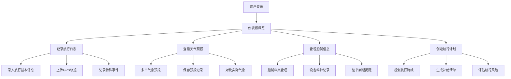

## 1. 产品概述

在线帆船航行日志和航行计划管理系统，为帆船爱好者和专业船员提供全方位的航行管理工具。

- 主要用途：记录航行历史、分析气象数据、管理船艇设备、规划航行路线
- 解决的问题：传统纸质日志难以检索、缺乏数据分析、无法可视化航行轨迹
- 目标用户：帆船爱好者、游艇船主、专业船员、帆船俱乐部

## 2. 核心功能

### 2.1 用户角色
| 角色 | 注册方式 | 核心权限 |
|------|----------|----------|
| 普通用户 | 邮箱/用户名注册 | 管理个人航行日志、船艇信息、航行计划 |

### 2.2 功能模块
1. **航行日志模块**：出海记录管理、GPS轨迹导入、地图展示、特殊事件记录
2. **气象分析模块**：天气预报查阅、实际与预报对比、季节性气象规律
3. **船艇管理模块**：船艇档案、设备维护记录、保养计划、证书追踪
4. **航行计划模块**：路线规划、补给清单、风险评估

### 2.3 页面详情
| 页面名称 | 模块名称 | 功能描述 |
|----------|----------|----------|
| 仪表板 | 数据概览 | 展示最近航行、即将到期证书、下次航行计划、统计数据卡片 |
| 航行日志列表 | 航行日志 | 按时间轴展示所有出海记录，支持筛选搜索 |
| 航行日志详情 | 航行日志 | 展示单次航行的完整信息、GPS轨迹地图、特殊事件时间线 |
| 新增/编辑航行日志 | 航行日志 | 表单录入航行信息、上传GPS文件、记录特殊事件 |
| 气象分析 | 气象分析 | 多日天气预报展示、历史气象对比、季节性规律图表 |
| 船艇列表 | 船艇管理 | 展示所有船艇档案，显示证书状态 |
| 船艇详情 | 船艇管理 | 船艇详细信息、设备清单、维护历史、保养计划 |
| 船艇维护记录 | 船艇管理 | 新增/编辑维护记录，查看历史 |
| 航行计划列表 | 航行计划 | 展示所有航行计划，显示状态 |
| 航行计划详情 | 航行计划 | 路线地图、补给清单、风险评估详情 |
| 新增/编辑航行计划 | 航行计划 | 规划路线、编辑补给清单、评估风险 |

## 3. 核心流程

用户登录系统后，可在仪表板查看整体概况。记录新航行时，先录入基本信息（时间、目的地、距离等），上传GPS轨迹文件，记录航行中的特殊事件。航行前可查看天气预报并保存记录，航行后对比实际天气。船艇管理中可录入船艇信息，定期记录设备维护，系统提醒证书到期。规划新航行时，设置路线和停靠点，生成补给清单，评估潜在风险。

## 4. 用户界面设计

### 4.1 设计风格
- **主色调**：深海蓝 (#0B3D91) 代表海洋和专业
- **辅助色**：航海橙 (#FF6B35) 用于强调和提醒
- **中性色**：白色、浅灰、深灰，确保良好的可读性
- **按钮风格**：圆角矩形，微妙的悬停动效，主色填充
- **字体**：Playfair Display（标题）+ Open Sans（正文）
- **布局风格**：卡片式布局，顶部导航栏 + 侧边菜单
- **图标风格**：线性图标，航海主题（锚、罗盘、帆、波浪）

### 4.2 页面设计概述
| 页面名称 | 模块名称 | UI元素 |
|----------|----------|--------|
| 仪表板 | 数据概览 | 航海主题背景、统计卡片网格、最近航行时间轴、即将到期提醒 |
| 航行日志列表 | 航行日志 | 搜索筛选栏、卡片式列表、航行时间轴、快速操作按钮 |
| 航行日志详情 | 航行日志 | 信息卡片组、内嵌地图组件、事件时间线、GPS轨迹动画 |
| 气象分析 | 气象分析 | 天气预报时间轴、风速风向图表、浪高潮汐卡片、对比柱状图 |
| 船艇列表 | 船艇管理 | 船艇卡片网格、证书状态标签、筛选工具栏 |
| 船艇详情 | 船艇管理 | 船艇信息面板、设备清单表格、维护历史时间线、保养计划日历 |
| 航行计划详情 | 航行计划 | 路线地图、分段时间线、补给清单表格、风险评估矩阵 |

### 4.3 响应性
- 桌面端优先设计，侧边导航展开
- 平板端侧边栏可收起，内容区域自适应
- 移动端底部导航栏，卡片堆叠布局
- 所有交互元素支持触摸操作
- 地图组件自适应容器尺寸

### 4.4 地图组件设计
- 加载OpenStreetMap作为底图
- 航线使用渐变颜色显示速度变化
- 特殊事件在地图上标注图标
- 支持缩放、平移交互
- 航行轨迹动画回放功能
