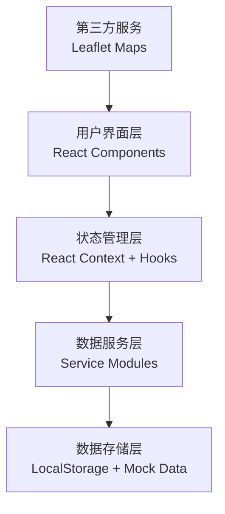
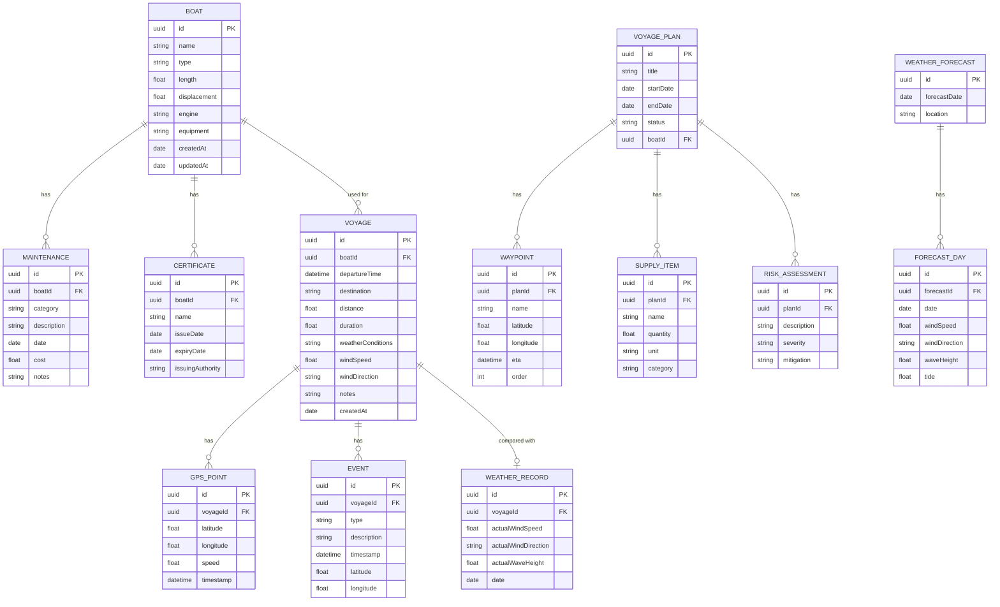

## 1. 架构设计



## 2. 技术描述

- **前端框架**：React@18.2.0 + TypeScript
- **构建工具**：Vite@5.0.0
- **样式方案**：TailwindCSS@3.4.0
- **路由管理**：React Router DOM@6.20.0
- **图表库**：Recharts@2.10.0
- **地图组件**：Leaflet@1.9.4 + react-leaflet@4.2.1
- **状态管理**：React Context + useReducer
- **图标库**：Lucide React@0.294.0
- **日期处理**：date-fns@2.30.0
- **后端**：无，使用LocalStorage持久化 + Mock数据
- **数据库**：LocalStorage作为客户端存储

## 3. 路由定义

| 路由路径 | 页面名称 | 用途 |
|----------|----------|------|
| `/` | 仪表板 | 数据概览、快捷操作入口 |
| `/voyages` | 航行日志列表 | 展示所有航行记录 |
| `/voyages/new` | 新增航行日志 | 创建新的航行记录 |
| `/voyages/:id` | 航行日志详情 | 查看单次航行完整信息 |
| `/voyages/:id/edit` | 编辑航行日志 | 修改航行记录 |
| `/weather` | 气象分析 | 天气预报、对比分析、季节性规律 |
| `/boats` | 船艇列表 | 展示所有船艇档案 |
| `/boats/new` | 新增船艇 | 创建船艇档案 |
| `/boats/:id` | 船艇详情 | 查看船艇完整信息和维护记录 |
| `/boats/:id/edit` | 编辑船艇 | 修改船艇档案 |
| `/boats/:id/maintenance/new` | 新增维护记录 | 创建设备维护记录 |
| `/plans` | 航行计划列表 | 展示所有航行计划 |
| `/plans/new` | 新增航行计划 | 创建新的航行计划 |
| `/plans/:id` | 航行计划详情 | 查看计划完整信息 |
| `/plans/:id/edit` | 编辑航行计划 | 修改航行计划 |

## 4. 数据模型

### 4.1 数据模型定义



### 4.2 数据初始化说明

系统首次运行时自动注入Mock数据，包含：
- 2艘完整的船艇档案（含证书和维护记录）
- 5条历史航行日志（含GPS轨迹和特殊事件）
- 3条航行计划（含路线、补给和风险评估）
- 多组气象预报和对比数据

## 5. 项目目录结构

```
src/
├── components/          # 通用组件
│   ├── Layout/         # 布局组件
│   ├── Map/            # 地图相关组件
│   ├── Charts/         # 图表组件
│   └── UI/             # UI基础组件
├── pages/              # 页面组件
│   ├── Dashboard/
│   ├── Voyages/
│   ├── Weather/
│   ├── Boats/
│   └── Plans/
├── context/            # React Context
├── services/           # 数据服务层
├── types/              # TypeScript类型定义
├── utils/              # 工具函数
├── mock/               # Mock数据
├── App.tsx
└── main.tsx
```
