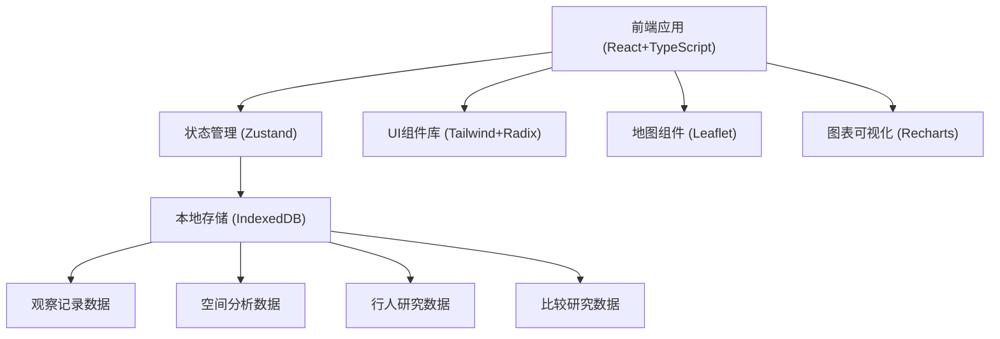
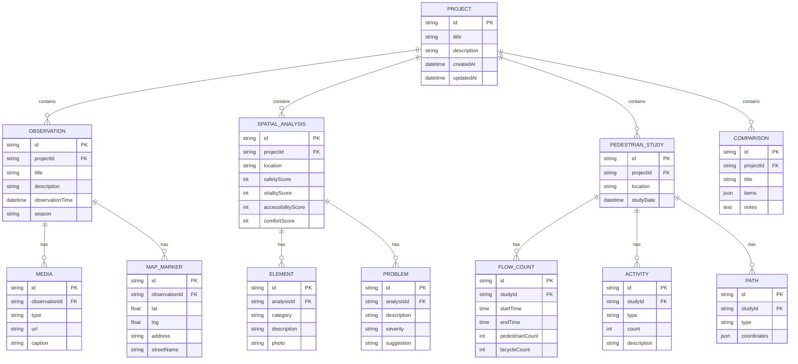

## 1. 架构设计



## 2. 技术描述

- **前端**：React@18 + TypeScript + Vite
- **样式方案**：TailwindCSS@3 + CSS变量
- **状态管理**：Zustand
- **地图**：Leaflet + react-leaflet
- **图表**：Recharts
- **图标**：lucide-react
- **UI组件**：Radix UI 基础组件
- **本地存储**：IndexedDB（通过 idb 库封装）
- **路由**：react-router-dom@6

## 3. 路由定义

| 路由 | 用途 |
|------|------|
| `/` | 首页仪表盘，项目总览 |
| `/observations` | 观察记录模块列表 |
| `/observations/:id` | 单个观察记录详情与编辑 |
| `/analysis` | 空间分析模块列表 |
| `/analysis/:id` | 单个空间分析详情与编辑 |
| `/pedestrian` | 行人研究模块列表 |
| `/pedestrian/:id` | 单个行人研究详情与编辑 |
| `/comparison` | 比较研究模块列表 |
| `/comparison/:id` | 单个比较研究详情与编辑 |

## 4. 数据模型

### 4.1 数据模型定义



### 4.2 类型定义

```typescript
interface Project {
  id: string;
  title: string;
  description: string;
  createdAt: string;
  updatedAt: string;
}

interface Observation {
  id: string;
  projectId: string;
  title: string;
  description: string;
  observationTime: string;
  season: 'spring' | 'summer' | 'autumn' | 'winter';
  markers: MapMarker[];
  media: MediaItem[];
}

interface MapMarker {
  id: string;
  lat: number;
  lng: number;
  address: string;
  streetName: string;
}

interface MediaItem {
  id: string;
  type: 'photo' | 'sketch' | 'text';
  url?: string;
  content?: string;
  caption: string;
}

interface SpatialAnalysis {
  id: string;
  projectId: string;
  location: string;
  scores: {
    safety: number;
    vitality: number;
    accessibility: number;
    comfort: number;
  };
  elements: SpatialElement[];
  problems: ProblemItem[];
}

interface SpatialElement {
  id: string;
  category: 'furniture' | 'signage' | 'vegetation' | 'building' | 'activity';
  description: string;
  photo?: string;
}

interface ProblemItem {
  id: string;
  description: string;
  severity: 'low' | 'medium' | 'high';
  suggestion: string;
}

interface PedestrianStudy {
  id: string;
  projectId: string;
  location: string;
  studyDate: string;
  flowCounts: FlowCount[];
  activities: ActivityItem[];
  paths: PathItem[];
}

interface FlowCount {
  id: string;
  startTime: string;
  endTime: string;
  pedestrianCount: number;
  bicycleCount: number;
}

interface ActivityItem {
  id: string;
  type: 'walk' | 'stay' | 'consume' | 'social';
  count: number;
  description: string;
}

interface PathItem {
  id: string;
  type: 'actual' | 'designed';
  coordinates: Array<{ lat: number; lng: number }>;
}
```
