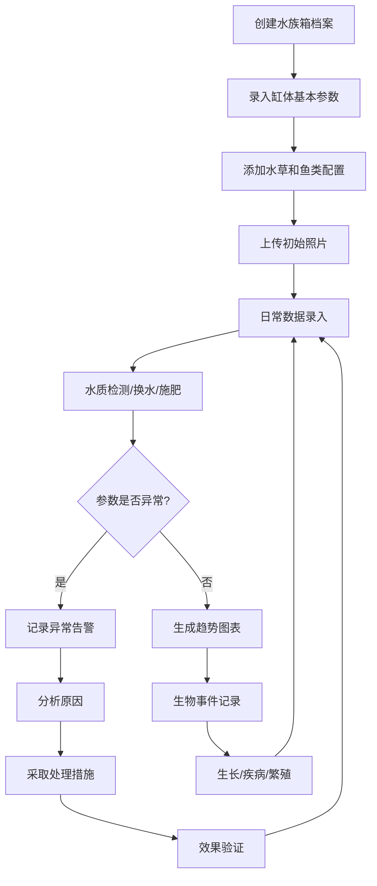

## 1. 产品概述

智能水族箱管理系统是一款面向水族爱好者的全生命周期管理工具，帮助用户科学记录、分析和管理水族箱的各项数据。通过系统化的档案管理、水质监测、生物追踪和日常维护记录，让养鱼养草变得更加科学高效。

- **目标用户**：水族爱好者、水草造景玩家、观赏鱼养殖者
- **核心价值**：建立完整的水族箱数据档案，实现科学养殖，提高养殖成功率
- **解决问题**：分散的记录方式、缺乏数据趋势分析、异常处理无追溯、维护计划混乱

## 2. 核心功能

### 2.1 功能模块

1. **首页概览**：水族箱列表、关键指标看板、近期提醒、快捷操作
2. **水族箱档案**：缸体参数配置、水草鱼类清单、照片时间轴
3. **水质监测**：检测数据录入、参数趋势图表、异常告警处理流程
4. **生物管理**：水草生长记录、鱼类疾病用药、繁殖事件追踪
5. **日常维护**：换水清洁计划、施肥CO2记录、设备维护历史

### 2.2 页面详情

| 页面名称 | 模块名称 | 功能描述 |
|---------|---------|---------|
| 首页概览 | 水族箱卡片 | 展示所有水族箱基本信息，点击进入详情 |
| 首页概览 | 指标看板 | 显示关键水质参数、下次维护提醒、异常告警 |
| 首页概览 | 快捷操作 | 快速录入水质检测、换水、喂食等日常操作 |
| 水族箱档案 | 缸体参数 | 记录尺寸、水量、过滤方式、灯光、底床、造景风格 |
| 水族箱档案 | 水草配置 | 品种、数量、入缸时间、来源、状态标签 |
| 水族箱档案 | 鱼类配置 | 品种、数量、入缸时间、来源、状态标签 |
| 水族箱档案 | 照片时间轴 | 按时间顺序展示水族箱成长历程，支持上传和备注 |
| 水质监测 | 数据录入 | pH、氨氮、亚硝酸盐、硝酸盐、GH、KH六项参数录入 |
| 水质监测 | 趋势图表 | 各参数历史变化曲线图，支持时间范围筛选 |
| 水质监测 | 异常告警 | 参数超标自动标记，记录发现→分析→措施→验证完整链条 |
| 生物管理 | 生长记录 | 水草开挂、植株增殖、生长状态变化记录 |
| 生物管理 | 疾病记录 | 疾病发现、用药方案、恢复情况完整记录 |
| 生物管理 | 繁殖记录 | 鱼卵发现、孵化天数、幼鱼存活数量记录 |
| 日常维护 | 换水记录 | 换水量、换水频率、水源类型记录 |
| 日常维护 | 施肥记录 | 肥料类型、用量、施用时间记录 |
| 日常维护 | CO2记录 | 供应量、开启时长、细化效果记录 |
| 日常维护 | 设备维护 | 设备清洗、更换、校准历史记录 |

## 3. 核心流程

**核心使用流程**：
1. 用户首次使用时创建水族箱档案，录入缸体参数和生物配置
2. 日常定期录入水质检测数据，系统自动计算趋势
3. 发现水质异常时，启动异常处理流程，完整记录处理链条
4. 记录水草生长、鱼类疾病、繁殖等生物事件
5. 按计划执行换水、施肥、CO2补充、设备维护等操作
6. 通过照片时间轴回顾水族箱的成长历程

## 4. 用户界面设计

### 4.1 设计风格

**设计主题**：清新自然的水族风格，以水蓝色和深绿色为主调，营造水下世界的沉浸感

- **主色调**：深海蓝 `#0C4A6E` - 代表稳定和专业
- **辅助色**：水草绿 `#059669` - 代表生机和健康
- **警告色**：珊瑚橙 `#EA580C` - 用于异常告警
- **背景色**：浅灰蓝 `#F0F9FF` - 营造清爽通透感
- **字体**：标题使用「思源宋体」，正文使用「思源黑体」，数字使用等宽字体增强数据可读性
- **按钮风格**：圆角8px，悬浮时轻微上浮，点击有按压反馈
- **布局风格**：卡片式布局，微妙的阴影层次，侧边导航+顶部标题栏
- **图标风格**：线性图标，水波纹动效，自然元素（水滴、鱼、水草）装饰

### 4.2 页面设计概述

| 页面名称 | 模块名称 | UI元素 |
|---------|---------|---------|
| 首页概览 | 水族箱卡片 | 渐变背景卡片，展示缩略图、名称、关键指标，悬浮放大动效 |
| 首页概览 | 指标看板 | 数据卡片带趋势箭头，彩色编码指标状态（正常/警告/异常） |
| 首页概览 | 快捷操作 | 浮动操作按钮组，图标+文字，展开收起动效 |
| 水族箱档案 | 参数表单 | 分组表单，标签页切换，图标化输入框 |
| 水族箱档案 | 生物列表 | 表格+卡片双视图，状态标签（健康/观察中/治疗中） |
| 水族箱档案 | 照片时间轴 | 垂直时间线，照片卡片悬浮缩放，日期标记 |
| 水质监测 | 数据录入 | 表单带单位显示，实时校验范围，提交成功动效 |
| 水质监测 | 趋势图表 | 多线折线图，交互式悬停显示数值，时间轴缩放 |
| 水质监测 | 异常处理 | 进度条展示处理阶段，状态流转，时间线记录 |
| 日常维护 | 记录列表 | 日历视图+列表视图，循环计划标记，完成勾选 |

### 4.3 响应式设计

- **桌面端优先**：侧边导航固定，主内容区1200px最大宽度，多栏布局
- **平板适配**：侧边栏可折叠，内容区自适应两栏布局
- **移动端**：底部标签导航，单栏流式布局，表单优化为全宽输入
- **触摸优化**：按钮最小高度44px，卡片点击区域扩大，支持滑动删除

### 4.4 视觉动效

- 页面加载：元素淡入+轻微上移，错落有致的延迟动画
- 数据更新：数字滚动动效，图表线条绘制动画
- 导航切换：内容区横向平滑过渡
- 卡片交互：悬浮时轻微上浮+阴影加深，点击时缩放反馈
- 表单交互：输入框聚焦时边框高亮+标签上浮
- 告警提示：轻微脉冲动效吸引注意，可关闭的平滑过渡
