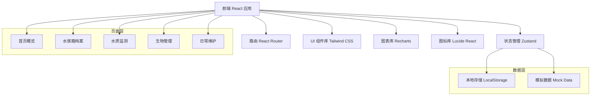
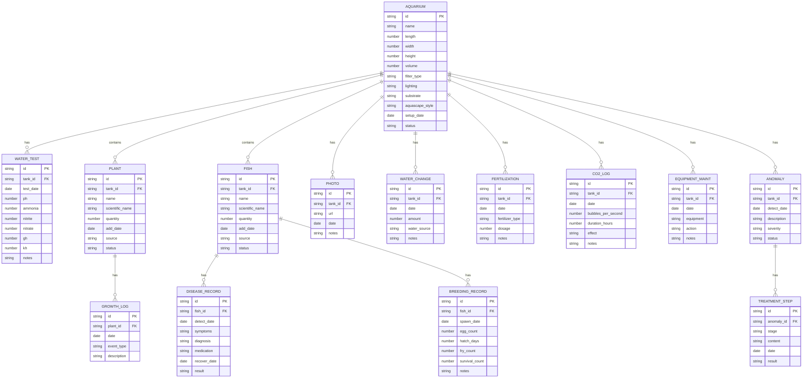

## 1. 架构设计



## 2. 技术描述

- **前端框架**：React@18 + TypeScript
- **构建工具**：Vite@5
- **路由管理**：react-router-dom@6
- **状态管理**：zustand@4
- **样式方案**：Tailwind CSS@3
- **图表组件**：Recharts@2
- **图标组件**：lucide-react@0.344
- **数据持久化**：LocalStorage（前端存储）
- **开发语言**：TypeScript@5
- **初始化工具**：vite-init

## 3. 路由定义

| 路径 | 页面名称 | 说明 |
|------|---------|------|
| `/` | 首页概览 | 水族箱列表、指标看板、快捷操作 |
| `/tanks` | 水族箱列表 | 所有水族箱卡片展示 |
| `/tanks/:id` | 水族箱详情 | 包含档案、水质、生物、维护四个标签页 |
| `/tanks/:id/profile` | 水族箱档案 | 缸体参数、生物配置、照片时间轴 |
| `/tanks/:id/water` | 水质监测 | 数据录入、趋势图表、异常处理 |
| `/tanks/:id/life` | 生物管理 | 生长、疾病、繁殖记录 |
| `/tanks/:id/maintenance` | 日常维护 | 换水、施肥、CO2、设备维护记录 |
| `/tanks/new` | 新建水族箱 | 创建新的水族箱档案表单 |

## 4. 数据模型

### 4.1 实体关系图



### 4.2 数据类型定义

```typescript
// 水族箱
interface Aquarium {
  id: string;
  name: string;
  length: number;
  width: number;
  height: number;
  volume: number;
  filterType: string;
  lighting: string;
  substrate: string;
  aquascapeStyle: string;
  setupDate: string;
  status: 'running' | 'cycling' | 'offline';
  coverImage?: string;
}

// 水质检测
interface WaterTest {
  id: string;
  tankId: string;
  testDate: string;
  ph: number;
  ammonia: number;
  nitrite: number;
  nitrate: number;
  gh: number;
  kh: number;
  notes?: string;
}

// 水草
interface Plant {
  id: string;
  tankId: string;
  name: string;
  scientificName?: string;
  quantity: number;
  addDate: string;
  source?: string;
  status: 'healthy' | 'growing' | 'melting' | 'dead';
}

// 鱼类
interface Fish {
  id: string;
  tankId: string;
  name: string;
  scientificName?: string;
  quantity: number;
  addDate: string;
  source?: string;
  status: 'healthy' | 'observing' | 'sick' | 'dead';
}

// 照片
interface Photo {
  id: string;
  tankId: string;
  url: string;
  date: string;
  notes?: string;
}

// 换水记录
interface WaterChange {
  id: string;
  tankId: string;
  date: string;
  amount: number;
  waterSource: string;
  notes?: string;
}

// 施肥记录
interface Fertilization {
  id: string;
  tankId: string;
  date: string;
  fertilizerType: string;
  dosage: number;
  notes?: string;
}

// CO2记录
interface CO2Log {
  id: string;
  tankId: string;
  date: string;
  bubblesPerSecond: number;
  durationHours: number;
  effect: string;
  notes?: string;
}

// 设备维护
interface EquipmentMaintenance {
  id: string;
  tankId: string;
  date: string;
  equipment: string;
  action: string;
  notes?: string;
}

// 水质异常
interface Anomaly {
  id: string;
  tankId: string;
  detectDate: string;
  description: string;
  severity: 'low' | 'medium' | 'high' | 'critical';
  status: 'detected' | 'analyzing' | 'treating' | 'verified' | 'resolved';
  steps: TreatmentStep[];
}

// 处理步骤
interface TreatmentStep {
  id: string;
  stage: 'detection' | 'analysis' | 'action' | 'verification';
  content: string;
  date: string;
  result?: string;
}

// 生长记录
interface GrowthLog {
  id: string;
  plantId: string;
  date: string;
  eventType: 'new_leaf' | 'propagation' | 'flowering' | 'melting' | 'pruning';
  description: string;
}

// 疾病记录
interface DiseaseRecord {
  id: string;
  fishId: string;
  detectDate: string;
  symptoms: string;
  diagnosis: string;
  medication: string;
  recoverDate?: string;
  result: 'recovered' | 'ongoing' | 'deceased';
}

// 繁殖记录
interface BreedingRecord {
  id: string;
  fishId: string;
  spawnDate: string;
  eggCount: number;
  hatchDays: number;
  fryCount: number;
  survivalCount: number;
  notes?: string;
}
```

## 5. 项目结构

```
project148/
├── src/
│   ├── components/          # 通用组件
│   │   ├── Layout.tsx       # 布局组件
│   │   ├── Sidebar.tsx      # 侧边导航
│   │   ├── TankCard.tsx     # 水族箱卡片
│   │   ├── StatCard.tsx     # 统计卡片
│   │   ├── Timeline.tsx     # 时间轴组件
│   │   ├── StatusBadge.tsx  # 状态标签
│   │   ├── Modal.tsx        # 弹窗组件
│   │   └── Form/            # 表单组件
│   ├── pages/               # 页面组件
│   │   ├── Dashboard.tsx    # 首页概览
│   │   ├── TankList.tsx     # 水族箱列表
│   │   ├── TankNew.tsx      # 新建水族箱
│   │   └── TankDetail/      # 水族箱详情页
│   │       ├── index.tsx
│   │       ├── Profile.tsx  # 档案模块
│   │       ├── Water.tsx    # 水质模块
│   │       ├── Life.tsx     # 生物模块
│   │       └── Maintenance.tsx # 维护模块
│   ├── store/               # 状态管理
│   │   └── useStore.ts
│   ├── types/               # 类型定义
│   │   └── index.ts
│   ├── utils/               # 工具函数
│   │   ├── storage.ts
│   │   ├── mock.ts
│   │   └── helpers.ts
│   ├── App.tsx
│   ├── main.tsx
│   └── index.css
├── .trae/
│   └── documents/
│       ├── prd.md
│       └── technical-architecture.md
├── package.json
├── tsconfig.json
├── vite.config.ts
├── tailwind.config.js
└── postcss.config.js
```

## 6. 关键技术点

### 6.1 状态管理方案

使用 Zustand 管理全局状态，包含：
- 水族箱列表数据
- 当前选中水族箱详情
- 各类记录数据（水质、生物、维护）
- 持久化到 LocalStorage

### 6.2 图表实现

使用 Recharts 实现水质趋势图：
- 多参数折线图
- 交互式 Tooltip
- 时间范围筛选
- 异常点高亮标记

### 6.3 表单处理

使用受控组件实现表单：
- 实时数据校验
- 参数范围提示
- 提交状态反馈

### 6.4 照片管理

使用图片 URL 存储：
- 支持本地图片预览
- 时间轴排序展示
- 渐进式加载

### 6.5 模拟数据

预置完整的模拟数据：
- 2个示例水族箱
- 30天水质检测历史
- 完整的生物配置
- 各类维护记录
- 异常处理案例
