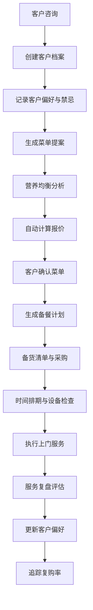

## 1. 产品概述

私人厨师服务和菜单定制管理工具是一款专为私人厨师设计的全流程管理系统，旨在帮助厨师高效管理客户信息、定制个性化菜单、规划备餐流程以及复盘服务质量。

- **主要用途**：客户档案管理、智能菜单定制、备餐计划安排、服务质量追踪
- **目标用户**：私人厨师、高端餐饮服务商、私厨工作室
- **解决问题**：传统手工管理效率低下、菜单定制缺乏数据支撑、备餐流程混乱、服务质量难以追踪

- **产品价值**：提升服务效率30%、菜单定制个性化程度提升、客户复购率追踪可视化、全流程数字化管理

## 2. 核心功能

### 2.1 用户角色

| 角色 | 注册方式 | 核心权限 |
|------|----------|----------|
| 厨师管理员 | 账号密码登录 | 全部功能权限，数据管理 |
| 厨师助手 | 子账号登录 | 查看备餐计划、执行备货检查 |

### 2.2 功能模块

1. **仪表盘**：数据概览、今日任务、快捷操作、统计图表
2. **客户管理**：客户档案、服务记录、特殊需求
3. **菜单定制**：菜单提案、营养分析、自动报价
4. **备餐计划**：备货清单、时间排期、设备检查
5. **服务复盘**：自我评估、偏好更新、复购追踪

### 2.3 页面详情

| 页面名称 | 模块名称 | 功能描述 |
|----------|----------|----------|
| 仪表盘 | 数据概览 | 客户总数、本月服务次数、营收统计、热门菜品排行 |
| 仪表盘 | 今日任务 | 今日待办事项、服务提醒、倒计时 |
| 客户管理 | 客户档案列表 | 客户列表展示、搜索筛选、新增/编辑/删除客户 |
| 客户管理 | 客户详情页 | 基本信息、饮食禁忌/过敏史、口味偏好、不喜欢食材、喜欢菜系 |
| 客户管理 | 服务记录 | 历次服务日期、人数、菜单、客户评价展示与录入 |
| 客户管理 | 特殊需求 | 婚礼晚宴、商务宴请、生日派对等场合需求记录 |
| 菜单定制 | 菜单提案生成 | 基于客户偏好筛选菜品、智能组合推荐、拖拽调整 |
| 菜单定制 | 营养均衡分析 | 宏量营养素分布可视化、热量统计、营养建议 |
| 菜单定制 | 自动报价计算 | 食材成本累加、服务费配置、总报价生成与导出 |
| 备餐计划 | 备货清单 | 食材精确用量计算、采购清单生成、采购状态追踪 |
| 备餐计划 | 时间安排计划 | 每道菜准备时间、上菜顺序排期、甘特图展示 |
| 备餐计划 | 设备检查清单 | 厨具清单、摆台物品、检查状态勾选 |
| 服务复盘 | 自我评估 | 菜品受欢迎度投票、环节改进记录、经验总结 |
| 服务复盘 | 偏好更新记录 | 服务中新发现的客户喜好、同步到客户档案 |
| 服务复盘 | 复购率追踪 | 客户复购统计、复购率图表、消费频次分析 |

## 3. 核心流程

## 4. 用户界面设计

### 4.1 设计风格

- **主色调**：深橄榄绿 #2D4A3E（代表专业、健康、自然）
- **辅助色**：暖金色 #D4A574（代表高端、品质、温暖）
- **点缀色**：珊瑚橙 #E07A5F（强调操作、提醒）
- **背景色**：米白色 #F8F5F0 + 深炭灰 #1A1A1A（深色模式）
- **按钮风格**：圆润边角（8px）、微阴影、悬停上浮效果
- **字体**：标题使用"Noto Serif SC"（优雅衬线体），正文使用"Noto Sans SC"（清晰无衬线）
- **布局风格**：卡片式布局、左侧导航栏、内容区留白充足
- **图标风格**：线性简约图标，统一2px描边，圆角端点

### 4.2 页面设计概述

| 页面名称 | 模块名称 | UI元素 |
|----------|----------|--------|
| 仪表盘 | 数据概览 | 卡片式统计面板、渐变色数据块、趋势图表、动画数字 |
| 仪表盘 | 今日任务 | 时间线布局、任务状态标签、倒计时组件 |
| 客户管理 | 客户列表 | 表格布局、头像+姓名展示、标签系统（过敏/偏好）、搜索筛选栏 |
| 客户管理 | 客户详情 | 分栏布局、Tab切换（基本信息/服务记录/特殊需求）、卡片分组 |
| 菜单定制 | 菜单提案 | 双栏布局（左侧菜品库/右侧已选菜单）、拖拽排序、分类筛选 |
| 菜单定制 | 营养分析 | 雷达图、饼图、进度条、营养指标卡片 |
| 备餐计划 | 时间排期 | 甘特图样式、时间轴、颜色区分不同菜品、进度可拖拽 |
| 服务复盘 | 复购追踪 | 折线图、柱状图、数据对比、客户复购标签 |

### 4.3 响应式

- **设计原则**：桌面端优先，移动端自适应
- **断点设计**：1280px（桌面）、768px（平板）、375px（手机）
- **移动端适配**：左侧导航变为底部Tab、表格变为卡片列表、图表自适应缩放
- **触控优化**：按钮最小尺寸44x44px、滑动操作支持、下拉刷新

### 4.4 交互与动效

- 页面加载：渐入动画，卡片依次上浮
- 数据更新：数字滚动动画、图表渐入
- 表单交互：输入框聚焦动效、错误提示震动
- 按钮交互：点击缩放反馈、悬停阴影加深
- 导航切换：平滑过渡、内容淡入淡出
