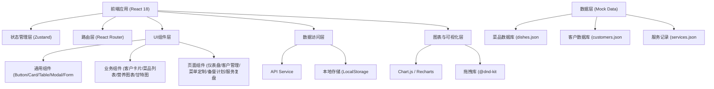
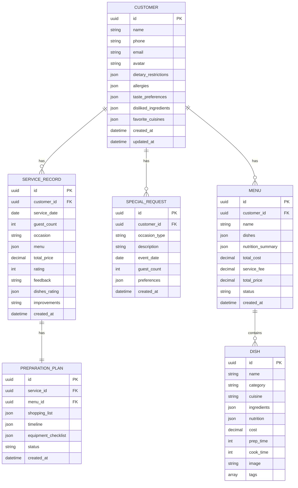

## 1. 架构设计



## 2. 技术描述

- **前端框架**：React 18 + TypeScript
- **构建工具**：Vite 5
- **样式方案**：Tailwind CSS 3
- **状态管理**：Zustand（轻量级状态管理）
- **路由方案**：React Router 6
- **图表库**：Recharts（React生态图表库）
- **拖拽功能**：@dnd-kit（现代React拖拽库）
- **图标库**：Lucide React
- **UI组件**：Headless UI（无样式组件库）
- **日期处理**：date-fns
- **数据持久化**：LocalStorage（前端本地存储）
- **数据模拟**：内置Mock数据

## 3. 路由定义

| 路由路径 | 页面名称 | 功能描述 |
|-----------|----------|----------|
| / | 仪表盘 | 数据概览、今日任务、快捷操作 |
| /customers | 客户列表 | 客户档案列表、搜索筛选 |
| /customers/:id | 客户详情 | 客户信息、服务记录、特殊需求 |
| /menus | 菜单定制 | 菜单提案、营养分析、报价计算 |
| /preparation | 备餐计划 | 备货清单、时间排期、设备检查 |
| /review | 服务复盘 | 自我评估、偏好更新、复购追踪 |
| /dishes | 菜品库管理 | 菜品CRUD、营养数据维护 |

## 4. 数据模型

### 4.1 数据模型定义



### 4.2 核心接口类型定义

```typescript
// 客户相关类型
interface Customer {
  id: string;
  name: string;
  phone: string;
  email: string;
  avatar?: string;
  dietaryRestrictions: string[];
  allergies: string[];
  tastePreferences: {
    spicy: number;
    salty: number;
    sweet: number;
    sour: number;
    bitter: number;
  };
  dislikedIngredients: string[];
  favoriteCuisines: string[];
  notes?: string;
  createdAt: string;
  updatedAt: string;
}

// 菜品相关类型
interface Dish {
  id: string;
  name: string;
  category: 'appetizer' | 'main' | 'soup' | 'dessert' | 'drink';
  cuisine: string;
  ingredients: { name: string; amount: number; unit: string }[];
  nutrition: {
    calories: number;
    protein: number;
    carbs: number;
    fat: number;
  };
  cost: number;
  prepTime: number;
  cookTime: number;
  image?: string;
  tags: string[];
}

// 服务记录类型
interface ServiceRecord {
  id: string;
  customerId: string;
  serviceDate: string;
  guestCount: number;
  occasion: string;
  menu: { dishId: string; dishName: string }[];
  totalPrice: number;
  rating: number;
  feedback: string;
  dishesRating: { dishId: string; rating: number }[];
  improvements: string[];
  newPreferences: string[];
}

// 菜单类型
interface Menu {
  id: string;
  customerId: string;
  name: string;
  dishes: { dishId: string; portion: number }[];
  nutritionSummary: {
    totalCalories: number;
    totalProtein: number;
    totalCarbs: number;
    totalFat: number;
    perPersonCalories: number;
  };
  totalCost: number;
  serviceFee: number;
  totalPrice: number;
  status: 'draft' | 'confirmed' | 'completed';
  createdAt: string;
}
```

## 5. 项目目录结构

```
src/
├── assets/          # 静态资源
├── components/     # 通用组件
│   ├── ui/       # 基础UI组件
│   │   ├── Button.tsx
│   │   ├── Card.tsx
│   │   ├── Modal.tsx
│   │   ├── Table.tsx
│   │   ├── Form.tsx
│   │   └── ...
│   └── layout/   # 布局组件
│       ├── Sidebar.tsx
│       ├── Header.tsx
│       └── Layout.tsx
├── pages/         # 页面组件
│   ├── Dashboard/
│   ├── Customers/
│   ├── MenuBuilder/
│   ├── Preparation/
│   └── Review/
├── store/         # 状态管理
│   ├── customerStore.ts
│   ├── dishStore.ts
│   ├── menuStore.ts
│   └── serviceStore.ts
├── types/         # 类型定义
│   └── index.ts
├── data/          # Mock数据
│   ├── customers.ts
│   ├── dishes.ts
│   └── services.ts
├── utils/         # 工具函数
│   ├── nutrition.ts
│   ├── pricing.ts
│   └── date.ts
├── hooks/         # 自定义Hooks
├── App.tsx
├── main.tsx
└── index.css
```

## 6. 核心功能实现思路

### 6.1 菜单提案生成算法
- 基于客户偏好权重筛选菜品
- 自动搭配前菜、主菜、汤品、甜点组合
- 排除过敏食材和不喜欢食材
- 营养均衡校验（蛋白质、碳水、脂肪比例

### 6.2 营养分析计算
- 累加所有菜品营养数据
- 按人数计算人均营养摄入
- 可视化展示宏量营养素分布

### 6.3 自动报价计算
- 食材成本 × 份数 × 人数
- 服务费比例配置（基础服务费、高端场合加价）
- 总报价 = 食材成本 + 服务费

### 6.4 备餐时间排期
- 反向推算每道菜准备开始时间
- 基于上菜顺序和烹饪时长
- 甘特图可视化展示

### 6.5 复购率计算
- 统计客户服务次数
- 按月/季度/年度复购率
- 客户消费频次分析
