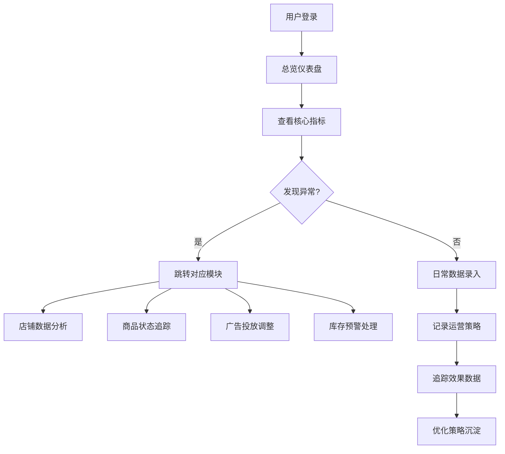

## 1. 产品概述

面向跨境电商运营团队的一站式数据追踪与策略管理平台，整合多平台店铺数据、商品全生命周期、广告投放、库存物流及运营策略，帮助运营者快速洞察业务健康度，制定科学决策。

- 核心价值：打破数据孤岛，实现多平台（Amazon/eBay/Shopify）统一视图；沉淀运营经验，将策略与效果关联追踪；数据驱动的库存与备货决策，降低资金占用。
- 目标用户：跨境电商运营经理、店铺运营专员、供应链负责人。

## 2. 核心功能

### 2.1 用户角色

| 角色 | 注册方式 | 核心权限 |
|------|----------|----------|
| 运营管理员 | 账号登录 | 全部功能、数据导出、用户管理 |
| 运营专员 | 账号登录 | 数据录入、策略记录、查看分析 |
| 供应链专员 | 账号登录 | 库存管理、物流记录、备货计划 |

### 2.2 功能模块

1. **仪表盘总览**：核心指标卡片、趋势图表、平台对比、异常告警
2. **店铺数据管理**：多平台店铺数据录入/导入、统一仪表盘、平台间对比分析
3. **商品管理**：商品全生命周期状态管理、关键词排名追踪、差评分析与应对
4. **广告投放管理**：广告活动记录、关键词出价优化历史、ROI趋势分析
5. **库存与物流管理**：库存水位追踪、头程物流记录、季节性备货计划
6. **运营策略记录**：价格调整历史与效果、促销活动策划与复盘

### 2.3 页面详情

| 页面名称 | 模块名称 | 功能描述 |
|----------|----------|----------|
| 总览仪表盘 | 数据概览 | 销售额/订单量/退款率/评价分核心指标卡片；趋势折线图；平台对比柱状图；异常告警列表 |
| 店铺数据管理 | 数据录入 | 手动录入或CSV导入各平台销售数据；数据校验与提交 |
| 店铺数据管理 | 平台分析 | 统一数据仪表盘展示；多平台ROI对比图表；数据筛选与导出 |
| 商品管理 | 生命周期 | 在售商品列表；状态流转（上架→推广→滞销→清库）；批量操作 |
| 商品管理 | 关键词排名 | 目标关键词维护；历史排名变化折线图；排名预警 |
| 商品管理 | 差评管理 | 差评列表；原因分类标签；回复策略记录与效果追踪 |
| 广告投放管理 | 活动管理 | 广告活动列表；投放类型/预算/ACOS/效果记录；状态管理 |
| 广告投放管理 | 出价优化 | 关键词出价调整历史；优化前后效果对比；建议出价 |
| 广告投放管理 | ROI分析 | 广告投入产出比趋势图；按平台/活动维度分析 |
| 库存与物流管理 | 库存追踪 | 各平台库存水位；销售速度计算；补货时间点预警 |
| 库存与物流管理 | 头程物流 | 发货批次记录；物流状态追踪；成本分摊 |
| 库存与物流管理 | 备货计划 | 季节性备货预测；安全库存计算；备货提醒 |
| 运营策略记录 | 价格管理 | 价格调整历史；调整前后销量对比；效果评估 |
| 运营策略记录 | 促销管理 | 促销活动策划；执行记录；复盘分析与ROI计算 |

## 3. 核心流程

用户登录后进入总览仪表盘查看核心业务指标，可快速发现异常并跳转至对应模块深入分析。日常工作中，运营人员录入各平台销售数据，追踪商品状态与关键词排名，管理广告投放活动，供应链人员维护库存与物流记录，所有策略调整均记录在案并关联后续效果数据，形成数据闭环。

## 4. 用户界面设计

### 4.1 设计风格
- **主色调**：深海蓝 #0F172A（专业、可信赖），搭配科技蓝 #2563EB 作为强调色
- **辅助色**：翡翠绿 #059669（增长/正常）、琥珀橙 #D97706（警告）、玫瑰红 #DC2626（异常）
- **字体**：展示字体使用 "Space Grotesk"，正文字体使用 "JetBrains Mono" 增强数据感
- **布局**：左侧固定导航 + 右侧内容区，卡片式模块布局，数据表格与图表混排
- **视觉细节**：深色渐变背景配微妙网格纹理，卡片采用玻璃拟态效果，数据变化采用微动画提示

### 4.2 页面设计概述

| 页面名称 | 模块名称 | UI元素 |
|----------|----------|--------|
| 总览仪表盘 | 数据概览 | 4个大尺寸指标卡片带趋势箭头；交互式折线图；横向柱状对比图；告警列表带状态色标 |
| 店铺数据管理 | 数据录入 | 分段表单设计；拖拽CSV上传区；数据预览表格；提交按钮带加载动画 |
| 商品管理 | 生命周期 | 状态流程时间轴；卡片网格布局；状态色标指示；批量操作工具栏 |
| 广告投放管理 | ROI分析 | 双Y轴折线图（投入vs产出）；数据透视表；筛选器面板 |
| 库存与物流管理 | 库存追踪 | 水位进度条；预警阈值线；补货倒计时；甘特图式物流追踪 |

### 4.3 响应式
- 桌面端优先设计，宽度 >= 1280px 呈现完整布局
- 平板端（768-1279px）：左侧导航收起为图标模式，图表自适应缩放
- 移动端（< 768px）：底部Tab导航，图表单列堆叠，数据表格支持横向滚动

### 4.4 交互与动画
- 页面加载：卡片渐入 + 数据数字滚动动画（count-up效果）
- 指标变化：上升/下降箭头带颜色动画
- 图表交互：悬停显示详细数据tooltip，点击图例切换数据系列
- 表单交互：输入框焦点态边框动画，提交成功绿色反馈
