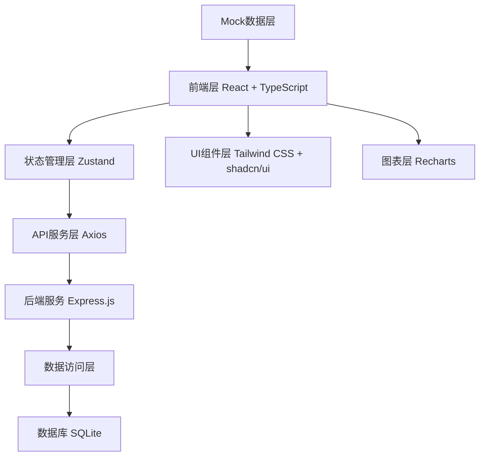
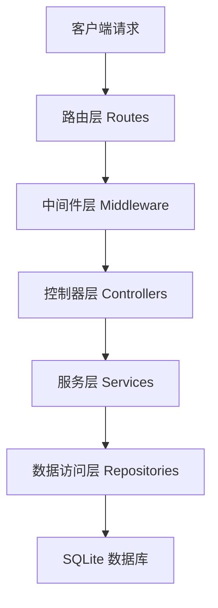
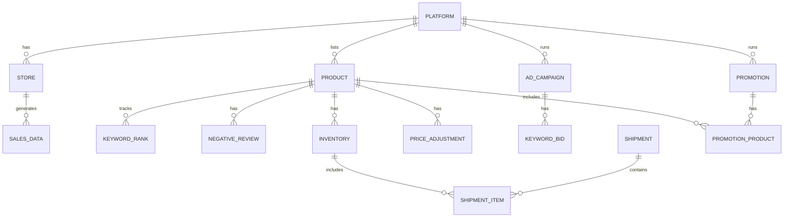

## 1. 架构设计



## 2. 技术描述

- **前端**：React@18 + TypeScript + Vite@5
- **UI框架**：Tailwind CSS@3 + shadcn/ui 组件库 + lucide-react 图标
- **状态管理**：Zustand@4
- **路由**：React Router DOM@6
- **图表**：Recharts@2
- **后端**：Express@4 + TypeScript
- **数据库**：SQLite3 + better-sqlite3
- **HTTP客户端**：Axios@1
- **初始化工具**：vite-init
- **数据策略**：内置Mock数据支持离线演示，同时支持真实API对接

## 3. 路由定义

| 路由 | 页面 | 说明 |
|------|------|------|
| /dashboard | 总览仪表盘 | 核心指标、趋势图、平台对比、告警 |
| /stores | 店铺数据管理 | 数据录入导入、平台分析、ROI对比 |
| /products | 商品管理 | 商品生命周期、关键词排名、差评管理 |
| /products/lifecycle | 商品生命周期 | 商品状态流转管理 |
| /products/keywords | 关键词排名 | 关键词追踪与历史趋势 |
| /products/reviews | 差评管理 | 差评分析与应对策略 |
| /advertising | 广告投放管理 | 广告活动、出价优化、ROI分析 |
| /advertising/campaigns | 广告活动 | 广告活动记录与管理 |
| /advertising/bidding | 出价优化 | 关键词出价调整历史 |
| /advertising/roi | ROI分析 | 广告投入产出比趋势 |
| /inventory | 库存与物流管理 | 库存追踪、物流记录、备货计划 |
| /inventory/stock | 库存追踪 | 库存水位与补货预警 |
| /inventory/logistics | 头程物流 | 物流批次记录 |
| /inventory/planning | 备货计划 | 季节性备货预测 |
| /strategy | 运营策略记录 | 价格调整、促销活动 |
| /strategy/pricing | 价格管理 | 价格调整历史与效果 |
| /strategy/promotions | 促销管理 | 促销策划与复盘 |
| /login | 登录页 | 用户认证 |

## 4. API 定义

### 4.1 类型定义

```typescript
// 平台枚举
type Platform = 'amazon' | 'ebay' | 'shopify';

// 商品状态
type ProductStatus = 'listing' | 'promoting' | 'slow_selling' | 'clearing';

// 店铺销售数据
interface StoreSalesData {
  id: string;
  platform: Platform;
  storeName: string;
  date: string;
  salesAmount: number;
  orderCount: number;
  refundRate: number;
  reviewScore: number;
  adSpend: number;
  profit: number;
}

// 商品信息
interface Product {
  id: string;
  sku: string;
  name: string;
  platform: Platform;
  status: ProductStatus;
  price: number;
  cost: number;
  stock: number;
  dailySalesRate: number;
  listedAt: string;
}

// 关键词排名
interface KeywordRank {
  id: string;
  productId: string;
  keyword: string;
  platform: Platform;
  rank: number;
  date: string;
  targetRank: number;
}

// 差评记录
interface NegativeReview {
  id: string;
  productId: string;
  platform: Platform;
  rating: number;
  content: string;
  date: string;
  reasonCategory: string;
  responseStrategy: string;
  responseDate: string;
  status: 'pending' | 'responded' | 'resolved';
}

// 广告活动
interface AdCampaign {
  id: string;
  name: string;
  platform: Platform;
  type: string;
  budget: number;
  acos: number;
  impressions: number;
  clicks: number;
  sales: number;
  startDate: string;
  endDate: string;
  status: 'active' | 'paused' | 'completed';
}

// 库存记录
interface InventoryRecord {
  id: string;
  productId: string;
  platform: Platform;
  warehouse: string;
  currentStock: number;
  reservedStock: number;
  dailySalesRate: number;
  safetyStock: number;
  restockDate: string | null;
}

// 头程物流
interface Shipment {
  id: string;
  batchNo: string;
  origin: string;
  destination: string;
  shippingMethod: string;
  departureDate: string;
  estimatedArrival: string;
  actualArrival: string | null;
  cost: number;
  status: 'pending' | 'shipping' | 'arrived' | 'warehoused';
  items: ShipmentItem[];
}

// 价格调整
interface PriceAdjustment {
  id: string;
  productId: string;
  oldPrice: number;
  newPrice: number;
  date: string;
  reason: string;
  effectDays: number;
  salesBefore: number;
  salesAfter: number;
}

// 促销活动
interface Promotion {
  id: string;
  name: string;
  platform: Platform;
  type: string;
  startDate: string;
  endDate: string;
  discount: string;
  budget: number;
  targetSales: number;
  actualSales: number | null;
  roi: number | null;
  reviewNotes: string;
}
```

### 4.2 接口列表

| 方法 | 路径 | 说明 |
|------|------|------|
| GET | /api/dashboard/summary | 获取仪表盘汇总数据 |
| GET | /api/stores | 获取店铺列表 |
| POST | /api/stores/data | 录入店铺销售数据 |
| POST | /api/stores/data/import | CSV导入销售数据 |
| GET | /api/stores/analysis | 平台数据分析 |
| GET | /api/products | 获取商品列表 |
| PUT | /api/products/:id/status | 更新商品状态 |
| GET | /api/products/:id/keywords | 获取商品关键词排名 |
| POST | /api/products/keywords | 新增关键词追踪 |
| GET | /api/reviews | 获取差评列表 |
| PUT | /api/reviews/:id/response | 更新差评回复策略 |
| GET | /api/advertising/campaigns | 获取广告活动列表 |
| POST | /api/advertising/campaigns | 创建广告活动 |
| GET | /api/advertising/roi | 获取ROI分析数据 |
| GET | /api/inventory | 获取库存列表 |
| GET | /api/inventory/shipments | 获取物流批次 |
| POST | /api/inventory/shipments | 创建物流批次 |
| GET | /api/strategy/pricing | 获取价格调整历史 |
| POST | /api/strategy/pricing | 记录价格调整 |
| GET | /api/strategy/promotions | 获取促销活动列表 |
| POST | /api/strategy/promotions | 创建促销活动 |
| POST | /api/auth/login | 用户登录 |

## 5. 服务端架构



## 6. 数据模型

### 6.1 ER图



### 6.2 DDL 语句

```sql
-- 平台表
CREATE TABLE platforms (
  id TEXT PRIMARY KEY,
  name TEXT NOT NULL UNIQUE,
  code TEXT NOT NULL UNIQUE,
  logo_url TEXT
);

-- 店铺表
CREATE TABLE stores (
  id TEXT PRIMARY KEY,
  platform_id TEXT NOT NULL,
  name TEXT NOT NULL,
  seller_id TEXT,
  status TEXT DEFAULT 'active',
  created_at TEXT DEFAULT CURRENT_TIMESTAMP,
  FOREIGN KEY (platform_id) REFERENCES platforms(id)
);

-- 销售数据表
CREATE TABLE sales_data (
  id TEXT PRIMARY KEY,
  store_id TEXT NOT NULL,
  date TEXT NOT NULL,
  sales_amount REAL NOT NULL DEFAULT 0,
  order_count INTEGER NOT NULL DEFAULT 0,
  refund_count INTEGER NOT NULL DEFAULT 0,
  refund_rate REAL NOT NULL DEFAULT 0,
  review_score REAL,
  ad_spend REAL NOT NULL DEFAULT 0,
  profit REAL NOT NULL DEFAULT 0,
  created_at TEXT DEFAULT CURRENT_TIMESTAMP,
  FOREIGN KEY (store_id) REFERENCES stores(id),
  UNIQUE(store_id, date)
);

-- 商品表
CREATE TABLE products (
  id TEXT PRIMARY KEY,
  sku TEXT NOT NULL UNIQUE,
  name TEXT NOT NULL,
  platform_id TEXT NOT NULL,
  asin TEXT,
  status TEXT NOT NULL DEFAULT 'listing',
  price REAL NOT NULL,
  cost REAL NOT NULL,
  image_url TEXT,
  listed_at TEXT,
  created_at TEXT DEFAULT CURRENT_TIMESTAMP,
  FOREIGN KEY (platform_id) REFERENCES platforms(id)
);

-- 关键词排名表
CREATE TABLE keyword_ranks (
  id TEXT PRIMARY KEY,
  product_id TEXT NOT NULL,
  keyword TEXT NOT NULL,
  platform_id TEXT NOT NULL,
  rank INTEGER NOT NULL,
  target_rank INTEGER,
  date TEXT NOT NULL,
  created_at TEXT DEFAULT CURRENT_TIMESTAMP,
  FOREIGN KEY (product_id) REFERENCES products(id),
  FOREIGN KEY (platform_id) REFERENCES platforms(id)
);

-- 差评表
CREATE TABLE negative_reviews (
  id TEXT PRIMARY KEY,
  product_id TEXT NOT NULL,
  platform_id TEXT NOT NULL,
  review_id TEXT,
  rating INTEGER NOT NULL,
  content TEXT,
  reviewer TEXT,
  date TEXT NOT NULL,
  reason_category TEXT,
  response_strategy TEXT,
  response_date TEXT,
  status TEXT DEFAULT 'pending',
  created_at TEXT DEFAULT CURRENT_TIMESTAMP,
  FOREIGN KEY (product_id) REFERENCES products(id),
  FOREIGN KEY (platform_id) REFERENCES platforms(id)
);

-- 广告活动表
CREATE TABLE ad_campaigns (
  id TEXT PRIMARY KEY,
  name TEXT NOT NULL,
  platform_id TEXT NOT NULL,
  type TEXT NOT NULL,
  budget REAL NOT NULL,
  daily_budget REAL,
  acos REAL,
  impressions INTEGER DEFAULT 0,
  clicks INTEGER DEFAULT 0,
  cpc REAL,
  sales REAL DEFAULT 0,
  orders INTEGER DEFAULT 0,
  start_date TEXT NOT NULL,
  end_date TEXT,
  status TEXT DEFAULT 'active',
  notes TEXT,
  created_at TEXT DEFAULT CURRENT_TIMESTAMP,
  FOREIGN KEY (platform_id) REFERENCES platforms(id)
);

-- 关键词出价表
CREATE TABLE keyword_bids (
  id TEXT PRIMARY KEY,
  campaign_id TEXT NOT NULL,
  keyword TEXT NOT NULL,
  old_bid REAL NOT NULL,
  new_bid REAL NOT NULL,
  date TEXT NOT NULL,
  reason TEXT,
  effect_7d_acos REAL,
  effect_7d_sales REAL,
  created_at TEXT DEFAULT CURRENT_TIMESTAMP,
  FOREIGN KEY (campaign_id) REFERENCES ad_campaigns(id)
);

-- 库存表
CREATE TABLE inventory (
  id TEXT PRIMARY KEY,
  product_id TEXT NOT NULL,
  platform_id TEXT NOT NULL,
  warehouse TEXT NOT NULL,
  current_stock INTEGER NOT NULL DEFAULT 0,
  reserved_stock INTEGER NOT NULL DEFAULT 0,
  daily_sales_rate REAL NOT NULL DEFAULT 0,
  safety_stock INTEGER NOT NULL DEFAULT 30,
  lead_time_days INTEGER NOT NULL DEFAULT 45,
  restock_date TEXT,
  created_at TEXT DEFAULT CURRENT_TIMESTAMP,
  updated_at TEXT DEFAULT CURRENT_TIMESTAMP,
  FOREIGN KEY (product_id) REFERENCES products(id),
  FOREIGN KEY (platform_id) REFERENCES platforms(id),
  UNIQUE(product_id, platform_id, warehouse)
);

-- 物流批次表
CREATE TABLE shipments (
  id TEXT PRIMARY KEY,
  batch_no TEXT NOT NULL UNIQUE,
  origin TEXT NOT NULL,
  destination TEXT NOT NULL,
  shipping_method TEXT NOT NULL,
  departure_date TEXT NOT NULL,
  estimated_arrival TEXT NOT NULL,
  actual_arrival TEXT,
  cost REAL NOT NULL,
  status TEXT DEFAULT 'pending',
  tracking_no TEXT,
  notes TEXT,
  created_at TEXT DEFAULT CURRENT_TIMESTAMP
);

-- 物流明细表
CREATE TABLE shipment_items (
  id TEXT PRIMARY KEY,
  shipment_id TEXT NOT NULL,
  product_id TEXT NOT NULL,
  quantity INTEGER NOT NULL,
  unit_cost REAL NOT NULL,
  created_at TEXT DEFAULT CURRENT_TIMESTAMP,
  FOREIGN KEY (shipment_id) REFERENCES shipments(id),
  FOREIGN KEY (product_id) REFERENCES products(id)
);

-- 价格调整表
CREATE TABLE price_adjustments (
  id TEXT PRIMARY KEY,
  product_id TEXT NOT NULL,
  old_price REAL NOT NULL,
  new_price REAL NOT NULL,
  date TEXT NOT NULL,
  reason TEXT,
  effect_days INTEGER DEFAULT 7,
  sales_before REAL,
  sales_after REAL,
  created_at TEXT DEFAULT CURRENT_TIMESTAMP,
  FOREIGN KEY (product_id) REFERENCES products(id)
);

-- 促销活动表
CREATE TABLE promotions (
  id TEXT PRIMARY KEY,
  name TEXT NOT NULL,
  platform_id TEXT NOT NULL,
  type TEXT NOT NULL,
  start_date TEXT NOT NULL,
  end_date TEXT NOT NULL,
  discount_description TEXT,
  budget REAL,
  target_sales REAL,
  actual_sales REAL,
  roi REAL,
  review_notes TEXT,
  created_at TEXT DEFAULT CURRENT_TIMESTAMP,
  FOREIGN KEY (platform_id) REFERENCES platforms(id)
);

-- 用户表
CREATE TABLE users (
  id TEXT PRIMARY KEY,
  username TEXT NOT NULL UNIQUE,
  email TEXT NOT NULL UNIQUE,
  password_hash TEXT NOT NULL,
  role TEXT NOT NULL DEFAULT 'operator',
  name TEXT,
  created_at TEXT DEFAULT CURRENT_TIMESTAMP
);

-- 初始化平台数据
INSERT INTO platforms (id, name, code) VALUES 
  ('amazon', 'Amazon', 'amazon'),
  ('ebay', 'eBay', 'ebay'),
  ('shopify', 'Shopify', 'shopify');

-- 初始化测试用户
INSERT INTO users (id, username, email, password_hash, role, name) VALUES 
  ('1', 'admin', 'admin@example.com', '$2b$10$...', 'admin', '系统管理员');
```
