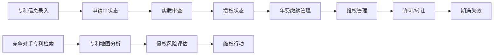

## 1. 产品概述

企业知识产权管理和专利追踪系统，为企业提供全方位的知识产权资产数字化管理解决方案，解决企业在专利、商标、版权等知识产权全生命周期管理中的痛点。

- 主要用途：集中管理企业专利、商标、版权资产，追踪专利状态，监控竞争对手，管理许可转让，评估知识产权价值
- 目标用户：企业知识产权管理部门、法务部门、研发部门
- 产品价值：提高知识产权管理效率，降低维护成本，防范侵权风险，最大化知识产权资产价值

## 2. 核心功能

### 2.1 用户角色
| 角色 | 注册方式 | 核心权限 |
|------|----------|----------|
| 系统管理员 | 系统创建 | 用户管理、系统配置、数据备份 |
| IP经理 | 管理员创建 | 全模块操作、报表导出、权限分配 |
| 专利工程师 | 管理员创建 | 专利/商标/版权录入、状态更新、年费管理 |
| 法务专员 | 管理员创建 | 许可协议管理、侵权评估、维权记录 |
| 研发人员 | 管理员创建 | 专利检索、技术参考、竞争对手监控查看 |

### 2.2 功能模块
1. **仪表盘总览**：关键指标卡片、专利状态统计、待办提醒、近期事件
2. **专利管理**：专利档案录入、状态追踪、年费管理
3. **商标版权管理**：商标档案、版权登记、地域覆盖分析
4. **竞争对手监控**：竞品专利检索、专利地图、侵权风险评估
5. **许可和转让**：许可协议、技术转让、质押融资
6. **价值评估**：专利估值、价值变化追踪

### 2.3 页面详情
| 页面名称 | 模块名称 | 功能描述 |
|---------|----------|----------|
| 仪表盘 | 总览模块 | 专利数量统计、状态分布图、年费到期提醒、最近事件时间线 |
| 专利列表 | 专利管理 | 专利表格展示、筛选搜索、批量操作、状态标签 |
| 专利详情 | 专利管理 | 完整专利信息展示、状态时间线、年费记录、相关文件 |
| 专利表单 | 专利管理 | 新增/编辑专利信息、文件上传、状态变更 |
| 年费管理 | 专利管理 | 年费列表、到期提醒、缴费记录、批量提醒 |
| 商标列表 | 商标版权 | 商标信息展示、图样预览、有效期管理 |
| 版权列表 | 商标版权 | 版权作品信息、登记证书、完成记录 |
| 地域分析 | 商标版权 | 世界地图可视化、国家/地区覆盖统计 |
| 竞品专利 | 竞争对手 | 竞品专利列表、定期检索记录、发现时间线 |
| 专利地图 | 竞争对手 | 技术领域分布图、IPC分类统计、竞争态势分析 |
| 侵权评估 | 竞争对手 | 侵权风险列表、评估记录、风险等级标识 |
| 许可协议 | 许可转让 | 许可合同档案、被许可方管理、费用追踪 |
| 转让记录 | 许可转让 | 技术转让列表、转让详情、状态追踪 |
| 质押融资 | 许可转让 | 质押记录、融资金额、到期管理 |
| 价值评估 | 价值评估 | 估值计算、评估历史、价值趋势图表 |

## 3. 核心流程

### 专利全生命周期管理流程

### 主要用户流程
1. **专利录入流程**：用户进入专利列表 → 点击新增专利 → 填写完整专利信息（名称/申请号/发明人/申请日等）→ 上传相关文件 → 保存 → 自动创建年费提醒
2. **年费管理流程**：系统自动检测即将到期专利 → 仪表盘显示提醒 → 用户查看年费列表 → 标记缴费状态 → 记录缴费凭证
3. **侵权评估流程**：检索竞品专利 → 与本公司专利比对 → 录入侵权风险评估 → 标记风险等级 → 生成评估报告
4. **许可管理流程**：新增许可协议 → 录入被许可方信息、许可范围、费用 → 上传合同文件 → 设置协议期限提醒 → 追踪付款记录

## 4. 用户界面设计

### 4.1 设计风格
- **主色调**：深蓝 (#0F3460) 代表专业和信赖，搭配科技蓝 (#1A5276) 作为辅助色
- **强调色**：金黄 (#E9B44C) 用于重要提醒和高亮，警示红 (#E74C3C) 用于高风险和紧急事项
- **中性色**：不同层级的灰色，确保内容清晰可读
- **按钮风格**：圆角矩形按钮，带有微妙的阴影和悬停动画
- **字体**：标题使用 "Noto Serif SC" 体现专业感，正文使用 "Inter" 确保可读性
- **布局风格**：左侧导航栏 + 右侧内容区的经典企业应用布局，卡片式内容组织
- **图标风格**：线性图标搭配实心图标，统一的圆角风格

### 4.2 页面设计概述
| 页面名称 | 模块名称 | UI元素 |
|---------|----------|--------|
| 仪表盘 | 总览模块 | 统计卡片网格、环形图、柱状图、时间线组件、提醒徽章 |
| 专利列表 | 专利管理 | 搜索栏、高级筛选器、数据表格、状态徽章、分页器 |
| 专利详情 | 专利管理 | 信息分组卡片、时间线、标签页切换、文件列表 |
| 地域分析 | 商标版权 | 交互式世界地图、国家列表、统计图表 |
| 专利地图 | 竞争对手 | 雷达图、热力分布图、技术分类树 |
| 价值评估 | 价值评估 | 折线趋势图、估值计算器、历史对比表 |

### 4.3 响应式设计
- **桌面优先**：1280px 以上最优展示，侧边栏固定宽度260px
- **平板适配**：1024px 时侧边栏可折叠，内容区自适应
- **移动端**：768px 以下转为汉堡菜单导航，表格转为卡片式展示
- **触控优化**：按钮最小尺寸44px，手势操作支持

### 4.4 交互动效
- 页面加载：内容区从上到下渐入，卡片依次出现（stagger动画）
- 悬停效果：卡片微微上浮，边框高亮，阴影加深
- 状态变更：平滑的过渡动画，状态徽章颜色渐变
- 数据可视化：图表数据加载时的柱状增长/环形填充动画
