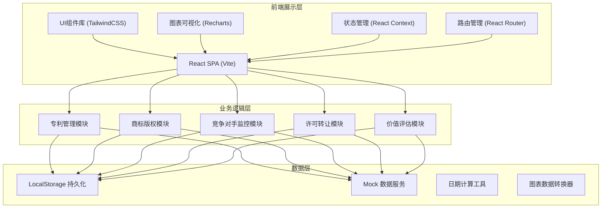
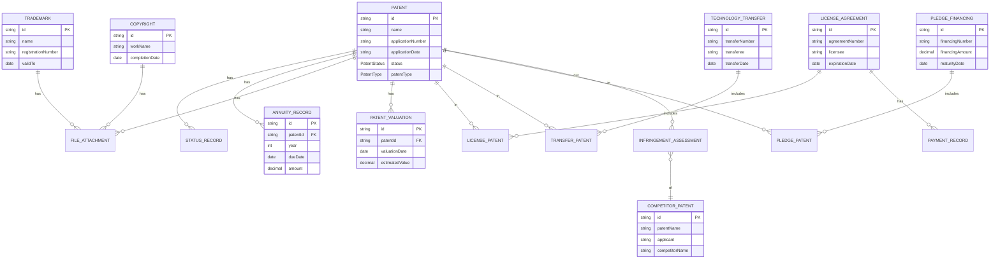

## 1. 架构设计



## 2. 技术描述

- **前端框架**：React@18 + TypeScript@5
- **构建工具**：Vite@5
- **样式方案**：TailwindCSS@3 + PostCSS + Autoprefixer
- **路由管理**：React Router@6
- **状态管理**：React Context + useReducer
- **图表可视化**：Recharts@2
- **图标库**：Lucide React@0.344
- **日期处理**：date-fns@3
- **UI组件**：headless UI 自定义组件
- **数据持久化**：localStorage + 自定义存储工具
- **Mock数据**：TypeScript 类型定义 + 静态数据工厂

## 3. 路由定义

| 路由路径 | 页面名称 | 功能说明 |
|---------|----------|----------|
| `/` | 仪表盘 | 总览数据统计、待办提醒、事件时间线 |
| `/patents` | 专利列表 | 专利表格展示、搜索筛选、批量操作 |
| `/patents/new` | 新增专利 | 专利信息录入表单 |
| `/patents/:id` | 专利详情 | 完整专利信息、状态时间线 |
| `/patents/:id/edit` | 编辑专利 | 编辑专利信息 |
| `/patents/annuity` | 年费管理 | 年费列表、到期提醒、缴费记录 |
| `/trademarks` | 商标列表 | 商标信息展示、图样预览 |
| `/trademarks/new` | 新增商标 | 商标信息录入 |
| `/copyrights` | 版权列表 | 版权作品信息、登记证书 |
| `/copyrights/new` | 新增版权 | 版权信息录入 |
| `/geo-analysis` | 地域分析 | 世界地图、国家/地区覆盖统计 |
| `/competitors/patents` | 竞品专利 | 竞品专利列表、检索记录 |
| `/competitors/map` | 专利地图 | 技术领域分布、IPC分类统计 |
| `/competitors/infringement` | 侵权评估 | 侵权风险列表、评估记录 |
| `/licenses` | 许可协议 | 许可合同档案、费用追踪 |
| `/licenses/new` | 新增许可 | 许可协议录入 |
| `/transfers` | 转让记录 | 技术转让列表、状态追踪 |
| `/pledge` | 质押融资 | 质押记录、融资金额管理 |
| `/valuation` | 价值评估 | 估值计算、价值趋势图表 |

## 4. 数据类型定义

```typescript
// 专利状态枚举
type PatentStatus = 'APPLICATION' | 'SUBSTANTIVE_EXAMINATION' | 'AUTHORIZED' | 'MAINTENANCE' | 'ENFORCEMENT' | 'EXPIRED';

// 专利类型枚举
type PatentType = 'INVENTION' | 'UTILITY_MODEL' | 'DESIGN';

// 风险等级枚举
type RiskLevel = 'LOW' | 'MEDIUM' | 'HIGH' | 'CRITICAL';

// 专利信息
interface Patent {
  id: string;
  name: string;
  applicationNumber: string;
  inventors: string[];
  applicationDate: string;
  authorizationDate?: string;
  patentType: PatentType;
  patentScope: string;
  status: PatentStatus;
  statusHistory: StatusRecord[];
  annuityRecords: AnnuityRecord[];
  technicalField: string;
  ipcClassification: string;
  abstract: string;
  claims?: string;
  description?: string;
  files: FileAttachment[];
  regions: string[];
  createdAt: string;
  updatedAt: string;
}

// 状态记录
interface StatusRecord {
  id: string;
  status: PatentStatus;
  date: string;
  note: string;
}

// 年费记录
interface AnnuityRecord {
  id: string;
  year: number;
  dueDate: string;
  amount: number;
  paidDate?: string;
  paidAmount?: number;
  status: 'PENDING' | 'PAID' | 'OVERDUE' | 'EXEMPTED';
  paymentProof?: string;
  note?: string;
}

// 商标信息
interface Trademark {
  id: string;
  name: string;
  registrationNumber: string;
  logoImage?: string;
  categories: string[];
  applicationDate: string;
  registrationDate?: string;
  validFrom: string;
  validTo: string;
  regions: string[];
  owner: string;
  status: 'APPLIED' | 'REGISTERED' | 'RENEWED' | 'EXPIRED' | 'OPPOSED';
  files: FileAttachment[];
  createdAt: string;
}

// 版权信息
interface Copyright {
  id: string;
  workName: string;
  workType: string;
  completionDate: string;
  registrationDate?: string;
  registrationNumber?: string;
  certificateImage?: string;
  authors: string[];
  owner: string;
  description: string;
  regions: string[];
  files: FileAttachment[];
  createdAt: string;
}

// 竞品专利
interface CompetitorPatent {
  id: string;
  patentName: string;
  applicationNumber: string;
  applicant: string;
  competitorName: string;
  applicationDate: string;
  publicationDate?: string;
  technicalField: string;
  ipcClassification: string;
  discoveryDate: string;
  abstract: string;
  relevanceScore: number;
  monitoringStatus: 'MONITORING' | 'TRACKING' | 'DISMISSED';
  notes: string;
}

// 侵权评估
interface InfringementAssessment {
  id: string;
  competitorPatentId: string;
  ourPatentId: string;
  assessmentDate: string;
  riskLevel: RiskLevel;
  similarityAnalysis: string;
  claimComparison: string;
  legalAdvice: string;
  recommendedActions: string[];
  assessor: string;
}

// 许可协议
interface LicenseAgreement {
  id: string;
  agreementNumber: string;
  patentIds: string[];
  licensee: string;
  licenseScope: string;
  licenseType: 'EXCLUSIVE' | 'NON_EXCLUSIVE' | 'SOLE';
  territory: string[];
  effectiveDate: string;
  expirationDate: string;
  licenseFee: number;
  paymentTerms: string;
  paymentRecords: PaymentRecord[];
  status: 'ACTIVE' | 'EXPIRED' | 'TERMINATED';
  contractFile?: string;
  notes: string;
}

// 转让记录
interface TechnologyTransfer {
  id: string;
  transferNumber: string;
  patentIds: string[];
  transferor: string;
  transferee: string;
  transferType: 'ASSIGNMENT' | 'MERGER' | 'SPIN_OFF';
  transferDate: string;
  consideration: number;
  status: 'PENDING' | 'COMPLETED' | 'CANCELLED';
  agreementFile?: string;
  notes: string;
}

// 质押融资
interface PledgeFinancing {
  id: string;
  financingNumber: string;
  patentIds: string[];
  pledgee: string;
  financingAmount: number;
  interestRate: number;
  termMonths: number;
  startDate: string;
  maturityDate: string;
  registrationDate?: string;
  status: 'ACTIVE' | 'MATURED' | 'REDEEMED';
  notes: string;
}

// 价值评估
interface PatentValuation {
  id: string;
  patentId: string;
  valuationDate: string;
  valuationMethod: string;
  estimatedValue: number;
  currency: string;
  factors: ValuationFactor[];
  assumptions: string;
  limitations: string;
  valuer: string;
}

// 估值因素
interface ValuationFactor {
  name: string;
  weight: number;
  score: number;
  description: string;
}

// 文件附件
interface FileAttachment {
  id: string;
  name: string;
  type: string;
  size: number;
  uploadDate: string;
  url: string;
}

// 付款记录
interface PaymentRecord {
  id: string;
  dueDate: string;
  amount: number;
  paidDate?: string;
  status: 'PENDING' | 'PAID' | 'OVERDUE';
  reference?: string;
}
```

## 5. 数据模型 ER图



## 6. 目录结构设计

```
src/
├── assets/              # 静态资源
│   ├── images/
│   ├── fonts/
│   └── data/           # Mock数据
├── components/         # 通用组件
│   ├── ui/            # 基础UI组件
│   │   ├── Button.tsx
│   │   ├── Input.tsx
│   │   ├── Card.tsx
│   │   ├── Table.tsx
│   │   ├── Modal.tsx
│   │   ├── Select.tsx
│   │   ├── DatePicker.tsx
│   │   ├── Badge.tsx
│   │   ├── Tabs.tsx
│   │   └── Timeline.tsx
│   ├── layout/        # 布局组件
│   │   ├── Sidebar.tsx
│   │   ├── Header.tsx
│   │   └── Layout.tsx
│   └── charts/        # 图表组件
│       ├── PieChart.tsx
│       ├── BarChart.tsx
│       ├── LineChart.tsx
│       └── RadarChart.tsx
├── pages/             # 页面组件
│   ├── Dashboard/
│   ├── Patents/
│   ├── Trademarks/
│   ├── Copyrights/
│   ├── GeoAnalysis/
│   ├── Competitors/
│   ├── Licenses/
│   ├── Transfers/
│   ├── Pledge/
│   └── Valuation/
├── context/           # 状态管理
│   ├── AppContext.tsx
│   └── PatentContext.tsx
├── hooks/             # 自定义Hooks
│   ├── usePatents.ts
│   ├── useAnnuity.ts
│   ├── useLocalStorage.ts
│   └── useDateCalc.ts
├── types/             # TypeScript类型定义
│   ├── patent.ts
│   ├── trademark.ts
│   ├── competitor.ts
│   ├── license.ts
│   └── index.ts
├── utils/             # 工具函数
│   ├── storage.ts
│   ├── dateUtils.ts
│   ├── formatters.ts
│   ├── mockData.ts
│   └── annuityCalc.ts
├── App.tsx
├── main.tsx
└── index.css
```

## 7. 开发规范

- **组件命名**：PascalCase，大驼峰命名
- **文件命名**：PascalCase 用于组件，kebab-case 用于工具和配置
- **类型定义**：使用 TypeScript interface，导出类型到 types 目录
- **样式规范**：优先使用 Tailwind CSS 类，自定义样式使用 CSS Modules
- **状态管理**：全局状态使用 Context，组件状态使用 useState/useReducer
- **数据流向**：单向数据流，通过 props 向下传递，回调向上传递
- **错误处理**：使用 Error Boundary 捕获组件错误，表单验证即时反馈
- **代码组织**：按功能模块分组，每个模块包含 types, hooks, components
