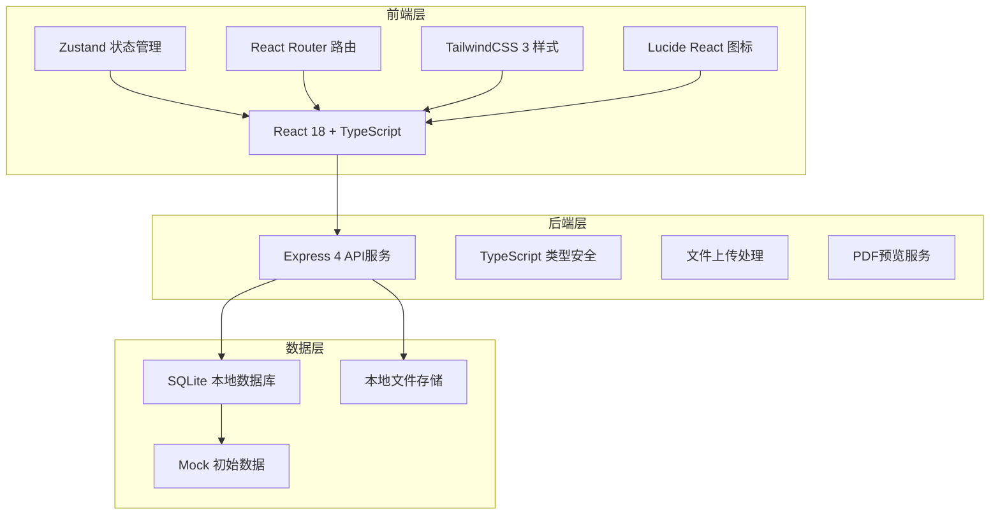
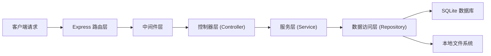
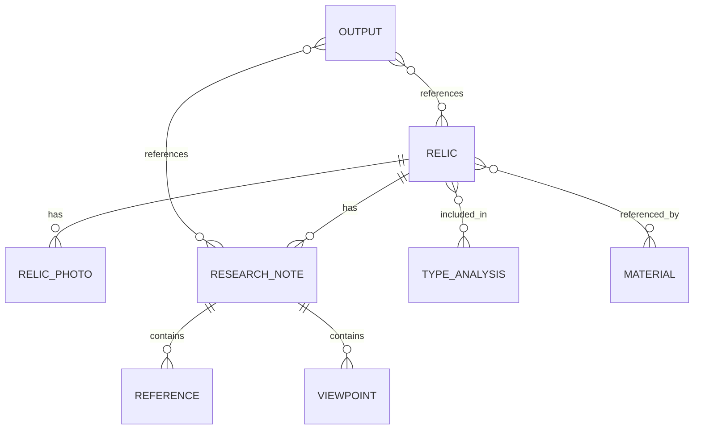

## 1. 架构设计



## 2. 技术描述

- **前端框架**：React@18 + TypeScript@5 + Vite@5
- **状态管理**：Zustand@4 - 轻量级状态管理，支持持久化
- **路由**：react-router-dom@6 - 单页应用路由管理
- **样式方案**：TailwindCSS@3 - 原子化CSS框架
- **图标库**：lucide-react@0.344 - 统一的线性图标体系
- **后端**：Express@4 + TypeScript - RESTful API服务
- **数据库**：SQLite3 + better-sqlite3 - 本地文件数据库，无需额外服务
- **文件存储**：本地文件系统 - 存储照片、PDF、拓片等资料
- **富文本编辑**：@tiptap/react + @tiptap/starter-kit - 所见即所得编辑器
- **PDF预览**：react-pdf@7 - PDF文档在线预览

## 3. 路由定义

| 路由路径 | 页面名称 | 主要功能 |
|----------|----------|----------|
| `/` | 首页仪表盘 | 统计概览、快捷入口、最近编辑 |
| `/relics` | 文物档案列表 | 文物列表、搜索筛选、新建入口 |
| `/relics/:id` | 文物档案详情 | 基础信息、照片管理、尺寸重量 |
| `/notes` | 研究笔记列表 | 笔记列表、分类标签、新建入口 |
| `/notes/:id` | 研究笔记详情 | 文献整理、观点对比、个人见解 |
| `/analysis` | 类型分析 | 同类比较、演变序列、分期断代 |
| `/materials` | 图像资料管理 | PDF存档、拓片管理、参考地图 |
| `/output` | 成果输出 | 论文提纲、论点证据链梳理 |

## 4. API 接口定义

### 4.1 TypeScript 类型定义

```typescript
// 文物基础信息
interface Relic {
  id: string;
  name: string;
  category: string;
  era: string;
  material: string;
  decoration: string;
  inscription: string;
  excavateLocation: string;
  currentLocation: string;
  relicNumber: string;
  dimensions: {
    height?: number;
    width?: number;
    length?: number;
    diameter?: number;
    weight?: number;
    unit: string;
  };
  photos: RelicPhoto[];
  createdAt: string;
  updatedAt: string;
}

// 文物照片
interface RelicPhoto {
  id: string;
  relicId: string;
  type: 'front' | 'side' | 'detail' | 'rubbing';
  url: string;
  caption: string;
  uploadDate: string;
}

// 研究笔记
interface ResearchNote {
  id: string;
  relicId: string;
  title: string;
  content: string;
  references: Reference[];
  viewpoints: Viewpoint[];
  personalInsights: string;
  tags: string[];
  createdAt: string;
  updatedAt: string;
}

// 参考文献
interface Reference {
  id: string;
  title: string;
  author: string;
  publication: string;
  year: number;
  page: string;
  excerpt: string;
  doi?: string;
}

// 研究观点
interface Viewpoint {
  id: string;
  scholar: string;
  aspect: 'dating' | 'usage' | 'origin';
  content: string;
  evidence: string;
  confidence: 'high' | 'medium' | 'low';
}

// 类型分析
interface TypeAnalysis {
  id: string;
  name: string;
  type: 'comparison' | 'evolution' | 'periodization';
  description: string;
  relicIds: string[];
  analysisData: any;
  createdAt: string;
}

// 图像资料
interface Material {
  id: string;
  type: 'pdf' | 'rubbing' | 'map';
  title: string;
  description: string;
  filePath: string;
  metadata: any;
  createdAt: string;
}

// 成果输出
interface Output {
  id: string;
  type: 'outline' | 'argument';
  title: string;
  content: any;
  relicIds: string[];
  noteIds: string[];
  createdAt: string;
}
```

### 4.2 RESTful API 列表

| 方法 | 路径 | 描述 |
|------|------|------|
| GET | `/api/relics` | 获取文物列表 |
| GET | `/api/relics/:id` | 获取单条文物详情 |
| POST | `/api/relics` | 创建文物档案 |
| PUT | `/api/relics/:id` | 更新文物档案 |
| DELETE | `/api/relics/:id` | 删除文物档案 |
| POST | `/api/relics/:id/photos` | 上传文物照片 |
| GET | `/api/notes` | 获取研究笔记列表 |
| GET | `/api/notes/:id` | 获取单条笔记详情 |
| POST | `/api/notes` | 创建研究笔记 |
| PUT | `/api/notes/:id` | 更新研究笔记 |
| DELETE | `/api/notes/:id` | 删除研究笔记 |
| GET | `/api/analysis` | 获取类型分析列表 |
| POST | `/api/analysis` | 创建类型分析 |
| PUT | `/api/analysis/:id` | 更新类型分析 |
| GET | `/api/materials` | 获取资料列表 |
| POST | `/api/materials/upload` | 上传资料文件 |
| DELETE | `/api/materials/:id` | 删除资料 |
| GET | `/api/output` | 获取成果列表 |
| POST | `/api/output` | 创建成果 |
| PUT | `/api/output/:id` | 更新成果 |

## 5. 服务器架构图



## 6. 数据模型

### 6.1 ER 图



### 6.2 DDL 语句

```sql
-- 文物表
CREATE TABLE relics (
  id TEXT PRIMARY KEY,
  name TEXT NOT NULL,
  category TEXT,
  era TEXT,
  material TEXT,
  decoration TEXT,
  inscription TEXT,
  excavate_location TEXT,
  current_location TEXT,
  relic_number TEXT,
  dimension_height REAL,
  dimension_width REAL,
  dimension_length REAL,
  dimension_diameter REAL,
  dimension_weight REAL,
  dimension_unit TEXT DEFAULT 'cm',
  created_at TEXT NOT NULL,
  updated_at TEXT NOT NULL
);

-- 文物照片表
CREATE TABLE relic_photos (
  id TEXT PRIMARY KEY,
  relic_id TEXT NOT NULL,
  type TEXT NOT NULL CHECK(type IN ('front', 'side', 'detail', 'rubbing')),
  url TEXT NOT NULL,
  caption TEXT,
  upload_date TEXT NOT NULL,
  FOREIGN KEY (relic_id) REFERENCES relics(id) ON DELETE CASCADE
);

-- 研究笔记表
CREATE TABLE research_notes (
  id TEXT PRIMARY KEY,
  relic_id TEXT,
  title TEXT NOT NULL,
  content TEXT,
  personal_insights TEXT,
  tags TEXT,
  created_at TEXT NOT NULL,
  updated_at TEXT NOT NULL,
  FOREIGN KEY (relic_id) REFERENCES relics(id) ON DELETE SET NULL
);

-- 参考文献表
CREATE TABLE references (
  id TEXT PRIMARY KEY,
  note_id TEXT NOT NULL,
  title TEXT NOT NULL,
  author TEXT,
  publication TEXT,
  year INTEGER,
  page TEXT,
  excerpt TEXT,
  doi TEXT,
  FOREIGN KEY (note_id) REFERENCES research_notes(id) ON DELETE CASCADE
);

-- 研究观点表
CREATE TABLE viewpoints (
  id TEXT PRIMARY KEY,
  note_id TEXT NOT NULL,
  scholar TEXT NOT NULL,
  aspect TEXT NOT NULL CHECK(aspect IN ('dating', 'usage', 'origin')),
  content TEXT NOT NULL,
  evidence TEXT,
  confidence TEXT NOT NULL CHECK(confidence IN ('high', 'medium', 'low')),
  FOREIGN KEY (note_id) REFERENCES research_notes(id) ON DELETE CASCADE
);

-- 类型分析表
CREATE TABLE type_analysis (
  id TEXT PRIMARY KEY,
  name TEXT NOT NULL,
  type TEXT NOT NULL CHECK(type IN ('comparison', 'evolution', 'periodization')),
  description TEXT,
  relic_ids TEXT,
  analysis_data TEXT,
  created_at TEXT NOT NULL
);

-- 资料表
CREATE TABLE materials (
  id TEXT PRIMARY KEY,
  type TEXT NOT NULL CHECK(type IN ('pdf', 'rubbing', 'map')),
  title TEXT NOT NULL,
  description TEXT,
  file_path TEXT NOT NULL,
  metadata TEXT,
  created_at TEXT NOT NULL
);

-- 成果表
CREATE TABLE outputs (
  id TEXT PRIMARY KEY,
  type TEXT NOT NULL CHECK(type IN ('outline', 'argument')),
  title TEXT NOT NULL,
  content TEXT,
  relic_ids TEXT,
  note_ids TEXT,
  created_at TEXT NOT NULL
);

-- 创建索引
CREATE INDEX idx_relic_name ON relics(name);
CREATE INDEX idx_relic_era ON relics(era);
CREATE INDEX idx_relic_category ON relics(category);
CREATE INDEX idx_note_relic_id ON research_notes(relic_id);
CREATE INDEX idx_note_tags ON research_notes(tags);
```

### 6.3 初始 Mock 数据

项目初始化时将插入以下示例数据：
- 3-5件典型文物（青铜器、瓷器、玉器等）
- 每文物附带多角度照片示例
- 2-3篇研究笔记示例
- 若干参考文献和观点对比数据
- 1份类型分析示例
- 1份PDF考古报告示例
- 1份论文提纲示例
