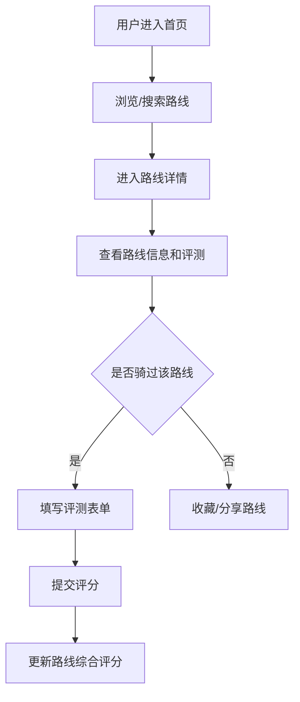
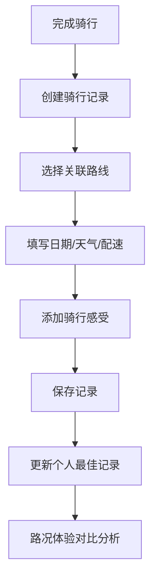
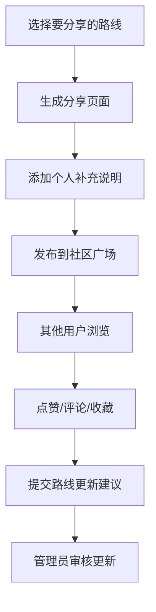

## 1. 产品概述

城市单车骑行路线评测和分享工具，为骑行爱好者提供专业的路线数据库、多维度评测体系、个人骑行记录管理和社区分享功能，解决骑行者找路难、体验分享不系统、路线信息不及时的痛点。

- **主要目的**：构建一站式骑行路线服务平台，连接骑行爱好者，沉淀高质量路线数据
- **解决问题**：路线信息分散、评测维度单一、骑行记录难以关联、社区分享不规范
- **目标用户**：城市通勤骑行者、休闲骑行爱好者、竞技骑行选手
- **产品价值**：打造国内最专业的骑行路线评测平台，建立骑行社区生态

## 2. 核心功能

### 2.1 用户角色

| 角色 | 注册方式 | 核心权限 |
|------|----------|----------|
| 普通用户 | 手机号/邮箱注册 | 浏览路线、发表评测、记录骑行、分享路线 |
| 认证骑行者 | 上传骑行证明审核 | 发布官方路线、创建评测模板、推荐优质内容 |
| 管理员 | 后台账号 | 内容审核、用户管理、数据统计、违规处理 |

### 2.2 功能模块

1. **首页**：导航栏、英雄区域、热门路线推荐、最新评测、统计数据展示
2. **路线库**：路线分类筛选、路线列表、路线详情、地图展示
3. **评测中心**：评测表单、分段评分、综合评分、评测历史
4. **骑行记录**：记录列表、记录详情、最佳成绩、数据对比
5. **社区广场**：分享动态、路线更新、用户互动、评论点赞

### 2.3 页面详情

| 页面名称 | 模块名称 | 功能描述 |
|----------|----------|----------|
| 首页 | 英雄区域 | 大标题展示、搜索框、核心功能入口卡片、动态背景 |
| 首页 | 热门路线 | 轮播展示高分路线、一键查看详情、难度标签 |
| 首页 | 数据统计 | 总路线数、总评测数、总骑行里程、活跃用户数 |
| 路线库 | 筛选面板 | 路线类型（通勤/休闲/竞技）、难度级别、距离范围、路面类型、季节适骑性 |
| 路线库 | 路线列表 | 卡片式展示路线摘要、评分星标、收藏按钮 |
| 路线详情 | 基本信息 | 路线名称、起点终点、距离、累计爬升、路面类型、难度级别、季节标注 |
| 路线详情 | 详细描述 | 沿途风景、加油站、停歇点、注意事项、地图轨迹 |
| 路线详情 | 评测统计 | 路面质量评分、安全性评分、骑行体验评分、综合评分分布 |
| 评测中心 | 评测表单 | 分段路面质量评分（坑洼/专用道/机动车干扰）、安全性评估（路口危险/夜间光照）、骑行体验（风景/挑战性/愉悦感） |
| 评测中心 | 评分组件 | 星级评分、滑块评分、文字描述上传 |
| 骑行记录 | 记录列表 | 时间线展示骑行历史、天气标签、配速展示 |
| 骑行记录 | 记录详情 | 日期、天气、配速、感受、关联路线、数据图表 |
| 骑行记录 | 最佳记录 | 个人PB展示、不同路况对比分析 |
| 社区广场 | 分享动态 | 用户分享卡片、地图预览、点赞评论 |
| 社区广场 | 路线更新 | 改道/施工信息、即时更新通知、更新时间线 |
| 分享页面 | 路线分享 | 生成专属分享页、包含地图和详细介绍、可复制链接 |

## 3. 核心流程

### 3.1 路线浏览与评测流程

用户进入首页 → 浏览热门路线或使用搜索 → 进入路线详情页查看信息 → 查看其他用户评测 → 填写评测表单提交评分 → 评测数据统计到路线评分

### 3.2 骑行记录关联流程

用户完成骑行 → 创建骑行记录 → 选择关联路线 → 填写天气/配速/感受 → 查看个人记录统计 → 对比不同路况体验

### 3.3 社区分享流程

用户选择路线 → 生成分享页面 → 填写补充说明 → 发布到社区广场 → 其他用户查看互动 → 提交更新建议

## 4. 用户界面设计

### 4.1 设计风格

- **设计理念**：运动活力与专业科技感结合，采用户外骑行主题
- **主色调**：深邃青绿 `#0F766E`（代表自然与探索）
- **辅助色**：活力橙 `#F97316`（代表运动与热情）、阳光黄 `#FBBF24`（代表安全与警示）
- **中性色**：深灰 `#1F2937`、中灰 `#4B5563`、浅灰 `#9CA3AF`、纯白 `#FFFFFF`
- **背景**：渐变青绿到深蓝的主背景，配合微妙的路网纹理图案
- **按钮风格**：圆角8px，带有微妙阴影，悬停时有轻微上浮和发光效果
- **字体**：标题使用「ZCOOL 正黑体」，正文使用「Noto Sans SC」
- **布局风格**：卡片式布局，大量留白，内容区块分明，支持对角线流动设计
- **图标风格**：线性图标，统一2px线宽，使用骑行相关元素（自行车、头盔、地图、路标等）

### 4.2 页面设计概览

| 页面名称 | 模块名称 | UI元素 |
|----------|----------|--------|
| 首页 | 英雄区域 | 全屏渐变背景、动态自行车道线条动画、大标题字体、圆角搜索框、功能入口卡片带悬停动效 |
| 首页 | 热门路线 | 横向滚动卡片、评分星星动效、难度标签渐变背景、hover缩放效果 |
| 路线库 | 筛选面板 | 折叠式筛选器、多选标签、滑动条选择距离、动画过渡效果 |
| 路线库 | 路线列表 | 瀑布流卡片、缩略图懒加载、收藏按钮心跳动效、评分进度条动画 |
| 路线详情 | 地图区域 | 交互式地图、路线轨迹高亮、标记点弹出信息、缩放控制动效 |
| 路线详情 | 评分面板 | 环形进度图展示综合评分、分项评分条形图、颜色区分评分等级 |
| 评测中心 | 评测表单 | 分段卡片设计、星级评分组件、滑块轨道渐变、提交按钮成功动效 |
| 骑行记录 | 时间线 | 垂直时间线设计、天气图标、配速曲线图、里程碑标记动画 |
| 社区广场 | 分享卡片 | 图片网格布局、用户头像悬停边框、点赞按钮粒子动效、评论展开动画 |
| 分享页面 | 海报区域 | 可下载的路线海报、地图快照、二维码、渐变边框设计 |

### 4.3 响应式设计

- **设计原则**：桌面优先，移动端自适应
- **断点设置**：1280px（桌面）、1024px（平板横屏）、768px（平板竖屏）、480px（手机）
- **移动端优化**：
  - 底部导航栏取代顶部菜单
  - 卡片单列布局
  - 触摸按钮最小尺寸48x48px
  - 地图支持手势缩放
  - 表单优化为垂直布局
  - 减少动画复杂度保证性能

### 4.4 动效与交互

- **页面加载**：元素依次淡入，从下往上位移，stagger延迟100ms
- **滚动触发**：元素进入视口时触发动画，使用IntersectionObserver
- **悬停效果**：卡片上浮4px，阴影加深，边框颜色高亮
- **评分交互**：星星选中时有填充动画，滑块拖动有实时数值反馈
- **提交反馈**：成功时绿色勾号扩展动画，错误时抖动提示
- **地图交互**：路线轨迹绘制动画，标记点弹出时缩放动效
