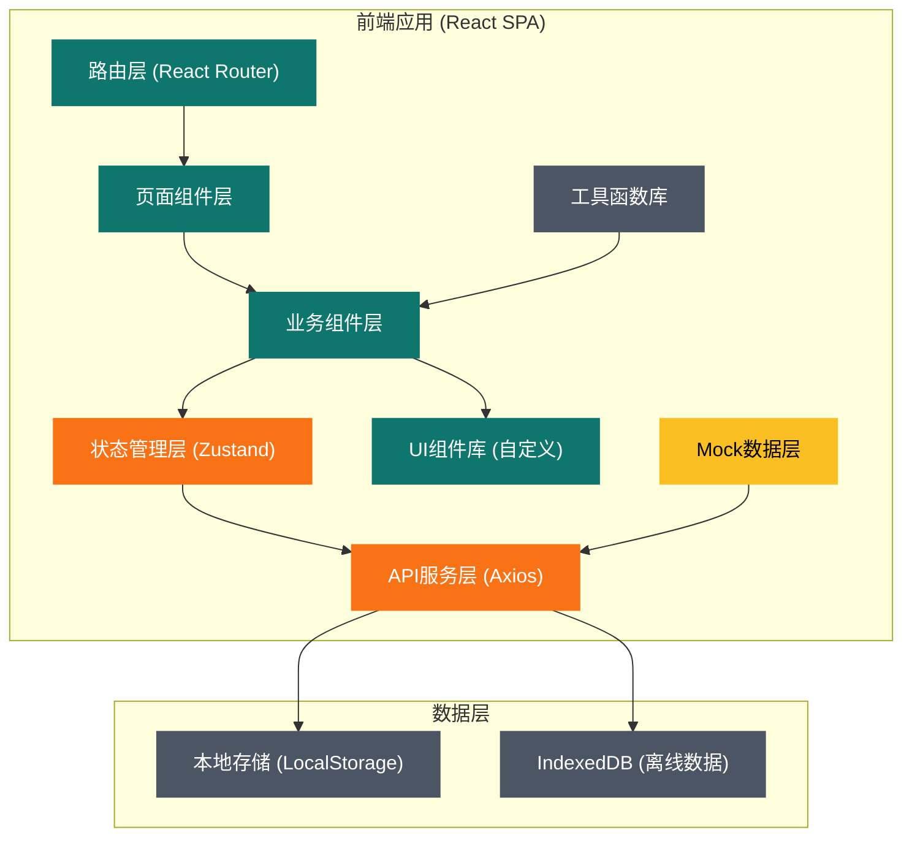
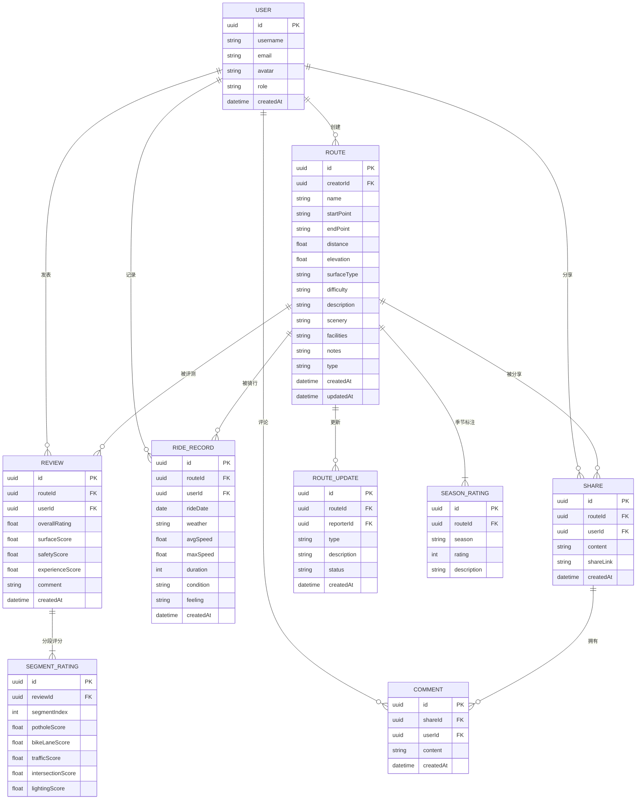

## 1. 架构设计



## 2. 技术描述

### 2.1 技术栈选择

| 层级 | 技术选型 | 版本 | 说明 |
|------|----------|------|------|
| 前端框架 | React | 18.2.0 | 使用函数组件+Hooks开发 |
| 构建工具 | Vite | 5.0.0 | 快速开发构建，支持热更新 |
| 语言 | TypeScript | 5.3.0 | 类型安全，提升代码质量 |
| 样式方案 | TailwindCSS | 3.4.0 | 原子化CSS，配合自定义设计系统 |
| 路由管理 | React Router | 6.20.0 | 单页应用路由，支持嵌套路由 |
| 状态管理 | Zustand | 4.4.0 | 轻量级状态管理，API简洁 |
| HTTP客户端 | Axios | 1.6.0 | 统一API请求处理，支持拦截器 |
| 图表库 | Chart.js + react-chartjs-2 | 4.4.0 | 评分统计、配速曲线等数据可视化 |
| 地图组件 | Leaflet + react-leaflet | 4.2.0 | 开源地图组件，展示路线轨迹 |
| 动画库 | Framer Motion | 10.16.0 | 页面动效、交互动画 |
| 图标库 | Lucide React | 0.294.0 | 精美线性图标库 |
| 表单处理 | React Hook Form | 7.48.0 | 高性能表单验证 |
| 工具函数 | date-fns | 3.0.0 | 日期时间处理 |

### 2.2 初始化方案

- 使用 `npm create vite@latest` 初始化React+TypeScript项目
- 配置TailwindCSS 3.x，自定义主题色和设计令牌
- 配置路径别名 `@` 指向 `src` 目录
- 配置ESLint和Prettier保证代码规范
- 配置Husky和lint-staged实现提交前检查

### 2.3 后端与数据

- **后端**：无独立后端服务，采用前端Mock数据模拟
- **数据持久化**：LocalStorage存储用户数据和记录
- **离线支持**：IndexedDB缓存路线和评测数据

## 3. 路由定义

| 路由路径 | 页面名称 | 说明 |
|----------|----------|------|
| `/` | 首页 | 英雄区域、热门路线、数据统计 |
| `/routes` | 路线库 | 路线列表、筛选面板、搜索功能 |
| `/routes/:id` | 路线详情 | 路线信息、地图、评测统计、用户评测 |
| `/routes/:id/review` | 发表评测 | 评测表单、分段评分、提交 |
| `/records` | 骑行记录 | 记录列表、时间线、最佳成绩 |
| `/records/new` | 新建记录 | 记录表单、关联路线、数据填写 |
| `/records/compare` | 记录对比 | 不同路况体验对比分析 |
| `/community` | 社区广场 | 分享动态、路线更新、互动功能 |
| `/community/share/:id` | 路线分享 | 生成分享页面、海报下载 |
| `/profile` | 个人中心 | 用户信息、收藏管理、设置 |

## 4. 目录结构

```
src/
├── assets/              # 静态资源
│   ├── fonts/          # 字体文件
│   ├── images/         # 图片资源
│   └── styles/         # 全局样式
├── components/          # 通用UI组件
│   ├── common/         # Button, Card, Input等基础组件
│   ├── layout/         # Header, Footer, Sidebar等布局组件
│   └── business/       # RouteCard, RatingStars, Timeline等业务组件
├── pages/              # 页面组件
│   ├── Home/
│   ├── Routes/
│   ├── RouteDetail/
│   ├── Review/
│   ├── Records/
│   ├── Community/
│   └── Profile/
├── store/              # 状态管理
│   ├── useRouteStore.ts
│   ├── useReviewStore.ts
│   ├── useRecordStore.ts
│   └── useUserStore.ts
├── services/           # API服务层
│   ├── routeService.ts
│   ├── reviewService.ts
│   ├── recordService.ts
│   └── index.ts
├── mock/               # Mock数据
│   ├── routes.ts
│   ├── reviews.ts
│   ├── records.ts
│   └── users.ts
├── types/              # TypeScript类型定义
│   ├── route.ts
│   ├── review.ts
│   ├── record.ts
│   └── user.ts
├── utils/              # 工具函数
│   ├── format.ts
│   ├── storage.ts
│   ├── map.ts
│   └── validator.ts
├── hooks/              # 自定义Hooks
│   ├── useMap.ts
│   ├── useRating.ts
│   └── useInfiniteScroll.ts
├── App.tsx
├── main.tsx
└── router.tsx
```

## 5. 数据模型

### 5.1 ER图



### 5.2 类型定义

```typescript
// 路线类型
type RouteType = 'commute' | 'leisure' | 'race';
type Difficulty = 'easy' | 'medium' | 'hard' | 'extreme';
type SurfaceType = 'asphalt' | 'concrete' | 'gravel' | 'mixed';
type Season = 'spring' | 'summer' | 'autumn' | 'winter';

interface Route {
  id: string;
  creatorId: string;
  name: string;
  startPoint: string;
  endPoint: string;
  distance: number;
  elevation: number;
  surfaceType: SurfaceType;
  difficulty: Difficulty;
  type: RouteType;
  description: string;
  scenery: string;
  facilities: string;
  notes: string;
  seasonRatings: SeasonRating[];
  coordinates: [number, number][];
  createdAt: string;
  updatedAt: string;
  stats: RouteStats;
}

interface SeasonRating {
  season: Season;
  rating: number;
  description: string;
}

interface RouteStats {
  totalReviews: number;
  avgSurfaceScore: number;
  avgSafetyScore: number;
  avgExperienceScore: number;
  avgOverallRating: number;
  totalRides: number;
}

// 评测类型
interface Review {
  id: string;
  routeId: string;
  userId: string;
  user: User;
  overallRating: number;
  surfaceScore: SurfaceScore;
  safetyScore: SafetyScore;
  experienceScore: ExperienceScore;
  segmentRatings: SegmentRating[];
  comment: string;
  createdAt: string;
}

interface SurfaceScore {
  pothole: number;
  bikeLane: number;
  traffic: number;
}

interface SafetyScore {
  intersection: number;
  lighting: number;
}

interface ExperienceScore {
  scenery: number;
  challenge: number;
  enjoyment: number;
}

interface SegmentRating {
  segmentIndex: number;
  segmentName: string;
  potholeScore: number;
  bikeLaneScore: number;
  trafficScore: number;
  intersectionScore: number;
  lightingScore: number;
}

// 骑行记录类型
type Weather = 'sunny' | 'cloudy' | 'rainy' | 'windy' | 'hot' | 'cold';
type RoadCondition = 'dry' | 'wet' | 'sandy' | 'icy';

interface RideRecord {
  id: string;
  routeId: string;
  route?: Route;
  userId: string;
  rideDate: string;
  weather: Weather;
  roadCondition: RoadCondition;
  avgSpeed: number;
  maxSpeed: number;
  duration: number;
  calories: number;
  feeling: string;
  notes: string;
  createdAt: string;
}

// 社区分享类型
interface Share {
  id: string;
  routeId: string;
  route?: Route;
  userId: string;
  user: User;
  content: string;
  images: string[];
  shareLink: string;
  likes: number;
  comments: Comment[];
  createdAt: string;
}

interface RouteUpdate {
  id: string;
  routeId: string;
  reporterId: string;
  reporter: User;
  type: 'detour' | 'construction' | 'accident' | 'other';
  description: string;
  location: string;
  status: 'pending' | 'confirmed' | 'resolved';
  createdAt: string;
  expiresAt: string;
}

interface Comment {
  id: string;
  targetId: string;
  targetType: 'share' | 'review' | 'update';
  userId: string;
  user: User;
  content: string;
  createdAt: string;
}

// 用户类型
interface User {
  id: string;
  username: string;
  email: string;
  avatar: string;
  role: 'user' | 'verified' | 'admin';
  bio: string;
  totalRides: number;
  totalDistance: number;
  createdAt: string;
}
```

## 6. 核心模块设计

### 6.1 路线数据库模块

**职责**：路线CRUD、分类筛选、详情展示、地图轨迹

**核心功能**：
- 路线列表分页加载和无限滚动
- 多条件筛选（类型、难度、距离、路面、季节）
- 关键词搜索
- 路线详情数据聚合
- 地图轨迹渲染和交互
- 收藏/取消收藏功能

### 6.2 评测体系模块

**职责**：评测表单、评分计算、统计展示

**核心功能**：
- 分段评分表单（动态添加分段）
- 星级评分组件（支持半星）
- 滑块评分组件（实时反馈）
- 综合评分加权计算
- 评测数据可视化（分布图、趋势图）
- 评测列表分页展示

### 6.3 骑行记录关联模块

**职责**：记录管理、数据关联、统计分析

**核心功能**：
- 骑行记录CRUD
- 路线关联选择器
- 时间线展示
- 配速曲线图表
- 不同路况对比分析
- 个人最佳记录追踪
- 数据导出功能

### 6.4 社区分享模块

**职责**：内容分享、用户互动、路线更新

**核心功能**：
- 分享页面生成（包含地图和介绍）
- 路线海报生成和下载
- 点赞/评论/收藏功能
- 路线更新提交和展示
- 分享链接复制
- 动态信息流

## 7. 状态管理设计

### 7.1 Store划分

```typescript
// useRouteStore.ts
interface RouteState {
  routes: Route[];
  currentRoute: Route | null;
  filters: RouteFilters;
  loading: boolean;
  total: number;
  // actions
  fetchRoutes: (filters: Partial<RouteFilters>) => Promise<void>;
  fetchRouteDetail: (id: string) => Promise<void>;
  setFilters: (filters: Partial<RouteFilters>) => void;
  toggleFavorite: (routeId: string) => void;
}

// useReviewStore.ts
interface ReviewState {
  reviews: Review[];
  currentReview: Review | null;
  loading: boolean;
  // actions
  fetchReviews: (routeId: string) => Promise<void>;
  submitReview: (data: ReviewFormData) => Promise<boolean>;
  getRouteStats: (routeId: string) => RouteStats | null;
}

// useRecordStore.ts
interface RecordState {
  records: RideRecord[];
  currentRecord: RideRecord | null;
  bestRecords: BestRecords;
  // actions
  fetchRecords: () => Promise<void>;
  createRecord: (data: RecordFormData) => Promise<boolean>;
  updateRecord: (id: string, data: Partial<RideRecord>) => Promise<boolean>;
  deleteRecord: (id: string) => Promise<boolean>;
  getBestRecords: () => BestRecords;
  compareRecords: (ids: string[]) => CompareResult;
}

// useUserStore.ts
interface UserState {
  currentUser: User | null;
  isAuthenticated: boolean;
  // actions
  login: (email: string, password: string) => Promise<boolean>;
  logout: () => void;
  updateProfile: (data: Partial<User>) => Promise<boolean>;
}
```

## 8. 性能优化

### 8.1 前端优化

- **代码分割**：按路由分割代码，动态导入
- **懒加载**：图片懒加载、组件懒加载
- **虚拟列表**：长列表使用虚拟滚动
- **防抖节流**：搜索输入、滚动事件
- **Memo优化**：React.memo、useMemo、useCallback
- **状态优化**：避免不必要的重渲染，合理拆分store

### 8.2 数据优化

- **本地缓存**：接口数据缓存到LocalStorage
- **请求去重**：相同请求合并，避免重复请求
- **分页加载**：大数据量分页返回
- **数据压缩**：JSON压缩传输（gzip）

## 9. 安全策略

- **XSS防护**：React自动转义，特殊场景使用DOMPurify
- **CSRF防护**：自定义Header验证
- **输入验证**：前端表单验证+类型检查
- **数据加密**：敏感信息本地存储加密
- **权限控制**：路由守卫，功能权限检查
