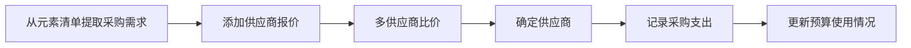

## 1. 产品概述
本产品是一款面向民宿业主、室内设计师和施工团队的全流程民宿设计改造项目管理平台，实现从空间规划、方案设计、预算管控、施工进度到供应商管理的一体化数字化管理。
- 解决民宿改造过程中多环节信息分散、进度难以追踪、预算容易超支等痛点
- 目标用户为民宿业主、独立设计师、装修施工团队

## 2. 核心功能

### 2.1 用户角色
| 角色 | 注册方式 | 核心权限 |
|------|---------|---------|
| 项目管理员 | 邮箱/手机注册 | 所有功能模块完整权限，可创建和管理多个项目 |
| 设计师 | 邀请加入 | 空间规划、设计方案模块的编辑权限 |
| 施工负责人 | 邀请加入 | 施工进度、问题记录模块权限 |
| 采购专员 | 邀请加入 | 预算管理、供应商管理模块权限 |

### 2.2 功能模块
1. **项目总览仪表盘**：项目概览、进度概览、预算概览、快捷操作入口
2. **空间规划模块**：房间平面图绘制、功能区域划分、空间效率评估
3. **设计方案管理模块**：方案版本管理、风格参考图板、设计元素清单
4. **改造预算管理模块**：预算分解、支出追踪、超支预警
5. **施工进度管理模块**：施工计划、进度对比、问题记录
6. **供应商管理模块**：供应商信息、比价记录、采购订单

### 2.3 页面详情
| 页面名称 | 模块名称 | 功能描述 |
|-----------|---------|-----------|
| 项目总览 | 仪表盘 | 项目进度环形图、预算使用进度条、关键时间节点、最近活动记录 |
| 空间规划 | 平面图绘制 | Canvas画布绘制房间轮廓、门窗标注、尺寸标注、拖拽调整 |
| 空间规划 | 功能区域划分 | 预设区域模板（床铺/工作区/休息区/卫生间）、面积自动计算、颜色区分 |
| 空间规划 | 效率评估 | 每平方米利用率评分、空间浪费区域高亮、优化建议 |
| 设计方案 | 版本管理 | 版本列表、版本对比、版本回滚、版本备注 |
| 设计方案 | 风格图板 | 按房间分类、图片上传、灵感标签、图片瀑布流展示 |
| 设计方案 | 元素清单 | 家具/软装/灯具/装饰品分类、数量单价计算、自动汇总总价 |
| 预算管理 | 预算分解 | 硬装/软装/家具/家电/装饰分类预算设置、饼图展示 |
| 预算管理 | 支出追踪 | 每笔采购记录、分类统计、偏差分析柱状图 |
| 预算管理 | 超支预警 | 超支项目红色标记、预警提醒、应对方案建议 |
| 施工管理 | 计划时间表 | 甘特图展示防水/电路/瓦工/木工/油漆/软装各环节时间线、依赖关系设置 |
| 施工管理 | 进度对比 | 计划vs实际对比甘特图、完成百分比、延期原因记录 |
| 施工管理 | 问题记录 | 质量问题描述、照片上传、整改要求、状态跟踪 |
| 供应商管理 | 比价记录 | 同一产品多家报价对比表格、推荐供应商标注 |

## 3. 核心流程

### 3.1 项目创建流程

### 3.2 采购审批流程

## 4. 用户界面设计

### 4.1 设计风格
- **主色调**：深墨蓝 (#1E3A5F) - 专业、稳重、专业感
- **辅助色**：暖木色 (#D4A574) - 温暖、自然、民宿特色
- **强调色**：珊瑚橙 (#FF6B6B) - 预警、重点标记
- **成功色**：薄荷绿 (#4ECDC4) - 完成、通过
- **背景色**：米白色 (#FAF8F5) - 温暖、舒适
- **按钮风格**：微圆角(8px)、轻微阴影、悬停微上浮效果
- **字体**：标题使用 Noto Serif SC（优雅衬线体），正文使用 Noto Sans SC
- **布局风格**：左侧导航栏 + 顶部项目切换 + 主内容卡片式布局
- **图标风格**：线性细线条图标，简约现代感

### 4.2 页面设计概览
| 页面名称 | 模块名称 | UI元素 |
|-----------|---------|--------|
| 项目总览 | 仪表盘 | 渐变背景统计卡片、环形进度图、进度条、时间线、柔和阴影、微妙渐变 |
| 空间规划 | 平面图绘制 | Canvas画布区域、工具栏悬浮面板、属性编辑侧栏、网格背景、拖拽把手 |
| 设计方案 | 风格图板 | 瀑布流图片卡片、标签筛选、悬停放大效果 |
| 预算管理 | 预算分解 | 交互式饼图、可编辑表格、条件格式颜色标记 |
| 施工管理 | 进度计划 | 甘特图时间轴、拖拽调整、里程碑标记、颜色区分工序 |
| 供应商管理 | 比价记录 | 对比表格、最优价格高亮、评分星级 |

### 4.3 响应式设计
- **桌面端（1280px+）：完整三栏布局，左侧导航+主内容+右侧属性面板
- **平板端（768px-1279px）：折叠式侧边栏，可展开收起
- **移动端（<768px）：底部标签导航，内容单列排布，触控优化

### 4.4 交互动效
- 页面加载：元素错落淡入动画（staggered fade-in）
- 卡片悬停：轻微上浮 + 阴影加深
- 数据更新：数字滚动动画
- 侧边栏展开/收起：平滑过渡动画
- Canvas绘图：平滑的拖拽反馈
