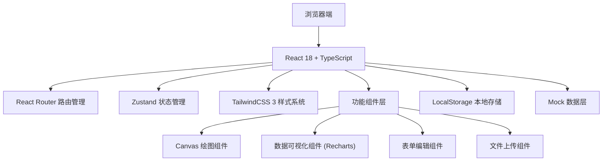
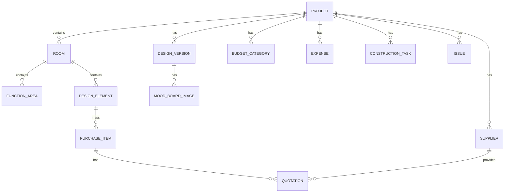

## 1. 架构设计



## 2. 技术描述

- **前端框架**：React@18.2.0 + TypeScript@5.4.0
- **构建工具**：Vite@5.2.0
- **样式系统**：TailwindCSS@3.4.0 + PostCSS
- **路由管理**：React Router Dom@6.22.0
- **状态管理**：Zustand@4.5.0
- **图表可视化**：Recharts@2.12.0
- **图标库**：Lucide React@0.344.0
- **Canvas绘图**：原生 HTML5 Canvas API
- **数据持久化**：LocalStorage + IndexedDB
- **后端服务**：无（纯前端应用，使用Mock数据）
- **数据库**：无，使用本地存储

## 3. 路由定义

| 路由路径 | 页面名称 | 说明 |
|----------|---------|------|
| / | 项目列表页 | 显示所有项目，可创建新项目 |
| /projects/:id | 项目总览仪表盘 | 项目概览、关键指标、快捷入口 |
| /projects/:id/space-planning | 空间规划页 | Canvas平面图绘制、功能区域划分、效率评估 |
| /projects/:id/design | 设计方案页 | 版本管理、风格图板、元素清单 |
| /projects/:id/budget | 预算管理页 | 预算分解、支出追踪、超支预警 |
| /projects/:id/construction | 施工进度页 | 甘特图、进度对比、问题记录 |
| /projects/:id/suppliers | 供应商管理页 | 供应商信息、比价记录 |

## 4. 数据模型

### 4.1 数据模型定义



### 4.2 数据类型定义

```typescript
// 项目
interface Project {
  id: string;
  name: string;
  description: string;
  location: string;
  totalBudget: number;
  startDate: string;
  endDate: string;
  status: 'planning' | 'design' | 'construction' | 'completed';
  createdAt: string;
  updatedAt: string;
}

// 房间
interface Room {
  id: string;
  projectId: string;
  name: string;
  type: 'bedroom' | 'living' | 'kitchen' | 'bathroom' | 'balcony' | 'other';
  width: number;
  height: number;
  floorPlanData: string; // Canvas序列化数据
  functionAreas: FunctionArea[];
}

// 功能区域
interface FunctionArea {
  id: string;
  roomId: string;
  type: 'bed' | 'work' | 'rest' | 'bath' | 'storage' | 'other';
  name: string;
  x: number;
  y: number;
  width: number;
  height: number;
  color: string;
  efficiencyScore?: number;
}

// 设计版本
interface DesignVersion {
  id: string;
  projectId: string;
  versionNumber: string;
  name: string;
  description: string;
  status: 'draft' | 'review' | 'approved' | 'final';
  createdAt: string;
  elements: DesignElement[];
  moodBoardImages: MoodBoardImage[];
}

// 设计元素
interface DesignElement {
  id: string;
  versionId: string;
  roomId: string;
  category: 'furniture' | 'soft-decor' | 'lighting' | 'decoration' | 'appliance';
  name: string;
  description: string;
  quantity: number;
  estimatedPrice: number;
  supplier?: string;
  status: 'pending' | 'ordered' | 'delivered' | 'installed';
}

// 预算分类
interface BudgetCategory {
  id: string;
  projectId: string;
  name: '硬装' | '软装' | '家具' | '家电' | '装饰';
  allocatedAmount: number;
  spentAmount: number;
}

// 支出记录
interface Expense {
  id: string;
  projectId: string;
  categoryId: string;
  description: string;
  amount: number;
  date: string;
  supplier: string;
  receiptUrl?: string;
  notes?: string;
}

// 施工任务
interface ConstructionTask {
  id: string;
  projectId: string;
  name: string;
  type: 'waterproof' | 'electrical' | 'tiling' | 'carpentry' | 'painting' | 'soft-decoration';
  plannedStartDate: string;
  plannedEndDate: string;
  actualStartDate?: string;
  actualEndDate?: string;
  progress: number;
  status: 'pending' | 'in-progress' | 'completed' | 'delayed';
  dependencies: string[];
  assignee?: string;
}

// 施工问题
interface Issue {
  id: string;
  projectId: string;
  taskId?: string;
  title: string;
  description: string;
  severity: 'low' | 'medium' | 'high' | 'critical';
  status: 'open' | 'in-progress' | 'resolved' | 'closed';
  images: string[];
  rectificationRequired: string;
  createdAt: string;
  resolvedAt?: string;
}

// 供应商
interface Supplier {
  id: string;
  projectId: string;
  name: string;
  contact: string;
  phone: string;
  category: string;
  rating: number;
  quotations: Quotation[];
}

// 报价
interface Quotation {
  id: string;
  supplierId: string;
  itemName: string;
  price: number;
  specs: string;
  validUntil: string;
  isRecommended: boolean;
}
```

## 5. 目录结构

```
src/
├── assets/                 # 静态资源
│   └── images/
├── components/             # 公共组件
│   ├── layout/            # 布局组件
│   │   ├── Sidebar.tsx
│   │   ├── Header.tsx
│   │   └── Container.tsx
│   ├── ui/                # UI基础组件
│   │   ├── Button.tsx
│   │   ├── Card.tsx
│   │   ├── Input.tsx
│   │   ├── Modal.tsx
│   │   ├── Table.tsx
│   │   ├── Progress.tsx
│   │   └── Badge.tsx
│   ├── charts/            # 图表组件
│   │   ├── RingChart.tsx
│   │   ├── PieChart.tsx
│   │   ├── BarChart.tsx
│   │   └── GanttChart.tsx
│   └── canvas/            # Canvas绘图组件
│       ├── FloorPlanCanvas.tsx
│       └── Toolbar.tsx
├── pages/                  # 页面组件
│   ├── ProjectList.tsx
│   ├── Dashboard.tsx
│   ├── SpacePlanning.tsx
│   ├── DesignManagement.tsx
│   ├── BudgetManagement.tsx
│   ├── ConstructionManagement.tsx
│   └── SupplierManagement.tsx
├── store/                  # 状态管理
│   ├── useProjectStore.ts
│   ├── useSpaceStore.ts
│   ├── useDesignStore.ts
│   ├── useBudgetStore.ts
│   └── useConstructionStore.ts
├── types/                  # 类型定义
│   └── index.ts
├── data/                   # Mock数据
│   └── mockData.ts
├── utils/                  # 工具函数
│   ├── canvasUtils.ts
│   ├── dateUtils.ts
│   ├── numberUtils.ts
│   └── storage.ts
├── App.tsx
├── main.tsx
├── index.css
└── router.tsx
```

## 6. 技术要点说明

### 6.1 Canvas 平面图绘制
- 使用原生 HTML5 Canvas API 实现房间平面图的绘制
- 支持绘制墙体、门窗、尺寸标注
- 实现拖拽调整、缩放平移
- 支持区域选择和属性编辑
- 使用 requestAnimationFrame 优化渲染性能

### 6.2 甘特图组件
- 基于 Recharts + 自定义组件实现施工进度甘特图
- 支持拖拽调整任务时间
- 实现任务依赖关系可视化
- 计划与实际进度对比展示

### 6.3 本地存储方案
- 使用 LocalStorage 存储项目基本信息
- 使用 IndexedDB 存储 Canvas 绘图数据和图片资源
- 实现数据自动保存和恢复

### 6.4 性能优化
- 组件懒加载 (React.lazy + Suspense)
- Canvas 局部重绘优化
- 长列表虚拟滚动
- 状态按需更新，避免不必要的重渲染
