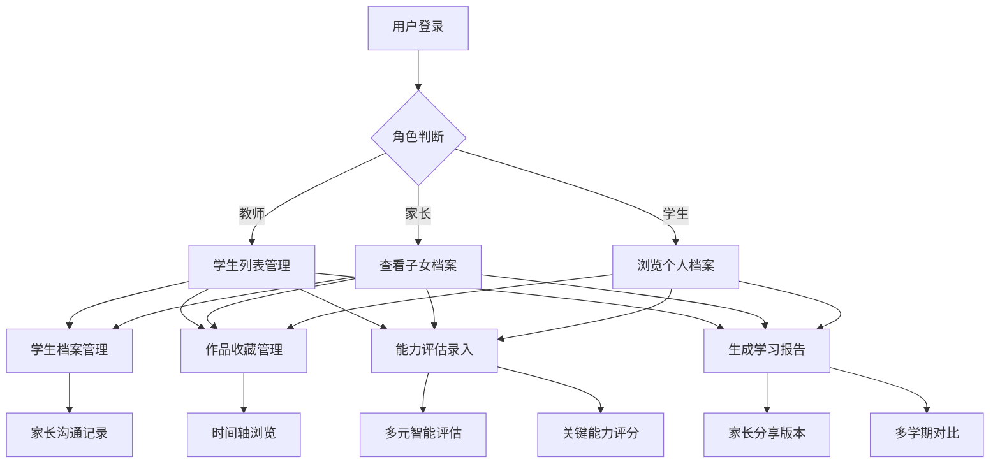

## 1. 产品概述

本平台是面向小学阶段学生成长档案数字化管理系统，为教师、家长和学生提供完整的学生成长记录解决方案，解决传统纸质档案易丢失、难以长期追踪学生发展的痛点。通过数字化方式记录学生从一年级到六年级的学习轨迹，让成长可见、让进步可追溯。

- 核心价值：帮助教育工作者全面了解学生特点、家长参与学生成长、学生自我认知与反思

## 2. 核心功能

### 2.1 用户角色

| 角色 | 注册方式 | 核心权限 |
|------|----------|----------|
| 教师/管理员 | 系统注册 | 学生档案管理、作品审核、能力评估、报告生成 |
| 家长 | 关联学生查看 | 查看子女档案、作品、评估报告 |
| 学生 | 账号登录 | 浏览个人档案、上传作品、查看评估结果 |

### 2.2 功能模块

1. **首页仪表盘**：学生列表概览、快速统计卡片、最近活动时间线
2. **学生档案管理**：基本信息、发展目标、家长沟通记录
3. **作品收藏**：作品归档、时间轴展示、优秀作品标注
4. **能力评估**：多元智能评估、关键能力指标、进步里程碑
5. **学习档案报告**：学期报告生成、家长分享版、多学期成长对比

### 2.3 页面详情

| 页面名称 | 模块名称 | 功能描述 |
|---------|---------|----------|
| 首页仪表盘 | 统计卡片 | 学生总数、作品数量、评估完成率、本月里程碑 |
| 首页仪表盘 | 学生列表 | 学生卡片展示、年级筛选、搜索功能 |
| 学生档案页 | 基本信息管理 | 姓名/年级/兴趣特长/学习风格/家庭背景编辑 |
| 学生档案页 | 发展目标设定 | 短期学期目标、长期培养方向 |
| 学生档案页 | 家长沟通记录 | 家访/家长会记录管理 |
| 作品收藏页 | 作品分类归档 | 绘画/写作/数学/科学作品分类展示 |
| 作品收藏页 | 时间轴展示 | 按年级时间轴浏览成长轨迹 |
| 作品收藏页 | 作品详情 | 作品预览、标注优秀、下载 |
| 能力评估页 | 多元智能雷达图 | 7项智能发展水平可视化 |
| 能力评估页 | 关键能力评估 | 批判思维/创造力/合作能力/学习习惯评分 |
| 能力评估页 | 进步里程碑 | 重要成就记录与徽章 |
| 学习报告页 | 学期报告生成 | 综合报告包含作品+评估+评语+亮点 |
| 学习报告页 | 家长分享版 | 精简友好格式、可打印导出 |
| 学习报告页 | 纵向成长对比 | 多学期数据对比图表 |

## 3. 核心流程

用户登录系统 → 选择学生 → 查看/编辑档案 → 上传作品 → 能力评估 → 生成报告 → 分享给家长

## 4. 用户界面设计

### 4.1 设计风格

- 主色调：温暖的教育蓝 (#1E40AF) 搭配柔和的薄荷绿 (#0D9488
- 辅助色：琥珀色 (#F59E0B) 用于重要提示、玫瑰红 (#F43F5E) 用于强调
- 字体：标题使用 LXGW WenKai 字体、正文使用思源宋体
- 按钮风格：圆角 12px、悬停时有柔和阴影
- 布局风格：卡片式布局、顶部导航 + 侧边菜单
- 图标风格：Lucide 线性图标、柔和色彩

### 4.2 页面设计概览

| 页面名称 | 模块名称 | UI元素 |
|---------|---------|--------|
| 首页仪表盘 | 统计卡片 | 渐变背景卡片、数据动画、悬停微动效 |
| 学生档案页 | 信息卡片 | 分栏布局、可编辑表单、时间线展示 |
| 作品收藏页 | 瀑布流布局 | 作品卡片缩略图、时间轴节点动画、悬浮放大 |
| 能力评估页 | 雷达图展示 | 交互雷达图、评分滑块、进度条动画 |
| 学习报告页 | 报告预览 | 报告卡片、导出按钮、对比图表 |

### 4.3 响应式

- 桌面端优先设计（1280px 以上）
- 平板端：侧边栏收起
- 移动端：底部导航栏

### 4.4 视觉细节

- 卡片悬浮时轻微上浮 + 阴影加深
- 数据加载时骨架屏动画
- 页面切换时淡入过渡
- 图表数据渐入动画
