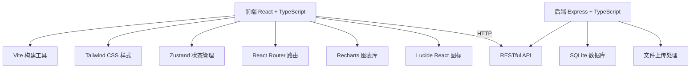
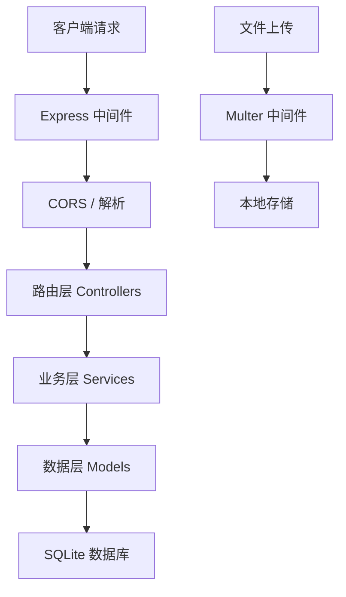
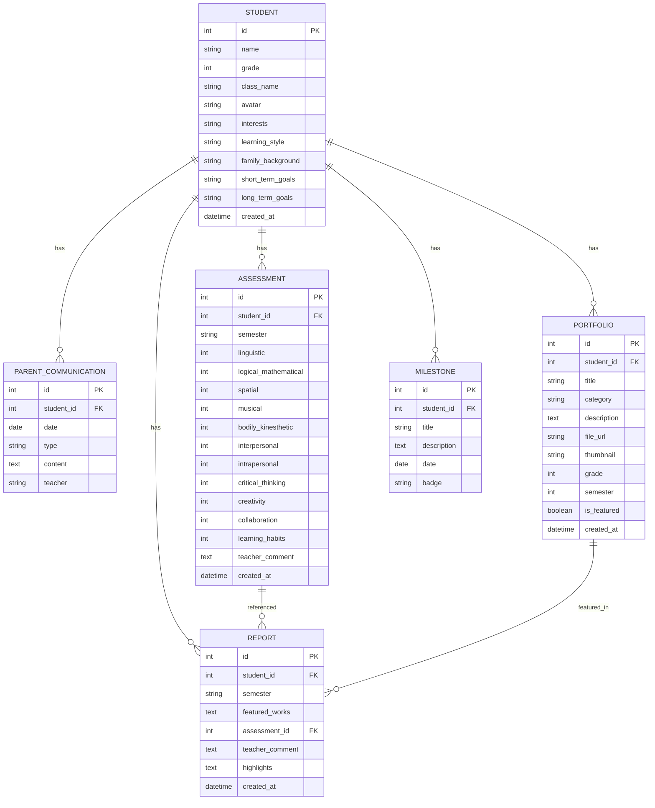

## 1. 架构设计



## 2. 技术描述

- 前端：React@18 + TypeScript + Tailwind CSS@3 + Vite
- 初始化工具：vite-init
- 后端：Express@4 + TypeScript
- 数据库：SQLite（本地存储，便于演示）
- 状态管理：Zustand
- 路由：React Router DOM
- 图表：Recharts
- 图标：Lucide React

## 3. 路由定义

| 路由 | 用途 |
|------|------|
| / | 首页仪表盘 |
| /students | 学生列表 |
| /students/:id | 学生档案详情 |
| /students/:id/portfolio | 作品收藏 |
| /students/:id/assessment | 能力评估 |
| /students/:id/report | 学习档案报告 |

## 4. API 定义

### 学生相关接口
```typescript
interface Student {
  id: number;
  name: string;
  grade: number;
  className: string;
  avatar: string;
  interests: string;
  learningStyle: string;
  familyBackground: string;
  shortTermGoals: string;
  longTermGoals: string;
  createdAt: string;
}

interface ParentCommunication {
  id: number;
  studentId: number;
  date: string;
  type: 'home_visit' | 'parent_meeting';
  content: string;
  teacher: string;
}

// GET /api/students - 获取学生列表
// GET /api/students/:id - 获取学生详情
// POST /api/students - 创建学生
// PUT /api/students/:id - 更新学生信息
// GET /api/students/:id/communications - 获取家长沟通记录
// POST /api/students/:id/communications - 添加沟通记录
```

### 作品相关接口
```typescript
interface Portfolio {
  id: number;
  studentId: number;
  title: string;
  category: 'art' | 'writing' | 'math' | 'science';
  description: string;
  fileUrl: string;
  thumbnail: string;
  grade: number;
  semester: number;
  isFeatured: boolean;
  createdAt: string;
}

// GET /api/students/:id/portfolio - 获取作品列表
// POST /api/students/:id/portfolio - 上传作品
// PUT /api/portfolio/:id/feature - 标注优秀作品
// DELETE /api/portfolio/:id - 删除作品
```

### 能力评估相关接口
```typescript
interface Intelligence {
  linguistic: number;
  logicalMathematical: number;
  spatial: number;
  musical: number;
  bodilyKinesthetic: number;
  interpersonal: number;
  intrapersonal: number;
}

interface KeySkills {
  criticalThinking: number;
  creativity: number;
  collaboration: number;
  learningHabits: number;
}

interface Milestone {
  id: number;
  studentId: number;
  title: string;
  description: string;
  date: string;
  badge: string;
}

interface Assessment {
  id: number;
  studentId: number;
  semester: string;
  intelligence: Intelligence;
  keySkills: KeySkills;
  teacherComment: string;
  createdAt: string;
}

// GET /api/students/:id/assessments - 获取评估列表
// POST /api/students/:id/assessments - 创建评估
// GET /api/students/:id/milestones - 获取里程碑
// POST /api/students/:id/milestones - 添加里程碑
```

### 报告相关接口
```typescript
interface Report {
  id: number;
  studentId: number;
  semester: string;
  featuredWorks: number[];
  assessmentId: number;
  teacherComment: string;
  highlights: string[];
  createdAt: string;
}

// GET /api/students/:id/reports - 获取报告列表
// POST /api/students/:id/reports - 生成报告
// GET /api/reports/:id/parent-version - 家长分享版本
// GET /api/students/:id/growth-comparison - 多学期对比数据
```

## 5. 服务器架构



## 6. 数据模型

### 6.1 ER 图


### 6.2 DDL 语句

```sql
-- 学生表
CREATE TABLE students (
  id INTEGER PRIMARY KEY AUTOINCREMENT,
  name VARCHAR(100) NOT NULL,
  grade INTEGER NOT NULL,
  class_name VARCHAR(50),
  avatar VARCHAR(255),
  interests TEXT,
  learning_style TEXT,
  family_background TEXT,
  short_term_goals TEXT,
  long_term_goals TEXT,
  created_at DATETIME DEFAULT CURRENT_TIMESTAMP
);

-- 家长沟通记录表
CREATE TABLE parent_communications (
  id INTEGER PRIMARY KEY AUTOINCREMENT,
  student_id INTEGER REFERENCES students(id),
  date DATE NOT NULL,
  type VARCHAR(20) NOT NULL,
  content TEXT NOT NULL,
  teacher VARCHAR(100),
  created_at DATETIME DEFAULT CURRENT_TIMESTAMP
);

-- 作品表
CREATE TABLE portfolios (
  id INTEGER PRIMARY KEY AUTOINCREMENT,
  student_id INTEGER REFERENCES students(id),
  title VARCHAR(200) NOT NULL,
  category VARCHAR(20) NOT NULL,
  description TEXT,
  file_url VARCHAR(255),
  thumbnail VARCHAR(255),
  grade INTEGER NOT NULL,
  semester INTEGER NOT NULL,
  is_featured BOOLEAN DEFAULT 0,
  created_at DATETIME DEFAULT CURRENT_TIMESTAMP
);

-- 评估表
CREATE TABLE assessments (
  id INTEGER PRIMARY KEY AUTOINCREMENT,
  student_id INTEGER REFERENCES students(id),
  semester VARCHAR(20) NOT NULL,
  linguistic INTEGER,
  logical_mathematical INTEGER,
  spatial INTEGER,
  musical INTEGER,
  bodily_kinesthetic INTEGER,
  interpersonal INTEGER,
  intrapersonal INTEGER,
  critical_thinking INTEGER,
  creativity INTEGER,
  collaboration INTEGER,
  learning_habits INTEGER,
  teacher_comment TEXT,
  created_at DATETIME DEFAULT CURRENT_TIMESTAMP
);

-- 里程碑表
CREATE TABLE milestones (
  id INTEGER PRIMARY KEY AUTOINCREMENT,
  student_id INTEGER REFERENCES students(id),
  title VARCHAR(200) NOT NULL,
  description TEXT,
  date DATE NOT NULL,
  badge VARCHAR(50),
  created_at DATETIME DEFAULT CURRENT_TIMESTAMP
);

-- 报告表
CREATE TABLE reports (
  id INTEGER PRIMARY KEY AUTOINCREMENT,
  student_id INTEGER REFERENCES students(id),
  semester VARCHAR(20) NOT NULL,
  featured_works TEXT,
  assessment_id INTEGER REFERENCES assessments(id),
  teacher_comment TEXT,
  highlights TEXT,
  created_at DATETIME DEFAULT CURRENT_TIMESTAMP
);
```
