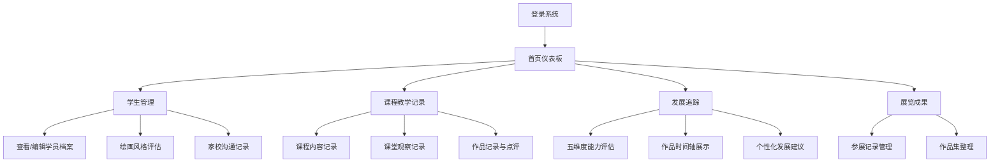

## 1. 产品概述

在线儿童绘画启蒙和美术教育追踪工具，专为美术培训机构、教师和家长设计，系统化管理学员档案、课程记录、发展评估和成果展示。
- 核心价值：通过数据化追踪学员艺术成长历程，提供个性化教学建议，促进家校沟通，提升教学质量。
- 目标用户：美术教师、培训机构管理者、学员家长。

## 2. 核心功能

### 2.1 用户角色
| 角色 | 注册方式 | 核心权限 |
|------|----------|----------|
| 教师/管理员 | 账号密码登录 | 全部功能：学生管理、课程记录、发展评估、展览管理、数据查看 |
| 家长 | 授权访问 | 查看自己孩子的档案、课程记录、评估报告、作品展示 |

### 2.2 功能模块
1. **首页仪表板**：数据概览、快捷操作、近期课程提醒
2. **学生管理模块**：学员档案、风格评估、家校沟通记录
3. **课程教学记录模块**：课程内容记录、课堂观察、作品点评
4. **学员发展追踪模块**：能力维度评估、作品时间轴、发展建议
5. **展览和成果模块**：参展记录、作品集管理

### 2.3 页面详情
| 页面名称 | 模块名称 | 功能描述 |
|----------|----------|----------|
| 首页仪表板 | 数据概览 | 学员总数、课程数量、近期评估、优秀作品展示卡片 |
| 首页仪表板 | 快捷操作 | 快速进入各功能模块的快捷入口 |
| 学生管理 | 学员档案列表 | 展示所有学员，支持搜索、筛选、添加新学员 |
| 学生管理 | 学员详情页 | 年龄、班级、入学时间、艺术发展特点、家长期望 |
| 学生管理 | 绘画风格评估 | 抽象/具象倾向、色彩感、构图意识评估卡片 |
| 学生管理 | 家校沟通记录 | 家长反馈与教师观察的对话时间线 |
| 课程教学 | 课程列表 | 按时间排序的课程记录，支持添加新课程 |
| 课程教学 | 课程详情 | 教学主题、使用材料、技法要点、教学目标 |
| 课程教学 | 课堂观察 | 参与程度、情感表达、技巧掌握情况记录 |
| 课程教学 | 作品点评 | 典型作品图片上传、分析点评 |
| 发展追踪 | 能力评估 | 构图、色彩、线条、创意、表现力五维度评分雷达图 |
| 发展追踪 | 作品时间轴 | 从入学到现在的作品展示，见证成长历程 |
| 发展追踪 | 发展建议 | 个性化发展方向分析与培养建议 |
| 展览成果 | 参展记录 | 校内外画展参展信息、获奖情况、展览体验 |
| 展览成果 | 作品集 | 精选代表作收藏与展示 |

## 3. 核心流程

教师日常工作流程：登录系统 → 查看今日课程安排 → 进入学生管理查看学员档案 → 记录课程内容和课堂观察 → 上传学员作品并点评 → 定期进行能力评估 → 记录参展情况和整理作品集。

## 4. 用户界面设计

### 4.1 设计风格
- **主色调**：温暖橙黄色（#FFB347）代表创意与活力，搭配天蓝色（#87CEEB）代表艺术与想象
- **辅助色**：柔和粉色（#FFB6C1）、薄荷绿（#98FB98）、薰衣草紫（#E6E6FA），营造童趣温馨氛围
- **中性色**：米白色背景（#FFFAF0），深灰色文字（#4A4A4A），保护视力
- **按钮风格**：圆润大圆角（16px），柔和阴影，悬停时有轻微上浮效果
- **字体**：标题使用圆润可爱的 "ZCOOL KuaiLe"，正文使用清晰易读的 "Noto Sans SC"
- **布局风格**：卡片式布局，充足留白，柔和圆角，淡雅边框
- **图标风格**：手绘风格彩色图标，配合emoji增强亲和力

### 4.2 页面设计概述
| 页面名称 | 模块名称 | UI元素 |
|----------|----------|--------|
| 首页仪表板 | 数据概览 | 渐变色彩统计卡片、迷你图表、滚动动画、悬停放大效果 |
| 学生管理 | 学员档案 | 头像卡片、标签式信息分类、可折叠详情面板 |
| 课程教学 | 课程列表 | 时间轴式布局、课程状态标签、彩色分类标识 |
| 发展追踪 | 能力评估 | 交互式雷达图、评分滑块、历史对比曲线 |
| 发展追踪 | 作品时间轴 | 瀑布流布局、图片渐入动画、时间节点连接线 |
| 展览成果 | 作品集 | 网格画廊、灯箱预览、分类筛选标签 |

### 4.3 响应式
- 桌面优先设计，支持1280px以上分辨率
- 平板端（768px-1280px）：侧边栏收起为图标导航，卡片自适应换行
- 移动端（<768px）：底部导航栏，单列布局，触摸友好的大按钮

### 4.4 交互动效
- 页面加载：元素从下至上渐入，错开延迟创造层次感
- 卡片悬停：轻微上浮（translateY(-4px)），阴影加深
- 数据图表：动画填充，数值滚动增长
- 作品图片：加载时模糊渐变清晰，悬停放大
- 按钮点击：缩放反馈（scale(0.96)）
