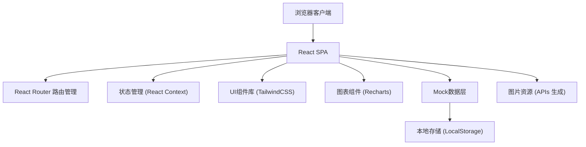
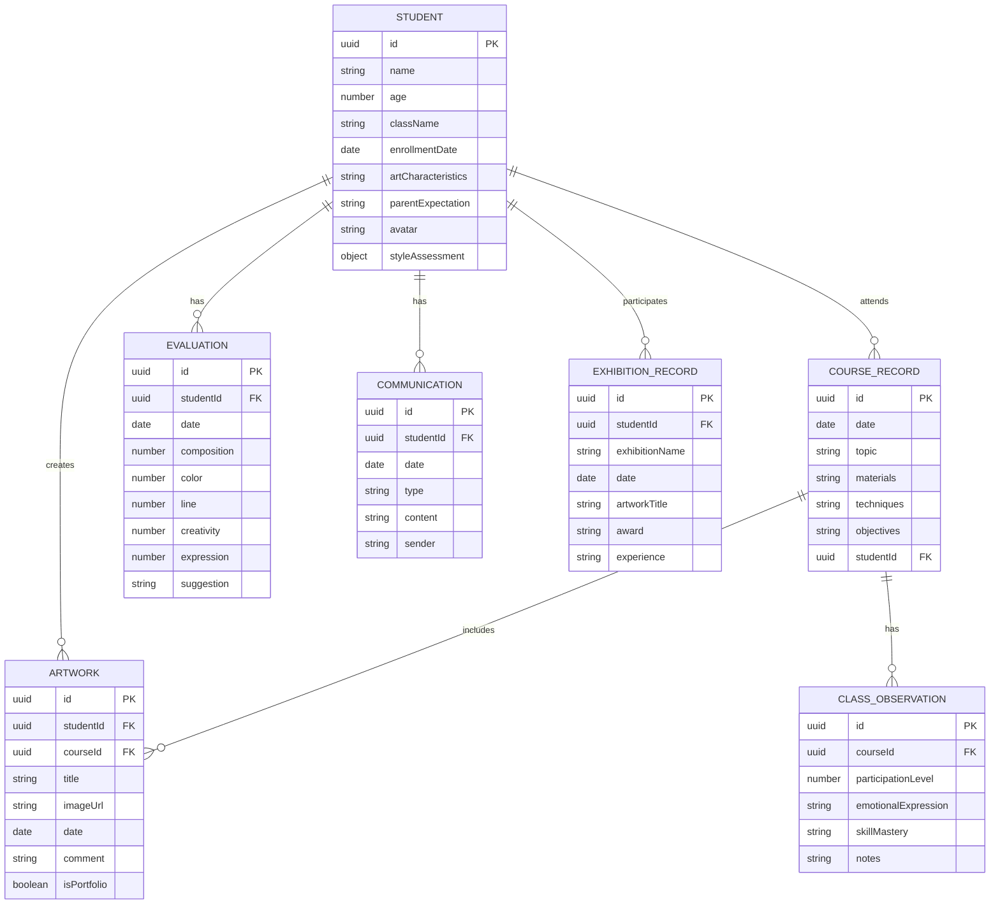

## 1. 架构设计



## 2. 技术描述

- **前端框架**: React@18 + TypeScript
- **构建工具**: Vite@5
- **样式方案**: TailwindCSS@3.4
- **路由管理**: React Router DOM@6
- **图表库**: Recharts@2
- **图标库**: Lucide React
- **数据持久化**: LocalStorage (前端模拟)
- **开发语言**: TypeScript@5
- **包管理器**: npm

## 3. 路由定义

| 路由 | 页面名称 | 用途 |
|------|----------|------|
| / | 首页仪表板 | 数据概览、快捷操作入口 |
| /students | 学生管理 | 学员列表展示 |
| /students/:id | 学生详情 | 学员档案、风格评估、家校沟通 |
| /courses | 课程记录 | 课程列表、教学记录 |
| /courses/:id | 课程详情 | 课程内容、课堂观察、作品点评 |
| /tracking | 发展追踪 | 能力评估、作品时间轴 |
| /tracking/:id | 学员追踪详情 | 个性化发展建议 |
| /exhibitions | 展览成果 | 参展记录、作品集管理 |

## 4. 数据模型

### 4.1 ER图



### 4.2 TypeScript 类型定义

```typescript
// 学生档案
interface Student {
  id: string;
  name: string;
  age: number;
  className: string;
  enrollmentDate: string;
  artCharacteristics: string;
  parentExpectation: string;
  avatar: string;
  styleAssessment: StyleAssessment;
}

// 绘画风格评估
interface StyleAssessment {
  abstractTendency: number; // 抽象倾向 0-10
  concreteTendency: number; // 具象倾向 0-10
  colorSense: number; // 色彩感 0-10
  compositionAwareness: number; // 构图意识 0-10
  notes: string;
}

// 课程记录
interface CourseRecord {
  id: string;
  studentId: string;
  date: string;
  topic: string;
  materials: string[];
  techniques: string[];
  objectives: string;
  observation: ClassObservation;
}

// 课堂观察
interface ClassObservation {
  participationLevel: number; // 参与度 0-10
  emotionalExpression: string;
  skillMastery: string;
  notes: string;
}

// 作品
interface Artwork {
  id: string;
  studentId: string;
  courseId: string;
  title: string;
  imageUrl: string;
  date: string;
  comment: string;
  isPortfolio: boolean;
}

// 能力评估
interface Evaluation {
  id: string;
  studentId: string;
  date: string;
  composition: number; // 构图 0-10
  color: number; // 色彩 0-10
  line: number; // 线条 0-10
  creativity: number; // 创意 0-10
  expression: number; // 表现力 0-10
  suggestion: string;
}

// 家校沟通
interface Communication {
  id: string;
  studentId: string;
  date: string;
  type: 'parent' | 'teacher';
  content: string;
}

// 参展记录
interface ExhibitionRecord {
  id: string;
  studentId: string;
  exhibitionName: string;
  date: string;
  artworkTitle: string;
  award: string;
  experience: string;
}
```

## 5. 项目目录结构

```
src/
├── components/          # 可复用组件
│   ├── Layout/         # 布局组件（侧边栏、导航）
│   ├── Student/        # 学生相关组件
│   ├── Course/         # 课程相关组件
│   ├── Tracking/       # 追踪相关组件
│   ├── Exhibition/     # 展览相关组件
│   └── ui/             # 基础UI组件（卡片、按钮等）
├── pages/              # 页面组件
├── types/              # TypeScript类型定义
├── data/               # Mock数据
├── context/            # React Context状态管理
├── utils/              # 工具函数
├── assets/             # 静态资源
├── App.tsx
├── main.tsx
└── index.css
```
