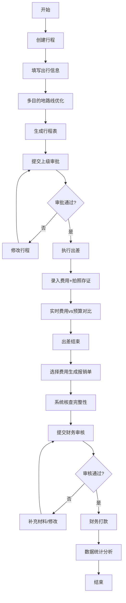

## 1. 产品概述

本系统是面向企业商务人士的一站式差旅管理平台，解决出差行程规划混乱、费用记录不便、报销流程繁琐、数据统计缺失等核心痛点。系统集成行程规划、费用记录、报销管理、数据分析四大模块，实现差旅全生命周期数字化管理，提升出差效率、降低管理成本。

目标用户：企业商务出差人员、部门经理、财务人员；核心价值：行程智能优化、费用透明管控、报销高效便捷、数据决策支持。

## 2. 核心功能

### 2.1 用户角色

| 角色 | 注册方式 | 核心权限 |
|------|----------|----------|
| 普通员工 | 企业账号登录 | 行程规划、费用录入、报销申请、个人数据查看 |
| 部门经理 | 企业账号登录 | 审批行程、审批报销、部门数据统计 |
| 财务人员 | 企业账号登录 | 报销审核、打款确认、财务数据汇总 |
| 系统管理员 | 企业账号登录 | 用户管理、系统配置、全局数据查看 |

### 2.2 功能模块

1. **首页仪表盘**：差旅概览、待办事项、快捷入口、趋势图表
2. **行程规划**：行程创建、多目的地优化、路线推荐、文档生成与分享
3. **费用记录**：费用录入、发票拍照、分类管理、预算对比
4. **报销管理**：报销清单整理、报销单生成、状态追踪、审批流程
5. **数据分析**：出行统计、费用分析、效率评估、可视化报表

### 2.3 页面详情

| 页面名称 | 模块名称 | 功能描述 |
|----------|----------|----------|
| 首页 | 仪表盘 | 展示月度出差次数、待报销金额、待审批事项、近期行程卡片、快捷操作按钮 |
| 行程规划 | 行程列表 | 展示所有行程，支持按状态/时间筛选，可新建、编辑、删除行程 |
| 行程规划 | 行程详情 | 展示完整行程信息、交通住宿安排、客户拜访计划、生成审批文档 |
| 行程规划 | 路线优化 | 输入多目的地城市，系统计算最优访问顺序，展示地图路线和距离 |
| 费用记录 | 费用列表 | 按时间/类别展示所有费用，支持搜索筛选，显示费用总额和预算对比 |
| 费用记录 | 费用录入 | 表单录入费用详情，支持上传发票照片，自动关联对应行程 |
| 报销管理 | 报销申请 | 选择未报销费用，自动汇总生成报销单，检查附件完整性 |
| 报销管理 | 报销列表 | 展示所有报销单及状态（草稿/已提交/审核中/已打款/已驳回） |
| 数据分析 | 出行统计 | 出差频率热力图、目的地城市排行、年度出差趋势图 |
| 数据分析 | 费用分析 | 费用分类饼图、月度费用趋势、部门/个人费用排行 |
| 数据分析 | 效率评估 | 出差天数与成果产出关联分析、ROI计算、效率排行 |

## 3. 核心流程

### 3.1 主要用户流程

员工创建出差行程 → 填写目的地和日期 → 系统优化路线 → 生成行程表提交上级审批 → 审批通过后执行出差 → 出差过程中实时录入费用并拍照发票 → 出差结束后选择费用生成报销单 → 系统检查完整性 → 提交财务审核 → 审核通过后打款 → 系统生成数据分析报表。

### 3.2 业务流程图

## 4. 用户界面设计

### 4.1 设计风格

- **主色调**：商务蓝 `#165DFF` 作为品牌主色，传达专业、可信赖的感觉
- **辅助色**：成功绿 `#00B42A`、警告橙 `#FF7D00`、危险红 `#F53F3F`
- **中性色**：深灰 `#1D2129`、中灰 `#4E5969`、浅灰 `#C9CDD4`、纯白 `#FFFFFF`
- **按钮风格**：圆角 6px，微立体阴影，悬停时轻微上浮效果
- **字体**：标题使用 "Noto Serif SC" 显示字体，正文使用 "Inter" 无衬线字体，体现商务专业感
- **布局风格**：左侧导航 + 顶部面包屑 + 主内容区卡片式布局，层次分明
- **图标风格**：使用线性风格图标，统一 24px 尺寸，与主色调呼应

### 4.2 页面设计概览

| 页面名称 | 模块名称 | UI元素 |
|----------|----------|--------|
| 首页 | 仪表盘 | 渐变色统计卡片、环形进度图、待办列表、横向滚动行程卡片、数据可视化图表、优雅的交互动画 |
| 行程规划 | 行程列表 | 列表视图/日历视图切换、标签状态筛选、搜索框、操作按钮组、分页 |
| 行程规划 | 路线优化 | 城市输入框（支持添加多个）、地图可视化、最优路线高亮、距离/时间估算、重新计算按钮 |
| 费用记录 | 费用录入 | 分步表单、费用类别图标选择器、日期选择器、金额输入带币种、图片上传预览区、自动计算合计 |
| 报销管理 | 报销列表 | 状态标签徽章、时间线状态追踪、报销单预览、导出PDF按钮 |
| 数据分析 | 可视化 | ECharts 柱状图/饼图/折线图/热力图、可切换统计维度、数据表格、导出Excel |

### 4.3 响应式设计

- **桌面端优先**：1440px 及以上最佳体验，三栏布局
- **平板适配**：1024px - 1439px，两栏布局，导航可折叠
- **手机适配**：375px - 1023px，单栏布局，底部Tab导航，优化触控区域
- **触控优化**：按钮最小高度 44px，滑动手势支持，图片支持双指缩放

## 5. 非功能需求

### 5.1 性能要求
- 页面首屏加载时间 < 2s
- 数据查询响应时间 < 500ms
- 支持离线缓存已查看数据

### 5.2 安全要求
- 所有数据本地加密存储
- 发票图片水印处理
- 操作日志完整记录
- 敏感数据脱敏显示

### 5.3 可用性要求
- 支持中英文切换
- 支持深色/浅色主题切换
- 键盘操作无障碍支持
