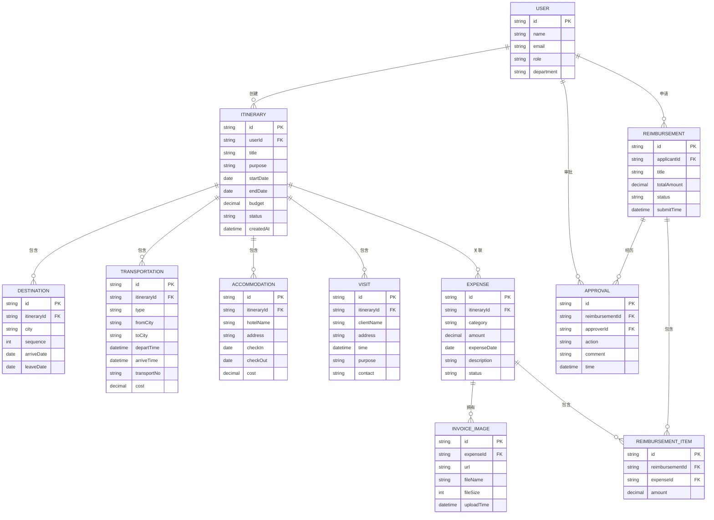

## 1. 架构设计

```mermaid
graph TD
    A["前端应用层"] --> B["React 18 + TypeScript"]
    A --> C["Vite 构建工具"]
    A --> D["Tailwind CSS 3 样式"]
    A --> E["React Router 路由"]
    A --> F["Zustand 状态管理"]
    A --> G["ECharts 数据可视化"]
    
    H["业务组件层"] --> H1["行程规划组件"]
    H --> H2["费用记录组件"]
    H --> H3["报销管理组件"]
    H --> H4["数据分析组件"]
    H --> H5["通用UI组件"]
    
    I["数据服务层"] --> I1["API Service"]
    I --> I2["Mock Data Service"]
    I --> I3["LocalStorage 持久化"]
    
    J["基础工具层"] --> J1["日期处理 (dayjs)"]
    J --> J2["表单验证 (react-hook-form)"]
    J --> J3["文件处理"]
    J --> J4["路线优化算法"]
    
    style A fill:#165DFF,color:#fff
    style H fill:#00B42A,color:#fff
    style I fill:#FF7D00,color:#fff
    style J fill:#722ED1,color:#fff
```



## 2. 技术描述

- **前端框架**：React@18.2.0 + TypeScript@5.3.0
- **构建工具**：Vite@5.0.0
- **样式方案**：Tailwind CSS@3.4.0
- **路由管理**：React Router@6.20.0
- **状态管理**：Zustand@4.4.7（轻量级，避免Redux过度设计）
- **数据可视化**：ECharts@5.4.3
- **UI组件库**：Ant Design@5.12.0（企业级组件库，贴合商务场景）
- **日期处理**：dayjs@1.11.10
- **表单处理**：react-hook-form@7.48.2
- **图标库**：@ant-design/icons@5.2.6
- **后端**：无后端，使用Mock数据 + LocalStorage本地持久化
- **数据库**：LocalStorage + IndexedDB（可选，用于图片存储）

## 3. 目录结构

```
src/
├── assets/              # 静态资源
│   ├── images/
│   └── styles/
├── components/          # 通用组件
│   ├── Layout/         # 布局组件
│   ├── Chart/          # 图表组件
│   ├── Form/           # 表单组件
│   └── Table/          # 表格组件
├── pages/              # 页面组件
│   ├── Dashboard/      # 首页仪表盘
│   ├── Itinerary/      # 行程规划
│   ├── Expense/        # 费用记录
│   ├── Reimbursement/  # 报销管理
│   └── Analysis/       # 数据分析
├── store/              # 状态管理
│   ├── useItineraryStore.ts
│   ├── useExpenseStore.ts
│   ├── useReimbursementStore.ts
│   └── useUserStore.ts
├── services/           # API服务
│   ├── itinerary.ts
│   ├── expense.ts
│   ├── reimbursement.ts
│   └── mock/           # Mock数据
├── utils/              # 工具函数
│   ├── date.ts
│   ├── routeOptimizer.ts
│   ├── pdfGenerator.ts
│   └── storage.ts
├── types/              # TypeScript类型定义
│   ├── itinerary.ts
│   ├── expense.ts
│   ├── reimbursement.ts
│   └── common.ts
├── hooks/              # 自定义Hooks
│   ├── useModal.ts
│   ├── useTable.ts
│   └── useUpload.ts
├── App.tsx
├── main.tsx
└── router.tsx
```

## 4. 路由定义

| 路由路径 | 页面名称 | 说明 |
|----------|----------|------|
| `/` | 首页仪表盘 | 数据概览、快捷操作、待办事项 |
| `/itinerary` | 行程列表 | 所有行程的列表展示 |
| `/itinerary/create` | 创建行程 | 新建出差行程表单 |
| `/itinerary/:id` | 行程详情 | 查看行程详情、编辑、生成文档 |
| `/itinerary/optimize` | 路线优化 | 多目的地路线优化工具 |
| `/expense` | 费用列表 | 所有费用记录展示 |
| `/expense/create` | 费用录入 | 新增费用记录表单 |
| `/reimbursement` | 报销列表 | 所有报销单列表 |
| `/reimbursement/create` | 创建报销单 | 选择费用生成报销单 |
| `/reimbursement/:id` | 报销详情 | 查看报销单详情、状态追踪 |
| `/analysis/travel` | 出行统计 | 出差频率、目的地统计 |
| `/analysis/expense` | 费用分析 | 费用分类、趋势分析 |
| `/analysis/efficiency` | 效率评估 | 出差效率、ROI分析 |

## 5. 数据模型

### 5.1 ER图



### 5.2 核心数据类型定义

```typescript
// 行程类型
type ItineraryStatus = 'draft' | 'pending' | 'approved' | 'rejected' | 'in_progress' | 'completed';

interface Itinerary {
  id: string;
  userId: string;
  title: string;
  purpose: string;
  startDate: string;
  endDate: string;
  budget: number;
  status: ItineraryStatus;
  destinations: Destination[];
  transportations: Transportation[];
  accommodations: Accommodation[];
  visits: Visit[];
  createdAt: string;
}

// 费用类型
type ExpenseCategory = 'transport' | 'accommodation' | 'food' | 'entertainment' | 'other';
type ExpenseStatus = 'unsubmitted' | 'pending' | 'approved' | 'rejected' | 'reimbursed';

interface Expense {
  id: string;
  itineraryId?: string;
  category: ExpenseCategory;
  amount: number;
  expenseDate: string;
  description: string;
  merchant?: string;
  images: InvoiceImage[];
  status: ExpenseStatus;
  createdAt: string;
}

// 报销类型
type ReimbursementStatus = 'draft' | 'submitted' | 'reviewing' | 'paid' | 'rejected';

interface Reimbursement {
  id: string;
  applicantId: string;
  title: string;
  totalAmount: number;
  items: ReimbursementItem[];
  status: ReimbursementStatus;
  submitTime?: string;
  approvals: Approval[];
  createdAt: string;
}

// 用户类型
type UserRole = 'employee' | 'manager' | 'finance' | 'admin';

interface User {
  id: string;
  name: string;
  email: string;
  avatar?: string;
  role: UserRole;
  department: string;
}
```

## 6. 核心算法设计

### 6.1 多目的地路线优化算法（TSP近似算法）

```typescript
// 使用最近邻算法 + 2-opt优化解决旅行商问题
function optimizeRoute(cities: City[], startCity?: City): RouteResult {
  // 1. 计算城市间距离矩阵
  const distanceMatrix = calculateDistanceMatrix(cities);
  
  // 2. 最近邻算法生成初始路线
  let route = nearestNeighbor(cities, distanceMatrix, startCity);
  
  // 3. 2-opt算法优化路线
  route = twoOptOptimization(route, distanceMatrix);
  
  // 4. 计算总距离和预估时间
  const totalDistance = calculateTotalDistance(route, distanceMatrix);
  const estimatedTime = calculateEstimatedTime(totalDistance);
  
  return { route, totalDistance, estimatedTime };
}
```

### 6.2 预算实时对比算法

```typescript
function calculateBudgetComparison(itinerary: Itinerary, expenses: Expense[]): BudgetInfo {
  const totalBudget = itinerary.budget;
  const spentAmount = expenses
    .filter(e => e.itineraryId === itinerary.id)
    .reduce((sum, e) => sum + e.amount, 0);
  const remaining = totalBudget - spentAmount;
  const percentage = (spentAmount / totalBudget) * 100;
  const status = percentage > 100 ? 'over' : percentage > 80 ? 'warning' : 'normal';
  
  return { totalBudget, spentAmount, remaining, percentage, status };
}
```

## 7. Mock数据设计

### 7.1 初始化数据

- 1个当前用户（员工角色）
- 5-8个历史行程数据（包含不同状态）
- 20-30条费用记录（各分类都有）
- 3-5个报销单（包含不同状态）
- 模拟的城市距离数据（用于路线优化）
- 部门、用户等基础数据

### 7.2 数据持久化

- 使用 LocalStorage 存储JSON格式数据
- 首次访问自动初始化Mock数据
- 所有操作实时同步到LocalStorage
- 发票图片使用base64编码存储
